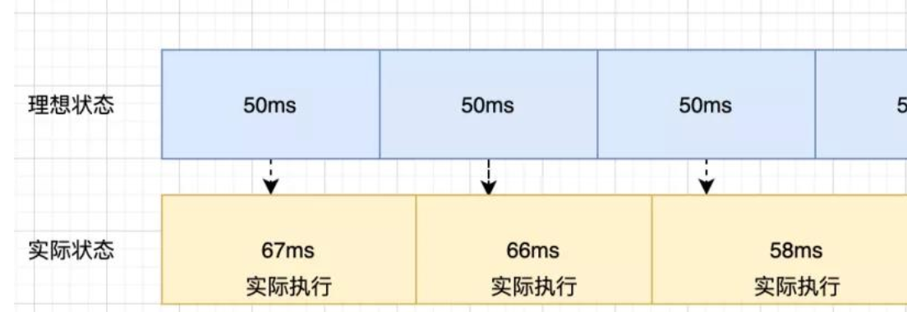
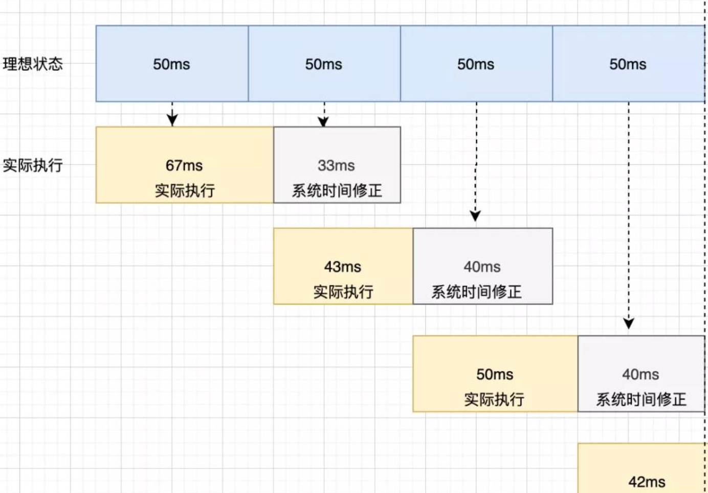

# 如何实现准时的 setTimeout

## 为什么不准？

因为 setTimeout 是一个宏任务，它的指定时间指的是： 进入主线程的时间。

```js
setTimeout(callback, 进入主线程的时间);
```

所以什么时候可以执行 callback，需要看 主线程前面还有多少任务待执行 。

## 如何实现准时的 “setTimeout”

### requestAnimationFrame

> window.requestAnimationFrame() 告诉浏览器——你希望执行一个动画，并且要求浏览器在下次重绘之前调用指定的回调函数更新动画。

该方法需要传入一个回调函数作为参数，该回调函数会在浏览器下一次重绘之前执行，回调函数执行次数通常是每秒 60 次，也就是每 16.7ms 执行一次，但是并不一定保证为 16.7 ms。

```js
// 模拟代码
function setTimeout(cb, delay) {
  let startTime = Date.now();
  loop();

  function loop() {
    const now = Date.now();
    if (now - startTime >= delay) {
      cb();
      return;
    }
    requestAnimationFrame(loop);
  }
}
```

由于 16.7 ms 间隔执行，在使用间隔很小的定时器，很容易导致时间的不准确。因此这种方案仍然不是一种好的方案。

### while

想得到准确的，我们第一反应就是如果我们能够主动去触发，获取到最开始的时间，以及不断去轮询当前时间，如果差值是预期的时间，那么这个定时器肯定是准确的，那么用 while 可以实现这个功能。

```js
function timer(time) {
  const startTime = Date.now();
  while (true) {
    const now = Date.now();
    if (now - startTime >= time) {
      console.log("误差", now - startTime - time);
      return;
    }
  }
}
timer(5000);
```

这样的方式很精确，但是我们知道 js 是单线程运行，使用这样的方式强行霸占线程会使得页面进入卡死状态，这样的结果显然是不合适的。

### setTimeout 系统时间补偿

我们来看看此方案和原方案的区别

原方案:



setTimeout 系统时间补偿:



当每一次定时器执行时后，都去获取系统的时间来进行修正，虽然每次运行可能会有误差，但是通过系统时间对每次运行的修复，能够让后面每一次时间都得到一个补偿。

```js
function timer() {
  let speed = 500,
    counter = 1,
    start = new Date().getTime();

  function instance() {
    let real = counter * speed,
      ideal = new Date().getTime() - start;

    counter++;
    let diff = ideal - real;
    setTimeout(function () {
      instance();
    }, speed - diff); // 通过系统时间进行修复
  }

  setTimeout(function () {
    instance();
  }, speed);
}
```
