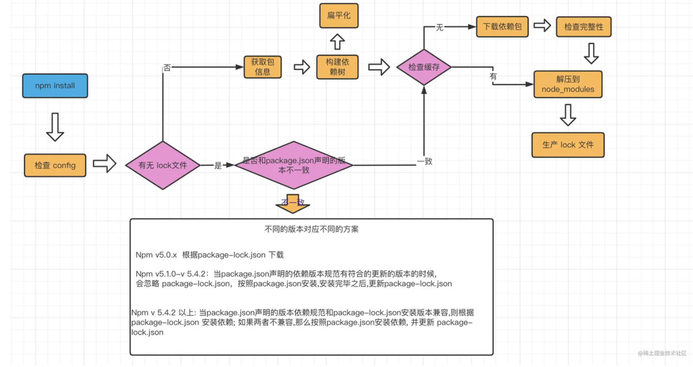

# monorepo

## npm 的 install 流程

## package-lock.json

package-lock.json 的作用是进行锁版本号，保证整个开发团队的版本号统一，使用 monorepo 的项目有可能会提到一个最外层进行一个管理。

- 为什么需要这个 package-lock.json
  package.json 的 semantic versioning(语意化版本控制），在不同的时间会安装不同的版本，如果没有 package-lock.json，不同的开发者可能就会得到不同版本的依赖，如果因为这个出现了一个 bug 的话，那排查起来也许会非常困难。
- 更新规则
  Npm v 5.4.2 以上：当 package.json 声明的版本依赖规范和 package-lock.json 安装版本兼容,则根据
  package-lock json 安装依赖：如果两者不兼容,那么按照 package.json 安装依赖，并更新 package-
  lock.json
  跟随 package.json 的语意化版本控制来进行更新，如果 package.json 中的依赖 a 的版本是^1.0.0，在这个时候如果 package-lock.json 中的版本锁定为 1.12.1 就是符合要求的不必重写，但如果是 0.12.11 即第一个数字变了，那就需要重写 package-lock.json 了。
- 版本规则
  - ^: 只会执行不更改最左边非零数字的更新。 如果写入的是 ^0.13.0，则当运行 npm update 时，可以更新到 0.13.1、0.13.2 等，但不能更新到 0.14.0 或更高版本。 如果写入的是 ^1.13.0，则当运行 npm update 时，可以更新到 1.13.1、1.14.0 等，但不能更新到 2.0.0 或更高版本。
  - ~: 如果写入的是 〜0.13.0，则当运行 npm update 时，会更新到补丁版本：即 0.13.1 可以，但 0.14.0 不可以。
  - > : 接受高于指定版本的任何版本。
  - > =: 接受等于或高于指定版本的任何版本。
  - =: 接受确切的版本。
  - -: 接受一定范围的版本。例如：2.1.0 - 2.6.2。
  - ||: 组合集合。例如 < 2.1 || > 2.6。

## npm 和 yarn

缺点。下面将两者进行比较

1. 性能

每当 Yarn 或 npm 需要安装包时，它们都会执行一系列任务。在 npm 中，这些任务是按包顺序执行的，这意味着它会等待一个包完全安装，然后再继续下一个。相比之下，Yarn 并行执行这些任务，从而提高了性能。
虽然这两个管理器都提供缓存机制，但 Yarn 似乎做得更好一些。
尽管 Yarn 有一些优势，但 Yarn 和 npm 在它们的最新版本中的速度相当。所以我们不能评判孰优孰劣。

2. 依赖版本

早期的时候 yarn 有 yarn.lock 来锁定版本，这一点上比 package.json 要强很多，而后面 npm 也推出了 package-lock.json，所以这一点上已经没太多差异了。

3. 安全性

从版本 6 开始，npm 会在安装过程中审核软件包并告诉您是否发现了任何漏洞。我们可以通过 npm audit 针对已安装的软件包运行来手动执行此检查。如果发现任何漏洞，npm 会给我们安全建议。
Yarn 和 npm 都使用加密哈希算法来确保包的完整性。

4. 工作区

工作区允许您拥有一个 monorepo 来管理跨多个项目的依赖项。这意味着您有一个单一的顶级根包，其中包含多个称为工作区的子包。

5. 用哪个？

目前 2021 年，yarn 的安装速度还是比 npm 快，其他地方的差异并不大，基本上可以忽略，用哪个都行。

# monorepo

## monorepo 方案的优势

1. 代码重用将变得非常容易：由于所有的项目代码都集中于一个代码仓库，我们将很容易抽离出各个项目共用的业务组件或工具，并通过 TypeScript，Lerna 或其他工具进行代码内引用；
2. 依赖管理将变得非常简单：同理，由于项目之间的引用路径内化在同一个仓库之中，我们很容易追踪当某个项目的代码修改后，会影响到其他哪些项目。通过使用一些工具，我们将很容易地做到版本依赖管理和版本号自动升级；
3. 代码重构将变得非常便捷：想想究竟是什么在阻止您进行代码重构，很多时候，原因来自于「不确定性」，您不确定对某个项目的修改是否对于其他项目而言是「致命的」，出于对未知的恐惧，您会倾向于不重构代码，这将导致整个项目代码的腐烂度会以惊人的速度增长。而在 monorepo 策略的指导下，您能够明确知道您的代码的影响范围，并且能够对被影响的项目可以进行统一的测试，这会鼓励您不断优化代码；
4. 它倡导了一种开放，透明，共享的组织文化，这有利于开发者成长，代码质量的提升：在 monorepo 策略下，每个开发者都被鼓励去查看，修改他人的代码（只要有必要），同时，也会激起开发者维护代码，和编写单元测试的责任心（毕竟朋友来访之前，我们从不介意自己的房子究竟有多乱），这将会形成一种良性的技术氛围，从而保障整个组织的代码质量。

## monorepo 方案的劣势

1. 项目粒度的权限管理变得非常复杂：无论是 Git 还是其他 VCS 系统，在支持 monorepo 策略中项目粒度的权限管理上都没有令人满意的方案，这意味着 A 部门的 a 项目若是不想被 B 部门的开发者看到就很难了。（好在我们可以将 monorepo 策略实践在「项目级」这个层次上，这才是我们这篇文章的主题，我们后面会再次明确它）；
2. 新员工的学习成本变高：不同于一个项目一个代码仓库这种模式下，组织新人只要熟悉特定代码仓库下的代码逻辑，在 monorepo 策略下，新人可能不得不花更多精力来理清各个代码仓库之间的相互逻辑，当然这个成本可以通过新人文档的方式来解决，但维护文档的新鲜又需要消耗额外的人力；
3. 对于公司级别的 monorepo 策略而言，需要专门的 VFS 系统，自动重构工具的支持：设想一下 Google 这样的企业是如何将十亿行的代码存储在一个仓库之中的？开发人员每次拉取代码需要等待多久？各个项目代码之间又如何实现权限管理，敏捷发布？任何简单的策略乘以足够的规模量级都会产生一个奇迹（不管是好是坏），对于中小企业而言，如果没有像 Google，Facebook 这样雄厚的人力资源，把所有项目代码放在同一个仓库里这个美好的愿望就只能是个空中楼阁。

## 如何取舍？

没错，软件开发领域从来没有「银弹」。monorepo 策略也并不完美，并且，我在实践中发现，要想完美在组织中运用 monorepo 策略，所需要的不仅是出色的编程技巧和耐心。团队日程，组织文化和个人影响力相互碰撞的最终结果才决定了想法最终是否能被实现。

但是请别灰心的太早，因为虽然让组织作出改变，统一施行 monorepo 策略困难重重，但这却并不意味着我们需要彻底跟 monorepo 策略说再见。我们还可以把 monorepo 策略实践在「项目」这个级别，即从逻辑上确定项目与项目之间的关联性，然后把相关联的项目整合在同一个仓库下，通常情况下，我们不会有太多相互关联的项目，这意味着我们能够免费得到 monorepo 策略的所有好处，并且可以拒绝支付大型 monorepo 架构的利息。
