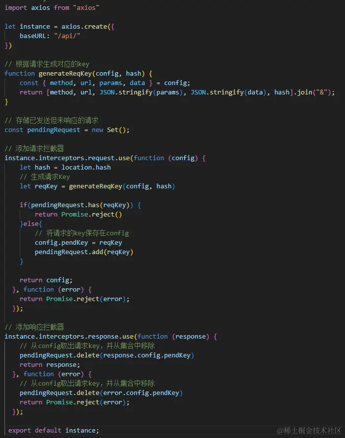
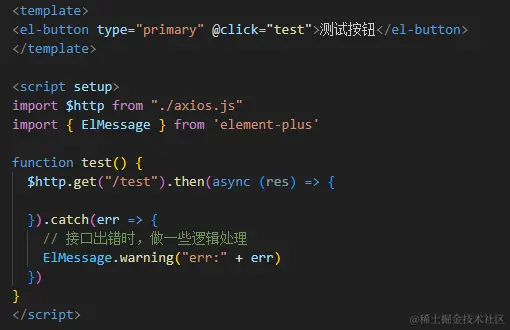
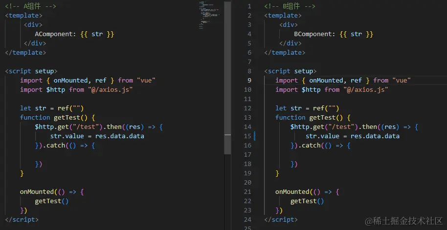
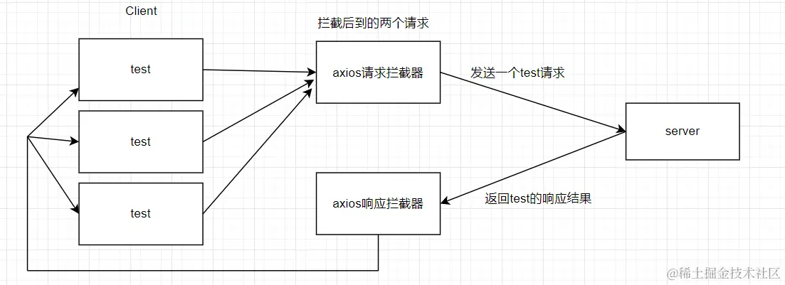

# 前端接口防止重复请求实现方案

## 前言

前段时间老板心血来潮，要我们前端组对整个的项目都做一下接口防止重复请求的处理（似乎是有用户通过一些快速点击薅到了一些优惠券啥的）。。。听到这个需求，第一反应就是，防止薅羊毛最保险的方案不还是在服务端加限制吗？前端加限制能够拦截的毕竟有限。可老板就是执意要前端搞一下子，行吧，搞就搞吧。
虽然大部分的接口处理我们都是加了 loading 的，但又不能确保真的是每个接口都加了的，可是如果要一个接口一个接口的排查，那这维护了四五年的系统，成百上千的接口肯定要耗费非常多的精力，根本就是不现实的，所以就只能去做 全局处理 。下面就来总结一下这次的防重复请求的实现方案：

## 方案一：使用 axios 拦截器

这个方案是最容易想到也是最 朴实无华 的一个方案：通过使用 axios 拦截器，在 请求拦截器 中开启全屏 Loading，然后在 响应拦截器 中将 Loading 关闭。

这个方案固然已经可以满足我们目前的需求，但不管三七二十一，直接搞个全屏 Loading 还是 不太美观 ，何况在目前项目的接口处理逻辑中还有一些 局部 Loading ，就有可能会出现 Loading 套 Loading 的情况，两个圈一起转，头皮发麻。

## 方案二：根据请求生成对应的 key

加 Loading 的方案不太友好，而对于同一个接口，如果传参都是一样的，一般来说都没有必要连续请求多次吧。那我们可不可以通过代码逻辑直接 把完全相同的请求给拦截掉 ，不让它到达服务端呢？这个思路不错，我们说干就干。
首先，我们要判断 什么样的请求属于是相同请求 ：

一个请求包含的内容不外乎就是 请求方法 ， 地址 ， 参数 以及请求发出的 页面 hash 。那我们是不是就可以根据这几个数据把这个请求生成一个 key 来作为这个 请求的标识 呢？

```js
// 根据请求生成对应的key
function generateReqKey(config, hash) {
  const { method, url, params, data } = config;
  return [method, url, JSON.stringify(params), JSON.stringify(data), hash].join(
    "&"
  );
}
```

有了请求的 key，我们就可以在请求拦截器中把每次发起的请求给 收集起来 ，后续如果有相同请求进来，那都去这个集合中去比对， 如果已经存在了，说明就是一个重复的请求 ，我们就给拦截掉。当请求完成响应后，再将这个请求从集合中移除。 合理，nice!
具体实现如下：



是不是觉得这种方案还不错，万事大吉？no，no，no！ 这个方案虽然理论上是解决了接口防重复请求这个问题，但是它会引发更多的问题。比如，我有这样一个接口处理：


这里我连续点击了 4 次按钮，可以看到，的确是只有一个请求发送出去，可是因为在代码逻辑中，我们对错误进行了一些处理，所以就将报错消息提示了 3 次，这样是很不友好的，而且，如果在错误捕获中有做更多的逻辑处理，那么很有可能会导致整个程序的异常。

而且，这种方案还会有另外一个 比较严重的问题 ：我们在上面在生成请求 key 的时候把 hash 考虑进去了( 如果是 history 路由，可以将 pathname 加入生成 key )，这是因为项目中会有一些数据字典型的接口，这些接口可能有不同页面都需要去调用，如果第一个页面请求的字典接口比较慢，第二个页面的接口就被拦截了，最后就会导致第二个页面逻辑错误。那么这么一看，我们生成 key 的时候加入了 hash ，讲道理就没问题了呀。

可是倘若我这 **两个请求是来自同一个页面** 呢？比如，一个页面同时加载两个组件，而这两个组件都需要调用某个接口时：



那么此时， 后调接口的组件就无法拿到正确数据了 。啊这，真是难顶！

## 方案三：相同的请求共享

延续我们方案二的前面思路，仍然是拦截相同请求，但这次我们可不可以 不直接把请求挂掉 ，而是 对于相同的请求我们先给它挂起，等到最先发出去的请求拿到结果回来之后，把成功或失败的结果共享给后面到来的相同请求 。



思路我们已经明确了，但这里有几个需要注意的点：

- 我们在拿到响应结果后，返回给之前我们 挂起的请求 时，我们要用到 发布订阅模式 （日常在面试题中看到，这次终于让我给用上了( ^▽^ )）
- 对于挂起的请求，我们需要将它 拦截 ，不能让它执行正常的请求逻辑，所以一定要在 请求拦截器 中通过 return Promise.reject() 来直接中断请求，并做一些 特殊的标记 ，以便于 在响应拦截器中进行特殊处理 。

```js
import axios from "axios";

let instance = axios.create({
  baseURL: "/api/",
});

// 发布订阅
class EventEmitter {
  constructor() {
    this.event = {};
  }
  on(type, cbres, cbrej) {
    if (!this.event[type]) {
      this.event[type] = [[cbres, cbrej]];
    } else {
      this.event[type].push([cbres, cbrej]);
    }
  }

  emit(type, res, ansType) {
    if (!this.event[type]) return;
    else {
      this.event[type].forEach((cbArr) => {
        if (ansType === "resolve") {
          cbArr[0](res);
        } else {
          cbArr[1](res);
        }
      });
    }
  }
}

// 根据请求生成对应的key
function generateReqKey(config, hash) {
  const { method, url, params, data } = config;
  return [method, url, JSON.stringify(params), JSON.stringify(data), hash].join(
    "&"
  );
}

// 存储已发送但未响应的请求
const pendingRequest = new Set();
// 发布订阅容器
const ev = new EventEmitter();

// 添加请求拦截器
instance.interceptors.request.use(
  async (config) => {
    let hash = location.hash;
    // 生成请求Key
    let reqKey = generateReqKey(config, hash);

    if (pendingRequest.has(reqKey)) {
      // 如果是相同请求,在这里将请求挂起，通过发布订阅来为该请求返回结果
      // 这里需注意，拿到结果后，无论成功与否，都需要return Promise.reject()来中断这次请求，否则请求会正常发送至服务器
      let res = null;
      try {
        // 接口成功响应
        res = await new Promise((resolve, reject) => {
          ev.on(reqKey, resolve, reject);
        });
        return Promise.reject({
          type: "limiteResSuccess",
          val: res,
        });
      } catch (limitFunErr) {
        // 接口报错
        return Promise.reject({
          type: "limiteResError",
          val: limitFunErr,
        });
      }
    } else {
      // 将请求的key保存在config
      config.pendKey = reqKey;
      pendingRequest.add(reqKey);
    }

    return config;
  },
  function (error) {
    return Promise.reject(error);
  }
);

// 添加响应拦截器
instance.interceptors.response.use(
  function (response) {
    // 将拿到的结果发布给其他相同的接口
    handleSuccessResponse_limit(response);
    return response;
  },
  function (error) {
    return handleErrorResponse_limit(error);
  }
);

// 接口响应成功
function handleSuccessResponse_limit(response) {
  const reqKey = response.config.pendKey;
  if (pendingRequest.has(reqKey)) {
    let x = null;
    try {
      x = JSON.parse(JSON.stringify(response));
    } catch (e) {
      x = response;
    }
    pendingRequest.delete(reqKey);
    ev.emit(reqKey, x, "resolve");
    delete ev.reqKey;
  }
}

// 接口走失败响应
function handleErrorResponse_limit(error) {
  if (error.type && error.type === "limiteResSuccess") {
    return Promise.resolve(error.val);
  } else if (error.type && error.type === "limiteResError") {
    return Promise.reject(error.val);
  } else {
    const reqKey = error.config.pendKey;
    if (pendingRequest.has(reqKey)) {
      let x = null;
      try {
        x = JSON.parse(JSON.stringify(error));
      } catch (e) {
        x = error;
      }
      pendingRequest.delete(reqKey);
      ev.emit(reqKey, x, "reject");
      delete ev.reqKey;
    }
  }
  return Promise.reject(error);
}

export default instance;
```

## 补充

到这里，这么一通操作下来上面的代码讲道理是万无一失了，但不得不说，线上的情况仍然是 复杂多样 的。而其中一个比较特殊的情况就是 文件上传 。

我在这里是上传了两个 不同的文件 的，但只调用了一次上传接口。按理说是两个不同的请求，可为什么会被我们前面写的逻辑给拦截掉一个呢？

可以看到， 请求体 data 中的数据是 FormData 类型 ，而我们在生成 请求 key 的时候，是通过 JSON.stringify 方法进行操作的，而对于 FormData 类型 的数据执行该函数得到的只有 {} 。所以，对于文件上传，尽管我们上传了不同的文件，但它们所发出的请求生成的 key 都是一样的，这么一来就触发了我们前面的拦截机制。
那么我们接下来我们只需要在我们原来的拦截逻辑中判断一下请求体的数据类型即可，如果含有 FormData 类型 的数据，我们就 直接放行 不再关注这个请求就是了。

```js
function isFileUploadApi(config) {
  return Object.prototype.toString.call(config.data) === "[object FormData]";
}
```

[demo](https://github.com/GuJiugc/JueJinDemo)
