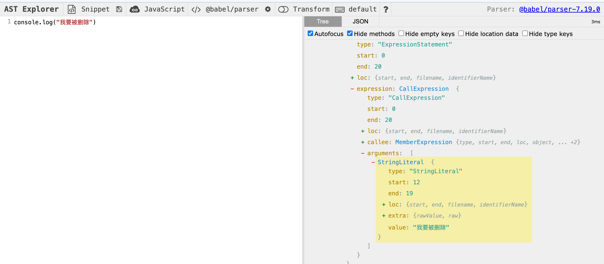
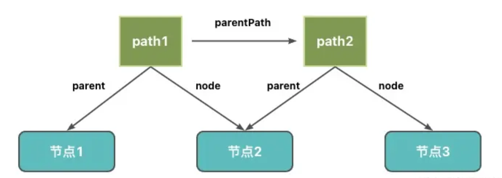
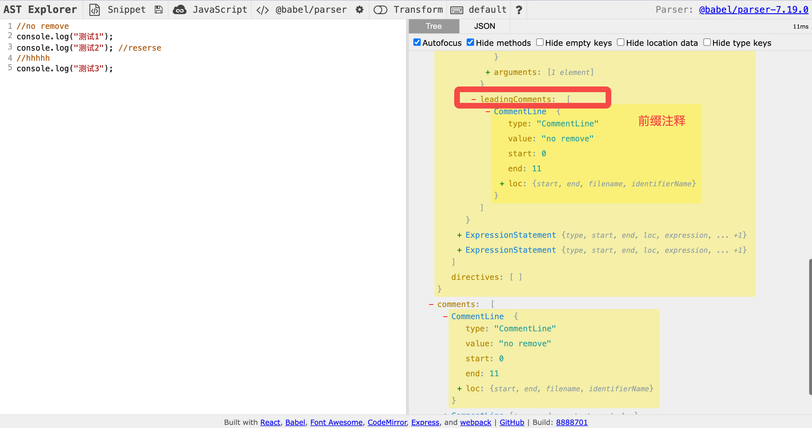

# 🔥 手撕 babel 插件-消灭 console！

写一个小插件来去除 生产环境 的 console.log

我们的目的是 去除 console.log ，我们首先需要通过 ast 查看语法树的结构。我们以下面的 console 为例：
注意 因为我们要写 babel 插件 所以我们选择 @babel/parser 库生成 ast，因为 babel 内部是使用这个库生成 ast 的



## 初见 AST

AST 是对源码的抽象，字面量、标识符、表达式、语句、模块语法、class 语法都有各自的 AST。

### Program

program 是代表整个程序的节点，它有 body 属性代表程序体，存放 statement 数组，就是具体执行的语句的集合。
可以看到我们这里的 body 只有一个 ExpressionStatement 语句，即 console.log。

### ExpressionStatement

statement 是语句，它是可以独立执行的单位，expression 是表达式，它俩唯一的区别是表达式执行完以后有返回值。所以 ExpressionStatement 表示这个表达式是被当作语句执行的。
ExpressionStatement 类型的 AST 有一个 expression 属性，代表当前的表达式。

### CallExpression

expression 是表达式，CallExpression 表示调用表达式，console.log 就是一个调用表达式。
CallExpression 类型的 AST 有一个 callee 属性，指向被调用的函数。这里 console.log 就是 callee 的值。
CallExpression 类型的 AST 有一个 arguments 属性，指向参数。这里“我会被清除”就是 arguments 的值。

### MemberExpression

Member Expression 通常是用于访问对象成员的。他有几种形式：

```js
a.b
a["b"]
new.target
super.b
```

我们这里的 console.log 就是访问对象成员 log。

> 为什么 MemberExpression 外层有一个 CallExpression 呢？
>
> 实际上，我们可以理解为，MemberExpression 中的某一子结构具有函数调用，那么整个表达式就成为了一个 Call Expression。
> MemberExpression 有一个属性 object 表示被访问的对象。这里 console 就是 object 的值。
> MemberExpression 有一个属性 property 表示对象的属性。这里 log 就是 property 的值。
> MemberExpression 有一个属性 computed 表示访问对象是何种方式。computed 为 true 表示[],false 表示. 。

### Identifier

Identifer 是标识符的意思，变量名、属性名、参数名等各种声明和引用的名字，都是 Identifer。

我们这里的 console 就是一个 identifier。Identifier 有一个属性 name 表示标识符的名字

### StringLiteral

表示字符串字面量。我们这里的 log 就是一个字符串字面量。StringLiteral 有一个属性 value 表示字符串的值

### 公共属性

每种 AST 都有自己的属性，但是它们也有一些公共的属性：

- type：AST 节点的类型
- start、end、loc：start 和 end 代表该节点在源码中的开始和结束下标。而 loc 属性是一个对象，有 line 和 column 属性分别记录开始和结束的行列号
- leadingComments、innerComments、trailingComments：表示开始的注释、中间的注释、结尾的注释，每个 AST 节点中都可能存在注释，而且可能在开始、中间、结束这三种位置，想拿到某个 AST 的注释就通过这三个属性。

## 如何写一个 babel 插件？

babel 插件是作用在 transform 阶段。

transform 阶段有@babel/traverse，可以遍历 AST，并调用 visitor 函数修改 AST。
我们可以新建一个 js 文件，其中导出一个方法，返回一个对象，对象存在一个 visitor 属性，里面可以编写我们具体需要修改 AST 的逻辑。

```js
export default () => {
  return {
    name: "@sunny-117/babel-plugin-console",
    visitor,
  };
};
复制代码;
```

## 构造 visitor 方法

path 是记录遍历路径的 api，它记录了父子节点的引用，还有很多增删改查 AST 的 api



```js
const visitor = {
  CallExpression(path, { opts }) {
    //当traverse遍历到类型为CallExpression的AST时，会进入函数内部，我们需要在函数内部修改
  },
};
```

我们需要遍历所有调用函数表达式 所以使用 CallExpression 。

## 去除所有 console

将所有的 console.log 去掉

path.get 表示获取某个属性的 path

path.matchesPattern 检查某个节点是否符合某种模式

path.remove 删除当前节点

```js
CallExpression(path, { opts }) {
  //获取callee的path
  const calleePath = path.get("callee");
  //检查callee中是否符合“console”这种模式
  if (calleePath && calleePath.matchesPattern("console", true)) {
    //如果符合 直接删除节点
    path.remove();
  }
},
```

## 增加 env api

一般去除 console.log 都是在生产环境执行 所以增加 env 参数

AST 的第二个参数 opt 中有插件传入的配置

```js
const isProduction = process.env.NODE_ENV === "production";
CallExpression(path, { opts }) {
    const { env } = opts;
    if (env === "production" || isProduction) {
        path.remove();
    }
},
```

## 增加 exclude api

我们上面去除了所有的 console，不管是 error、warning、table 都会清除，所以我们加一个 exclude api，传一个数组，可以去除想要去除的 console 类型

```js
const isArray = (arg) =>
  Object.prototype.toString.call(arg) === "[object Array]";

const { env, exclude } = opts;
if (env === "production" || isProduction) {
  removeConsoleExpression(path, calleePath, exclude);
}
const removeConsoleExpression = (path, calleePath, exclude) => {
  if (isArray(exclude)) {
    const hasTarget = exclude.some((type) => {
      return calleePath.matchesPattern("console." + type);
    });
    //匹配上直接返回不进行操作
    if (hasTarget) return;
  }
  path.remove();
};
```

## 增加 commentWords api

某些时候 我们希望一些 console 不被删除 我们可以给他添加一些注释 比如

```js
//no remove
console.log("测试1");
console.log("测试2"); //reserse
//hhhhh
console.log("测试3");
```



如上 我们希望带有 no remove 前缀注释的 console 和带有 reserse 后缀注释的 console 保留不被删除
之前我们提到 babel 给我们提供了 leadingComments（前缀注释）和 trailingComments（后缀注释）我们可以利用他们 由 AST 可知 她和 CallExpression 同级，所以我们需要获取他的父节点 然后获取父节点的属性

> path.parentPath 获取父 path
> path.node 获取当前节点

```js
const { exclude, commentWords, env } = opts;
const isFunction = (arg) =>
  Object.prototype.toString.call(arg) === "[object Function]";
// 判断是否有前缀注释
const hasLeadingComments = (node) => {
  const leadingComments = node.leadingComments;
  return leadingComments && leadingComments.length;
};
// 判断是否有后缀注释
const hasTrailingComments = (node) => {
  const trailingComments = node.trailingComments;
  return trailingComments && trailingComments.length;
};
//判断是否有关键字匹配 默认no remove || reserve 且如果commentWords和默认值是相斥的
const isReserveComment = (node, commentWords) => {
  if (isFunction(commentWords)) {
    return commentWords(node.value);
  }
  return (
    ["CommentBlock", "CommentLine"].includes(node.type) &&
    (isArray(commentWords)
      ? commentWords.includes(node.value)
      : /(no[t]? remove\b)|(reserve\b)/.test(node.value))
  );
};
const removeConsoleExpression = (path, calleePath, exclude, commentWords) => {
  //获取父path
  const parentPath = path.parentPath;
  const parentNode = parentPath.node;
  //标识是否有前缀注释
  let leadingReserve = false;
  //标识是否有后缀注释
  let trailReserve = false;
  if (hasLeadingComments(parentNode)) {
    //traverse
    parentNode.leadingComments.forEach((comment) => {
      if (isReserveComment(comment, commentWords)) {
        leadingReserve = true;
      }
    });
  }
  if (hasTrailingComments(parentNode)) {
    //traverse
    parentNode.trailingComments.forEach((comment) => {
      if (isReserveComment(comment, commentWords)) {
        trailReserve = true;
      }
    });
  }
  //如果没有前缀节点和后缀节点 直接删除节点
  if (!leadingReserve && !trailReserve) {
    path.remove();
  }
};
```

## 细节完善

我们大致完成了插件 我们引进项目里面进行测试

```js
console.log("测试 1");
//no remove
console.log("测试 2");
console.log("测试 3"); //reserve
console.log("测试 4");
```

新建.babelrc 引入插件

```json
{
  "plugins": [
    [
      "../dist/index.cjs",
      {
        "env": "production"
      }
    ]
  ]
}
```

理论上应该移除测试 1、测试 4，但是我们惊讶的发现 竟然一个 console 没有删除！！经过排查 我们大致确定了问题所在。
因为测试 2 的前缀注释同时也被 AST 纳入了测试 1 的后缀注释中了，而测试 3 的后缀注释同时也被 AST 纳入了测试 4 的前缀注释中了
所以测试 1 存在后缀注释 测试 4 存在前缀注释 所以测试 1 和测试 4 没有被删除
那么我们怎么判断呢？

### 对于后缀注释

我们可以判断后缀注释是否与当前的调用表达式处于同一行，如果不是同一行，则不将其归纳为后缀注释

```js
if (hasTrailingComments(parentNode)) {
  const {
    start: { line: currentLine },
  } = parentNode.loc;
  //traverse
  // @ts-ignore
  parentNode.trailingComments.forEach((comment) => {
    const {
      start: { line: currentCommentLine },
    } = comment.loc;

    if (currentLine === currentCommentLine) {
      comment.belongCurrentLine = true;
    }
    //属于当前行才将其设置为后缀注释
    if (isReserveComment(comment, commentWords) && comment.belongCurrentLine) {
      trailReserve = true;
    }
  });
}
```

### 对于前缀注释

因为我们在后缀注释的节点中添加了一个变量 belongCurrentLine，表示该注释是否是和节点属于同一行。
那么对于前缀注释，我们只需要判断是否存在 belongCurrentLine，如果存在 belongCurrentLine，表示不能将其当作前缀注释。

```js
if (hasLeadingComments(parentNode)) {
  parentNode.leadingComments.forEach((comment) => {
    if (isReserveComment(comment, commentWords) && !comment.belongCurrentLine) {
      leadingReserve = true;
    }
  });
}
```

# code

```js
// @ts-ignore
const isArray = (arg) =>
  Object.prototype.toString.call(arg) === "[object Array]";
// @ts-ignore
const isFunction = (arg) =>
  Object.prototype.toString.call(arg) === "[object Function]";

const isProduction = process.env.NODE_ENV === "production";

// @ts-ignore
const isReserveComment = (node, commentWords) => {
  if (isFunction(commentWords)) {
    return commentWords(node.value);
  }
  return (
    ["CommentBlock", "CommentLine"].includes(node.type) &&
    (isArray(commentWords)
      ? commentWords.includes(node.value)
      : /(no[t]? remove\b)|(reserve\b)/.test(node.value))
  );
};

// @ts-ignore
const removeConsoleExpression = (path, calleePath, exclude, commentWords) => {
  // if has exclude key exclude this
  if (isArray(exclude)) {
    // @ts-ignore
    const hasTarget = exclude.some((type) => {
      return calleePath.matchesPattern("console." + type);
    });
    if (hasTarget) return;
  }

  const parentPath = path.parentPath;
  const parentNode = parentPath.node;

  let leadingReserve = false;
  let trailReserve = false;

  if (hasLeadingComments(parentNode)) {
    //traverse
    // @ts-ignore
    parentNode.leadingComments.forEach((comment) => {
      if (
        isReserveComment(comment, commentWords) &&
        !comment.belongCurrentLine
      ) {
        leadingReserve = true;
      }
    });
  }

  if (hasTrailingComments(parentNode)) {
    const {
      start: { line: currentLine },
    } = parentNode.loc;
    //traverse
    // @ts-ignore
    parentNode.trailingComments.forEach((comment) => {
      const {
        start: { line: currentCommentLine },
      } = comment.loc;

      if (currentLine === currentCommentLine) {
        comment.belongCurrentLine = true;
      }

      if (
        isReserveComment(comment, commentWords) &&
        comment.belongCurrentLine
      ) {
        trailReserve = true;
      }
    });
  }
  if (!leadingReserve && !trailReserve) {
    path.remove();
  }
};

// @ts-ignore
// has leading comments
const hasLeadingComments = (node) => {
  const leadingComments = node.leadingComments;
  return leadingComments && leadingComments.length;
};

// @ts-ignore
// has trailing comments
const hasTrailingComments = (node) => {
  const trailingComments = node.trailingComments;
  return trailingComments && trailingComments.length;
};

const visitor = {
  // @ts-ignore
  CallExpression(path, { opts }) {
    const calleePath = path.get("callee");

    const { exclude, commentWords, env } = opts;

    if (calleePath && calleePath.matchesPattern("console", true)) {
      if (env === "production" || isProduction) {
        removeConsoleExpression(path, calleePath, exclude, commentWords);
      }
    }
  },
};

export default () => {
  return {
    name: "@sunny-117/babel-plugin-console",
    visitor,
  };
};
```
