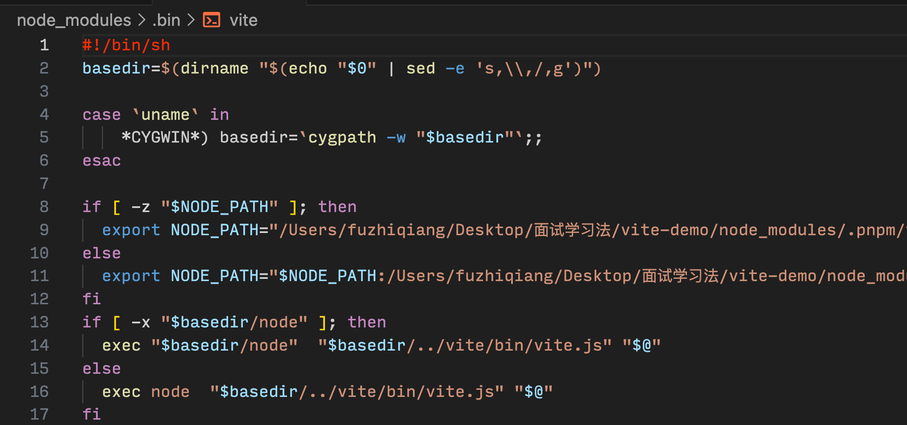

# 输入 npm run xxx 后发生了什么？

在前端开发中，我们经常使用 npm run dev 来启动本地开发环境。那么，当输入完类似 npm run xxx 的命令后，到底发生了什么呢？项目又是如何被启动的？

首先我们知道，node 可以把 .js 文件当做脚本来运行，例如启动后台项目时经常会输入：

```shell
node app.js
```

这个是直接使用全局安装的 node 命令来执行了 ./src 目录下的 app.js 文件。

而当我们使用 npm （或者 yarn）来管理项目时，会在根目录下生成一个 package.json 文件，其中的 scripts 属性，就是用于配置 npm run xxx 命令的，比如以下配置：

```json
"scripts": {
    "dev": "vite",
    "build": "vite build",
    "preview": "vite preview"
},
```

再看对应的 node_modules 目录下的.bin 目录，里面有一个 vite 文件

打开 vite 文件可以看到 #!/bin/sh，表示这是一个脚本（node 可以执行）。



当执行 npm run dev 时，首先会去 package.json 文件中找到 script 属性的"dev",然后再到 node_modules 目录下的.bin 目录中找到"dev"对应的"vite"，执行 vite（由前面可知 vite 是一个脚本，类似于前面提过的 node app.js）。 再如：

```json
{
  "dev": "./node_modules/.bin/nodemon bin/www"
}
```

当执行 npm run dev 时，相当于执行 "./node_modules/.bin/nodemon bin/www"，其中 bin/www 作为参数传入。

总之：先去 package.json 的 scripts 属性中查找 xxx1,再去./node_modules/.bin 中查找 xxx1 对应的 sss1,执行 sss1 文件）

## 问题分析

:::tip
问题 1： 为什么不直接执行 sss 而要执行 xxx 呢？
:::
直接执行 sss 会报错，因为操作系统中不存在 sss 这一条指令。
:::tip
问题 2： 为什么执行 npm run xxx（或者 yarn xxx）时就能成功呢？
:::
因为我们在安装依赖的时候，是通过 npm i xxx (或者 yarn ...)来执行的，例如 npm i @vue/cli-service，npm 在 安装这个依赖的时候，就会 node_modules/.bin/ 目录中创建好名为 vue-cli-service 的几个可执行文件了。

.bin 目录下的文件，是一个个的软链接，打开文件可以看到文件顶部写着 #!/bin/sh ，表示这是一个脚本，可由 node 来执行。当使用 npm run xxx 执行 sss 时，虽然没有安装 sss 的全局命令，但是 npm 会到 ./node_modules/.bin 中找到 sss 文件作为脚本来执行，则相当于执行了 ./node_modules/.bin/sss。

即： **运行 npm run xxx 的时候，npm 会先在当前目录的 node_modules/.bin 查找要执行的程序，如果找到则运行；没有找到则从全局的 node_modules/.bin 中查找； 全局目录还是没找到，就会从 window 的 path 环境变量中查找有没有其他同名的可执行程序。**

## [浅析 npm install 机制阅读](https://juejin.cn/post/7206998548343504956)
