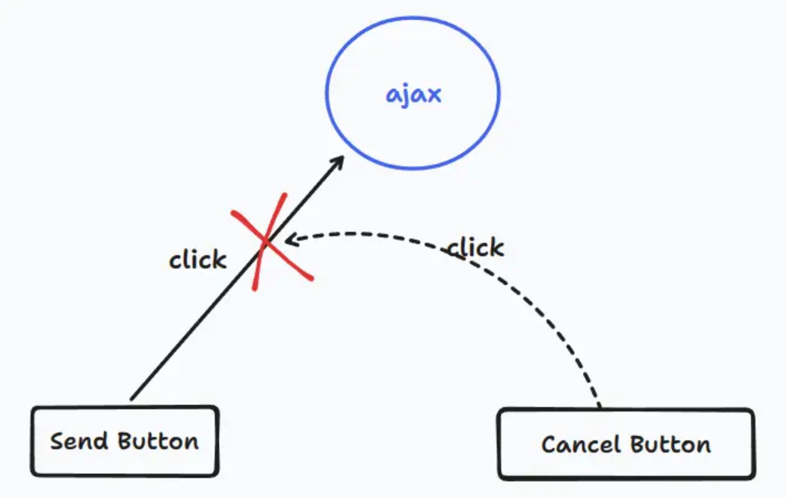

# 面试官：能不能给 Promise 增加取消功能和进度通知功能... 我：？

问题：点击一个 button，触发一次这个函数，但是既没有走成功回调，也没有走失败回调。问下一次点击，类似取消上次 promise 的操作，但没有这种方法，怎么去做。我又说了提供变量控制，这个可以，还有就说不出来了。面试官说可以包装 promise，写一个类，提供一个 cancel 方法，类似这种，主要是不想拿到期望的 promise 值。

原面经链接： [美团暑期一面\_牛客网 (nowcoder.com)](https://www.nowcoder.com/feed/main/detail/ee9470049a404441a96520d619a0b6dc)

## 取消功能

我们都知道 Promise 的状态是不可逆的，也就是说只能从 pending -> fulfilled 或 pending -> rejected，这一点是毋庸置疑的。但现在可能会有这样的需求，在状态转换过程当中我们可能不再想让它进行下去了，也就是说让它 永远停留至 pending 状态 。奇怪了，想要一直停留在 pending，那我不调用 resolve 和 reject 不就行了 🤔

```js
const p = new Promise((resolve, reject) => {
  setTimeout(() => {
    // handler data, no resolve and reject
  }, 1000);
});
console.log(p); // Promise {<pending>} 💡
```

但注意我们的需求条件，是 **在状态转换过程中** ，也就是说必须有调用 resolve 和 reject，只不过中间可能由于某种条件，阻止了这两个调用。
其实这个场景和超时中断有点类似但还是不太一样，我们先利用 Promise.race 来看看：模拟一个发送请求，如果超时则提示超时错误：

```js
const getData = () =>
  new Promise((resolve) => {
    setTimeout(() => {
      console.log("发送网络请求获取数据"); // ❗
      resolve("success get Data");
    }, 2500);
  });

const timer = () =>
  new Promise((_, reject) => {
    setTimeout(() => {
      reject("timeout");
    }, 2000);
  });

const p = Promise.race([getData(), timer()])
  .then((res) => {
    console.log("获取数据:", res);
  })
  .catch((err) => {
    console.log("超时: ", err);
  });
```

问题是现在确实能够确认超时了，但 race 的本质是内部会遍历传入的 promise 数组对它们的结果进行判断，那好像并没有实现网络请求的中断哎 🤔，即使超时网络请求还会发出。

而我们想要实现的取消功能是希望不借助 race 等其他方法并且不发送请求。比如让用户进行控制， 一个按钮用来表示发送请求，一个按钮表示取消 ，来中断 promise 的流程：当然这里我们不讨论关于请求的取消操作，重点在 Promise 上



其实按照我们的理解只用 Promise 是不可能实现这样的效果的，因为从一开始接触 Promise 就知道一旦调用了 resolve/reject 就代表着要进行状态转换。不过 取消 这两个字相信一定不会陌生， clearTimeout 、 clearInterval 嘛。

OK，如果你想到了这一点这个功能就出来了，我们直接先来看红宝书上给出的答案：

```html
<!DOCTYPE html>
<html lang="en">
  <head>
    <meta charset="UTF-8" />
    <meta name="viewport" content="width=device-width, initial-scale=1.0" />
    <title>Document</title>
  </head>
  <body>
    <button id="send">Send</button>
    <button id="cancel">Cancel</button>

    <script>
      class CancelToken {
        constructor(cancelFn) {
          this.promise = new Promise((resolve, reject) => {
            cancelFn(() => {
              console.log("delay cancelled");
              resolve();
            });
          });
        }
      }
      const sendButton = document.querySelector("#send");
      const cancelButton = document.querySelector("#cancel");

      function cancellableDelayedResolve(delay) {
        console.log("prepare send request");
        return new Promise((resolve, reject) => {
          const id = setTimeout(() => {
            console.log("ajax get data");
            resolve();
          }, delay);

          const cancelToken = new CancelToken((cancelCallback) =>
            cancelButton.addEventListener("click", cancelCallback)
          );
          cancelToken.promise.then(() => clearTimeout(id));
        });
      }
      sendButton.addEventListener("click", () =>
        cancellableDelayedResolve(1000)
      );
    </script>
  </body>
</html>
```

这段代码说实话是有一点绕的，而且个人觉得是有多余的地方，我们一点一点来看：

首先针对于 sendButton 的事件处理函数，这里传入了一个 delay，可以把它理解为 取消功能期限 ，超过期限就要真的发送请求了。我们看该处理函数内部返回了一个 Promise，而 Promise 的 executor 中首先开启了定时器，并且实例化了一个 CancelToken，而在 CancelToken 中才给 cancelButton 添加点击事件。

这里的 CancelToken 就是我觉得最奇怪的地方，可能没有体会到这个封装的技巧。它的内部创建了一个 Promise，绕了一圈后相当于 cancelButton 的点击处理函数是调用这个 Promise 的 resolve，最终是在其 pending -> fuilfilled，即 then 方法里才去取消定时器，那为什么不直接在事件处理函数中取消呢？难道是为了不影响主执行栈的执行所以才将其推到微任务处理 🤔？

介于自己没理解，我就按照自己的思路封装个不一样的 🤣：

```js
const sendButton = document.querySelector("#send");
const cancelButton = document.querySelector("#cancel");

class CancelPromise {
  // delay: 取消功能期限  request：获取数据请求(必须返回 promise)
  constructor(delay, request) {
    this.req = request;
    this.delay = delay;
    this.timer = null;
  }

  delayResolve() {
    return new Promise((resolve, reject) => {
      console.log("prepare request");
      this.timer = setTimeout(() => {
        console.log("send request");
        this.timer = null;
        this.req().then(
          (res) => resolve(res),
          (err) => reject(err)
        );
      }, this.delay);
    });
  }

  cancelResolve() {
    console.log("cancel promise");
    this.timer && clearTimeout(this.timer);
  }
}

// 模拟网络请求
function getData() {
  return new Promise((resolve) => {
    setTimeout(() => {
      resolve("this is data");
    }, 2000);
  });
}

const cp = new CancelPromise(1000, getData);

sendButton.addEventListener("click", () =>
  cp.delayResolve().then((res) => {
    console.log("拿到数据：", res);
  })
);
cancelButton.addEventListener("click", () => cp.cancelResolve());
```

## 进度通知功能

进度通知？那不就是类似发布订阅嘛？还真是，我们来看红宝书针对这块的描述：

执行中的 Promise 可能会有不少离散的“阶段”，在最终解决之前必须依次经过。某些情况下，监控 Promise 的执行进度会很有用

这个需求就比较明确了，我们直接来看红宝书的实现吧，核心思想就是扩展之前的 Promise，为其添加 notify 方法作为监听，并且在 executor 中增加额外的参数来让用户进行通知操作：

```js
class TrackablePromise extends Promise {
  constructor(executor) {
    const notifyHandlers = [];
    super((resolve, reject) => {
      return executor(resolve, reject, (status) => {
        notifyHandlers.map((handler) => handler(status));
      });
    });
    this.notifyHandlers = notifyHandlers;
  }
  notify(notifyHandler) {
    this.notifyHandlers.push(notifyHandler);
    return this;
  }
}
let p = new TrackablePromise((resolve, reject, notify) => {
  function countdown(x) {
    if (x > 0) {
      notify(`${20 * x}% remaining`);
      setTimeout(() => countdown(x - 1), 1000);
    } else {
      resolve();
    }
  }
  countdown(5);
});

p.notify((x) => setTimeout(console.log, 0, "progress:", x));
p.then(() => setTimeout(console.log, 0, "completed"));
```

emm 就是这个例子总感觉不太好，为了演示这种效果还用了递归，大伙们觉得呢？

不好就自己再写一个 🤣！不过这次的实现就没有多大问题了，基本功能都具备也没有什么阅读障碍，我们再添加一个稍微带点实际场景的例子吧：

```js
// 模拟数据请求
function getData(timer, value) {
  return new Promise((resolve) => {
    setTimeout(() => {
      resolve(value);
    }, timer);
  });
}

let p = new TrackablePromise(async (resolve, reject, notify) => {
  try {
    const res1 = await getData1();
    notify("已获取到一阶段数据");
    const res2 = await getData2();
    notify("已获取到二阶段数据");
    const res3 = await getData3();
    notify("已获取到三阶段数据");
    resolve([res1, res2, res3]);
  } catch (error) {
    notify("出错！");
    reject(error);
  }
});

p.notify((x) => console.log(x));
p.then((res) => console.log("Get All Data:", res));
```

## End

关于取消功能在红宝书上 TC39 委员会也曾准备增加这个特性，但相关提案最终被撤回了。结果 ES6 Promise 被认为是“激进的”：只要 Promise 的逻辑开始执行，就没有办法阻止它执行到完成。

实际上我们学了这么久的 Promise 也默认了这一点，因此这个取消功能反而就不太符合常理，而且十分鸡肋。比如说我们有使用 then 回调接收数据，但因为你点击了取消按钮造成 then 回调不执行，我们知道 Promise 支持链式调用，那如果还有后续操作都将会被中断，这种中断行为 debug 时也十分痛苦，更何况最麻烦的一点是你还需要传入一个 delay 来表示取消的期限，而这个期限到底要设置多少才合适呢...
