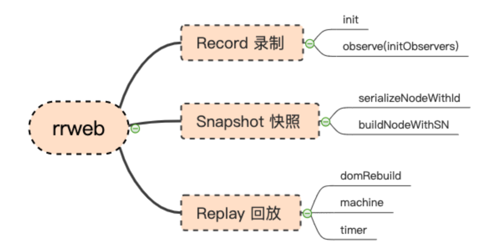

# 前端录制回放系统初体验

## 问题背景

### 什么是前端录制回放?

顾名思义，就是录制用户在网页中的各种操作，并且支持能随时回放操作。

### 为什么需要？

说到需要就不得不说一个经典的场景，一般前端做异常监控和错误上报，会采用自研或接入第三方 SDK 的形式，来收集和上报网站交互过程中 JavaScript 的报错信息和其它相关数据，也就是埋点。
在传统的埋点方案中，根据 SourceMap 能定位到具体报错代码文件和行列信息等。基本能定位大部分场景问题，但有一些情况下是很难复现错误，多是在测试扯皮的时候，程序员口头禅之一（我这里没有报错呀，是不是你电脑有问题）。
要是能把出错的操作过程录制下来就好了，这样就能方便我们复现场景了，且留存证据，好像是自己给自己挖了个坑。

### 如何实现

前端能实现录视频？我第一反应就是质疑，接着我就是一波 Google ，发现确实有可行方案。
在 Google 之前，我想到了通过设定定时器，对视图窗口进行截图，截图可用 canvas2html 的方式来实现，但这种方式无疑会造成性能问题，立马否决。
下面介绍我所「知道」的 Google 的方案

## 思路初现

网页本质上是一个 DOM 节点形式存在，通过浏览器渲染出来。我们是否可以把 DOM 以某种方式保存起来，并且在不同时间节点持续记录 DOM 数据状态。再将数据还原成 DOM 节点渲染出来完成回放呢？

### 操作记录

通过 `document.documentElement.cloneNode()` 克隆到 DOM 的数据对象，此时这个数据不能直接通过接口传输给后端，需要进行一些格式化预处理，处理成方便传输及存储的数据格式。最简单的方式就是进行序列化，也就是转换成 JSON 数据格式。

```js
// 序列化后
let docJSON = {
  type: "Document",
  childNodes: [
    {
      type: "Element",
      tagName: "html",
      attributes: {},
      childNodes: [
        {
          type: "Element",
          tagName: "head",
          attributes: {},
          childNodes: [],
        },
      ],
    },
  ],
};
```

有完整的 DOM 数据之后，还需要在 DOM 变化时进行监听，记录每次变化的 DOM 节点信息。对数据进行监听可用 MutationObserver ，它是一个可以监听 DOM 变化的 API 。

```js
const observer = new MutationObserver((mutationsList) => {
  console.log(mutationsList); // 发生变化的数据
});
// 以上述配置开始观察目标节点
observer.observe(document, {});
```

除了对 DOM 变化进行监听以外，还有一个就是事件监听，用户与网页的交互多是通过鼠标，键盘等输入设备来进行。而这些交互的背后就是 JavaScript 的事件监听。事件监听可以通过绑定系统事件来完成，同样是需要记录下来，以鼠标移动为例：

```js
// 鼠标移动
document.addEventListener("mousemove", (e) => {
  // 伪代码 获取鼠标移动的信息并记录下来
  positions.push({
    x: clientX,
    y: clientY,
    timeOffset: Date.now() - timeBaseline,
  });
});
```

### 回放操作

数据已经有了，接着就是回放，回放本质上是将 JSON 数据还原成 DOM 节点渲染出来。那就将快照数据还原就可以啊「嘴强王者」，数据还原并非那么容易啊！

### 渲染环境

首先为了确保回放过程代码隔离，需要沙箱环境， iframe 标签可以做到，并且 iframe 提供了 sandbox 属性可配置沙箱。沙箱环境的作用是确保代码安全并且不被干扰。

```html
<iframe sandbox srcdoc></iframe>
```

> sanbox 属性可以做到沙箱作用， [点击查看文档](https://developer.mozilla.org/zh-CN/docs/Web/HTML/Element/iframe)
> srcdoc 可以直接设置成一段 html 代码

### 数据还原

快照重组主要是 DOM 节点的重组，有点像虚拟 DOM 转成真实文档节点的过程，但是事件类型快照是不需要重组。

### 定时器

有了数据和环境，还需要定时器。通过定时器不停渲染 DOM ，实质上就是一个播放视频的效果， `requestAnimationFrame` 是最合适的。

`requestAnimationFrame` 执行机制在浏览器下一次 repaint(重绘)之前执行，执行频率取决于浏览器刷新频率，更适合制作动画效果

至此有一个大概的想法，距离落地还是有段距离。得益于开源，我们可上 Github 看看有没有合适的轮子可复制（借鉴），刚好有现成的一框架 「rrweb」 ，不妨一起看看。

## rrweb 框架

rrweb 是一个前端录制和回放的框架。全称 record and replay the web ，顾名思义就是可以录制和回放 web 界面中的操作，其核心原理就是上面介绍的方案。

rrweb 包含三个部分：

- rrweb-snapshot 主要处理 DOM 结构序列化和重组；
- rrweb 主要功能是录制和回放；
- rrweb-player 一个视频播放器 UI 空间

通过 rrweb.record 方法来录制页面， emit 回调可接受到录制的数据。

```js
// 1.录制
let events = []; // 记录快照

rrweb.record({
  emit(event) {
    // 将 event 存入 events 数组中
    events.push(event);
  },
});
```

通过 rrweb.Replayer 可回放视频，需要传递录制好的数据。

```js
// 2.回放
const replayer = new rrweb.Replayer(events);
replayer.play();
```

## rrweb 源码

按照以上所说的思路，接下来会解析其中一些关键代码，当然只是在我个人理解上做的一些分析，实际上 rrweb 源码远不止这些。



核心部分为三大块： record (录制)、 replay 回放、 snapshot 快照。

### Record 录制

在 DOM 加载完成后， record 会做一次完整的 DOM 序列化，我们把它叫做全量快照，全量快照记录了整个 HTML 数据结构。
在 record.ts 中找到关键的入口函数的定义 init ，入口函数是会在 document 加载完成或（可交互，完成）时调用了 takeFullSnapshot 以及 observe(document) 函数。

```js
if (
    document.readyState === 'interactive' ||
    document.readyState === 'complete'
) {
    init();
} else {
    on('load',() => { init(); },),
}
const init = () => {
    takeFullSnapshot(); // 生成全量快照
    handlers.push(observe(document)); //监听器
};
```

document.readyState 包含三种状态：

1. 可交互 interactive ；
2. 正在加载中 loading ；
3. 完成 complete

takeFullSnapshot 从字面意思能看出其作用是生成「完整」的快照，也就是会将 document 序列化出一个完整的数据，称之为 「全量快照」 。
所有序列化相关操作都是使用 snapshot 完成， snapshot 接受一个 dom 对象和一个配置对象传递 document 将整个页面序列化得到完成的快照数据。

```js
// 生成全量快照
takeFullSnapshot = (isCheckout = false) => {
  const [node, idNodeMap] = snapshot(document, {
    //...一些配置项
  });
};
```

> idNodeMap 是一个 id 为 key , DOM 对象为 value 的 key-value 键值对对象

observe(document) 是一些监听器的初始化，同样是将整个 document 对象传过去进行监听，通过调用 initObservers 来初始化一些监听器。

```js
const observe = (doc: Document) => {
  return initObservers();
};
```

在 observer.ts 文件中可以找到 initObservers 函数定义，该函数初始化了 11 个监听器，可以分为 DOM 类型 / Event 事件类型 / Media 媒体三大类：

```js
export function initObservers(
// dom
const mutationObserver = initMutationObserver();
const mousemoveHandler = initMoveObserver();
const mouseInteractionHandler = initMouseInteractionObserver();
const scrollHandler = initScrollObserver();
const viewportResizeHandler = initViewportResizeObserver();
// ...
)
```

- DOM 变化监听器，主要有 DOM 变化(增删改), 样式变化，核心是通过 MutationObserver 来实现

```js
let mutationObserverCtor = window.MutationObserver;

const observer = new mutationObserverCtor(
  // 处理变化的数据
  mutationBuffer.processMutations.bind(mutationBuffer)
);
observer.observe(doc, {});
return observer;
```

- 交互监听-以鼠标移动 initMoveObserver 为例

```js
// 鼠标移动记录
function initMoveObserver() {
  const updatePosition =
    (throttle < MouseEvent) |
    (TouchEvent >
      ((evt) => {
        positions.push({
          x: clientX,
          y: clientY,
        });
      }));
  const handlers = [
    on("mousemove", updatePosition, doc),
    on("touchmove", updatePosition, doc),
  ];
}
```

- 媒体类型监听器，有 canvas / video / audio ，以 video 为例，本质上记录播放和暂停状态， mediaInteractionCb 将 play / pause 状态回调出来。

```js
function initMediaInteractionObserver(): listenerHandler {
    mediaInteractionCb({
        type: type === 'play' ? MediaInteractions.Play : MediaInteractions.Pause,
        id: mirror.getId(target as INode),
    });
}

```

### Snapshot 快照

snapshot 负责序列化和重组的功能，主要通过 serializeNodeWithId 处理 DOM 序列化和 rebuildWithSN 函数处理 DOM 重组。
serializeNodeWithId 函数负责序列化，主要做了三件事：

- 调用 serializeNode 序列化 Node ；
- 通过 genId() 生成唯一 ID 并绑定到 Node 中；
- 递归实现序列化子节点，并最终返回一个带 ID 的对象

```js
// 序列化一个带有ID的DOM
export function serializeNodeWithId(n) {
  // 1. 序列化 核心函数 serializeNode
  const _serializedNode = serializeNode(n);
  // 2. 生成唯一ID
  let id = genId();
  // 绑定ID
  const serializedNode = Object.assign(_serializedNode, { id });

  // 3.子节点序列化-递归
  for (const childN of Array.from(n.childNodes)) {
    const serializedChildNode = serializeNodeWithId(childN, bypassOptions);
    if (serializedChildNode) {
      serializedNode.childNodes.push(serializedChildNode);
    }
  }
}
```

serializeNodeWithId 核心是通过 serializeNode 序列化 DOM ，针对不同的节点分别做了一些特殊处理。

节点属性的处理:

```js
for (const { name, value } of Array.from((n as HTMLElement).attributes)) {
    attributes[name] = transformAttribute(doc, tagName, name, value);
}
```

处理外联 css 样式，通过 getCssRulesString 获取到具体样式代码，并且储存到 attributes 中。

```js
const cssText = getCssRulesString(stylesheet as CSSStyleSheet);
if (cssText) {
    attributes._cssText = absoluteToStylesheet(
        cssText,
        stylesheet!.href!,
    );
}
```

处理 form 表单，逻辑是保存选中状态，并且做了一些安全处理，例如密码框内容替换成 \* 。

```js
if (
    attributes.type !== 'radio' &&
    attributes.type !== 'checkbox' &&
    // ...
) {
    attributes.value = maskInputOptions[tagName]
        ? '*'.repeat(value.length)
        : value;
  } else if (n.checked) {
    attributes.checked = n.checked;
  }
```

canvas 状态保存通过 toDataURL 保存 canvas 数据：

```js
attributes.rr_dataURL = (n as HTMLCanvasElement).toDataURL();
```

rebuild 负责重建 DOM :

- 通过 buildNodeWithSN 函数重组 Node
- 递归调用 重组子节点

```js
export function buildNodeWithSN(n) {
  // DOM 重组核心函数 buildNode
  let node = buildNode(n, { doc, hackCss });
  // 子节点重建并且appendChild
  for (const childN of n.childNodes) {
    const childNode = buildNodeWithSN(childN);
    if (afterAppend) {
      afterAppend(childNode);
    }
  }
}
```

### Replay 回放

回放部分在 replay.ts 文件中，先创建沙箱环境，接着或进行重建 document 全量快照，在通过 requestAnimationFrame 模拟定时器的方式来播放增量快照。
replay 的构造函数接收两个参数，快照数据 events 和 配置项 config

```js
export class Replayer {
  constructor(events, config) {
    // 1.创建沙箱环境
    this.setupDom();
    // 2.定时器
    const timer = new Timer();
    // 3.播放服务
    this.service = new createPlayerService(events, timer);
    this.service.start();
  }
}
```

构造函数中最核心三步，创建沙箱环境，定时器，和初始化播放器并且启动。播放器创建依赖 events 和 timer ，本质上还是使用 timer 来实现播放。

#### 沙箱环境

首先，在 replay.ts 的构造函数中可以找打 this.setupDom 的调用， setupDom 核心是通过 iframe 来创建出一个沙箱环境。

```js
private setupDom() {
  // 创建iframe
  this.iframe = document.createElement('iframe');
  this.iframe.style.display = 'none';
  this.iframe.setAttribute('sandbox', attributes.join(' '));
}
```

#### 播放服务

同样在 replay.ts 构造函数中，调用 createPlayerService 函数来创建播放器服务器，该函数在同级目录下的 machine.ts 中定义了，核心思路是通过给定时器 timer 加入需要执行的快照动作 actions , 在调用 timer.start() 开始回放快照。

```js
export function createPlayerService() {
    //...
    play(ctx) {
        // 获取每个 event 执行的 doAction 函数
        for (const event of needEvents) {
            //..
            const castFn = getCastFn(event);
            actions.push({
                doAction: () => {
                    castFn();
                }
            })
            //..
         }
         // 添加到定时器队列中
         timer.addActions(actions);
         // 启动定时器播放 视频
         timer.start();
    },
    //...
}
```

> 播放服务使用到第三方库 @xstate/fsm 状态机来控制各种状态（播放，暂停，直播）

定时器 timer.ts 也是在同级目录下，核心是通过 requestAnimationFrame 实现了定时器功能， 并对快照回放，以队列的形式存储需要播放的快照 actions ，接着在 start 中递归调用 action.doAction 来实现对应时间节点的快照还原。

```js
export class Timer {
    // 添加队列
    public addActions(actions: actionWithDelay[]) {
        this.actions = this.actions.concat(actions);
    }
    // 播放队列
    public start() {
        function check() {
            // ...
            // 循环调用actions中的doAction 也就是 castFn 函数
            while (actions.length) {
                const action = actions[0];
                actions.shift();
                // doAction 会对快照进行回放动作，针对不同快照会执行不同动作
                action.doAction();
            }
            if (actions.length > 0 || self.liveMode) {
                self.raf = requestAnimationFrame(check);
            }
        }
        this.raf = requestAnimationFrame(check);
    }
}
```

doAction 在不同类型快照会执行不同动作，在播放服务中 doAction 最终会调用 getCastFn 函数来做了一些 case :

```js
private getCastFn(event: eventWithTime, isSync = false) {
    switch (event.type) {
        case EventType.DomContentLoaded: //dom 加载解析完成
        case EventType.FullSnapshot: // 全量快照
        case EventType.IncrementalSnapshot: //增量
            castFn = () => {
                this.applyIncremental(event, isSync);
            }
    }
}
```

applyIncremental 函数会增对不同的增量快照做不同处理，包含 DOM 增量， 鼠标交互，页面滚动等，以 DOM 增量快照的 case 为例，最终会走到 applyMutation 中：

```js
private applyIncremental(){
  switch (d.source) {
      case IncrementalSource.Mutation: {
        this.applyMutation(d, isSync); // DOM变化
        break;
      }
      case IncrementalSource.MouseMove: //鼠标移动
      case IncrementalSource.MouseInteraction: //鼠标点击事件

  }
}
```

applyMutation 才是最终执行 DOM 还原操作的地方，包含 DOM 的增删改步骤:

```js
private applyMutation(d: mutationData, useVirtualParent: boolean) {
    d.removes.forEach((mutation) => {
        //.. 移除dom
    });
    const appendNode = (mutation: addedNodeMutation) => {
        // 添加dom到具体节点下
    };
    d.adds.forEach((mutation) => {
        // 添加
        appendNode(mutation);
    });
    d.texts.forEach((mutation) => {
        //...文本处理
    });
    d.attributes.forEach((mutation) => {
        //...属性处理
    });
}
```

以上就是回放的关键流程实现代码， rrweb 中不仅仅是做了这些，还包含数据压缩，移动端处理，隐私问题等等细节处理，有兴趣可自行查看源码。
