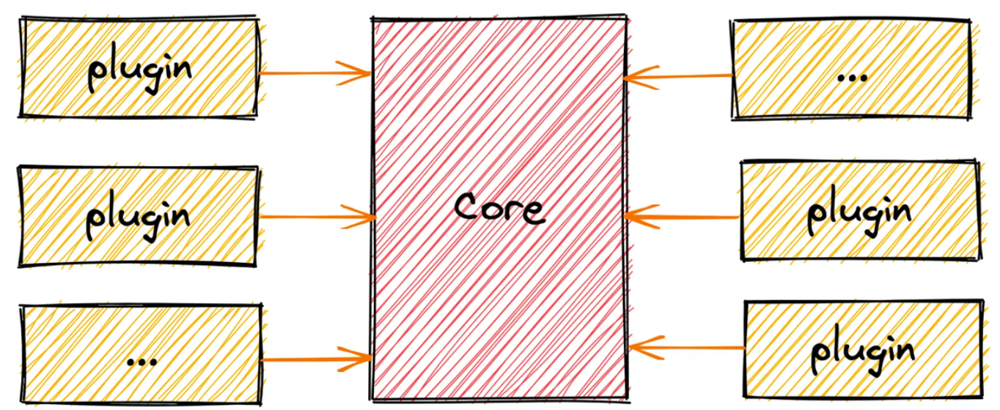

# 🔥 微内核架构在前端的实现及其应用

## 前置知识

微内核架构，大白话讲就是插件系统，就像下面这张图：



从上图中可以看出，微内核架构主要由两部分组成：Core + plugin，也就是一个内核和多个插件。通常来说：

- 内核主要负责一些基础功能、核心功能以及插件的管理；
- 插件则是一个独立的功能模块，用来丰富和加强内核的能力。

内核和插件通常是解耦的，在不使用插件的情况下，内核也能够独立运行。看得出来这种架构拓展性极强，在前端主流框架中都能看到它的影子：

- 你在用 vue 的时候，可以用 Vue.use()
- webpack 用的一些 plugins
- babel 用的一些 plugins
- 浏览器插件
- vscode 插件
- koa 中间件（中间件也可以理解为插件）
- 甚至是 jQuery 插件
- ...

## 如何实现

话不多说，接下来就直接开撸，实现一个微内核系统。不过在做之前，我们要先明确要做什么东西，这里就以文档编辑器为例子吧，每篇文档由多个 Block 区块组成，每个 Block 又可以展示不同的内容（列表、图片、图表等），这种情况下，我们要想扩展文档没有的功能（比如脑图），就很适合用插件系统做啦！

### 如何调用

通常在开发之前，我们会先确定一下期望的调用方式，大抵应该是下面这个样子 👇🏻：

```js
// 内核初始化
const core = new Core();
// 使用插件
core.use(new Plugin1());
core.use(new Plugin2());
// 开始运行
core.run();
```

### Core 和 Plugin 的实现

插件是围绕内核而生的，所以我们先来实现内核的部分吧，也就是 Core 类。通常内核有两个用途：一个是实现基础功能；一个是管理插件。基础功能要看具体使用场景，它是基于业务的，这里就略过了。我们的重点在插件，要想能够在内核中使用插件肯定是要在内核中开个口子的，最基本的问题就是如何注册、如何执行。一般来说插件的格式会长下面这个样子：

```ts
interface IPlugin {
  /** 插件名字 */
  name: string;
  /** 插件能力，通常是个函数，也可以叫 apply、exec、handle */
  fn: Function;
}
```

再看看前面定义的调用方式， core.use() 就是向内核中注册插件了，而 core.run() 则是执行，也就是说 Core 中需要有 use 和 run 这两个方法，于是我们就能简单写出如下代码 👇🏻：

```ts
/** 内核 Core ：基础功能 + 插件调度器 */
class Core {
  pluginMap: Map<string, IPlugin> = new Map();
  constructor() {
    console.log("实现内核基础功能：文档初始化");
  }
  /** 插件注册，也可以叫 register，通常以注册表的形式实现，其实就是个对象映射 */
  use(plugin: IPlugin): Core {
    this.pluginMap.set(plugin.name, plugin);
    return this; // 方便链式调用
  }
  /** 插件执行，也可以叫 start */
  run() {
    this.pluginMap.forEach((plugin) => {
      plugin.fn();
    });
  }
}
class Plugin1 implements IPlugin {
  name = "Block1";
  fn() {
    console.log("扩展文档功能：Block1");
  }
}
class Plugin2 implements IPlugin {
  name = "Block2";
  fn() {
    console.log("扩展文档功能：Block2");
  }
}
// 运行结果如下：
// 实现内核基础功能：文档初始化
// 扩展文档功能：Block1
// 扩展文档功能：Block2
```

### 设计思想

一个好的架构肯定是能够体现一些设计模式思想的：

- 单一职责：每个插件相互独立，只负责其对应的功能模块，也方便进行单独测试。如果把功能点都写在内核里，就容易造成高耦合。
- 开放封闭：也就是我们扩展某个功能，不会去修改老代码，每个插件的接入成本是一样的，我们也不用关心内核是怎么实现的，只要知道它暴露了什么 api，会用就行。
- 策略模式：比如我们在渲染文档的某个 Block 区块时，需要根据不同 Block 类型（插件名、策略名）去执行不同的渲染方法（插件方法、策略），当然了，当前的代码体现的可能不是很明显。
- 还有一个就是控制反转：这个暂时还没体现，但是下文会提到，简单来说就是通过依赖注入实现控制权的反转

## 重点问题

### 通讯问题

前面我们说道，内核和插件是解耦的，那如果我需要在插件中用到一些内核的功能，该怎么和内核通信呢？插件与插件之间又该怎么通信呢？别急，先来解决第一个问题，这个很简单，既然插件要用内核的东西，那我把内核暴露给插件不就好了，就像下面这样 👇🏻：

```ts
interface IPlugin {
  /** 插件名字 */
  name: string;
  /** 插件能力：这个 ctx 就是内核 */
  fn(ctx: Core): void;
}
class Core {
  run() {
    this.pluginMap.forEach((plugin) => {
      plugin.fn(this); // 注意这里，我们把 this 传递了进去
    });
  }
}
```

这样一来我们就能在插件中获取 Core 实例了（也可以叫做上下文），相应的就能够用内核的一些东西了。比如内核中通常会有一些系统基础配置信息（isDev、platform、version 等），那我们在插件中就能根据不同环境、不同平台、不同版本进行进一步处理，甚至是更改内核的内容。
这个暴露内核的过程其实就是前文提到的控制反转，什么意思呢？比如通常情况下我们要在一个类中要使用另外一个类，你会怎么做呢？是不是会直接在这个类中直接实例化另外一个类，这个就是正常的控制权。现在呢，我们虽然需要在内核中使用插件，但是我们把内核实例暴露给了插件，变成了在插件中使用内核，注意，此时主动权已经在插件这里了，这就是通过依赖注入实现了控制反转，可以好仔体会一下 🤯。
这种方式虽然我们能够引用和修改到内核的一些信息，但是好像不能干预内核初始化和执行的过程，要是想在内核初始化和执行过程中做一些处理该怎么办呢？我们可以引入事件机制，也就是发布订阅模式，在内核执行过程中抛出一些事件，然后由插件去监听相应的事件，我们可以叫 events，也可以叫 hooks（webpack 里面就是 hooks），具体实现就像下面这样：

```js
import { EventEmitter } from "events"; // webpack 中使用 tapable，很强大的一个发布订阅库

class Core {
  events: EventEmitter = new EventEmitter(); // 也可以叫 hooks，就是发布订阅
  constructor() {
    this.events.emit("beforeInit");
    console.log("实现内核基础功能：文档初始化");
    this.events.emit("afterInit");
  }
  run() {
    this.events.emit("before all plugins");
    this.pluginMap.forEach((plugin) => {
      plugin.fn(this);
    });
    this.events.emit("after all plugins");
  }
}
// 插件中可以这样调用：this.events.on('xxxx');
```

我们也可以改成生命周期的形式，比如：

```ts
class Core {
  constructor(opts?: IOption) {
    opts?.beforeCreate();
    console.log("实现内核基础功能：文档初始化");
    opts?.afterCreate();
  }
}
```

这就是生命周期钩子。除了内核本身的生命周期之外，插件也可以有，一般分为加载、运行和卸载三部分，道理类似。当然这里要注意上面两种通信方式的区别， hooks 侧重的是时机，它会在特定阶段触发，而 ctx 则侧重于共享信息的传递。
至于插件和插件的通信，通常来说在这个模式中使用相互影响的插件是不友好的，也不建议这么做，但是如果一定需要的话可以通过内核和一些 hooks 来做桥接。

### 插件的调度

我们思考一个问题，插件的加载顺序对内核有影响吗？多个插件之间应该如何运行，它们是怎样的关系？看看我们的代码是直接 forEach 遍历执行的，这样的对吗？此处可以停下来思考几秒种 🤔。

通常来说多个插件有以下几种运行方式：

具体采用哪种方式就要看我们的具体业务场景了，比如我们的业务是文档编辑器，插件主要用于扩展文档的 Block 功能，所以顺序不是很重要，相当于上面的第三种模式，主要就是加强功能。那管道式呢，管道式的特点就是上一步的输入是下一步的输出，也就是管道流，这种就是对顺序有要求的，改变插件的顺序，结果也是不一样的，比如我们的业务核心是处理数据，input 就是原始数据，中间的 plugin 就是各种数据处理步骤（比如采样、均化、归一等），output 就是最终处理后的结果；又比如构建工具 gulp 也是如此，有兴趣的可以自行了解下。最后是洋葱式，这个最典型的应用场景就是 koa 中间件了，每个路由都会经过层层中间件，又层层返回；还有 babel 遍历过程中访问器 vistor 的进出过程也是如此。了解上图的三种模式你就大概能知道何时何地加载、运行和销毁插件了。
那我们除了用 use 来使用插件外，还可以用什么方式来注册插件呢？可以用声明式注入，也就是通过配置文件来告诉系统应该去哪里去取什么插件，系统运行时会按照约定的配置去加载对应的插件。比如 babel 就可以通过在配置文件中填写插件名称，运行时就会去自行查找对应的插件并加载（可以想想我们平时开发时的各种 config.js 配置文件）。而编程式的就是系统提供某种注册 api，开发者通过将插件传入该 api 中来完成注册，也就是本文使用的方式。
另外我们再来说个小问题，就是插件的管理，也就是插件池，有时我们会用 map，有时我们会用数组，就像这样：

```js
// map: {'pluginName1': plugin1, 'pluginName2': plugin2, ...}
// 数组：[new Plugin1(), new Plugin2(), ...]
```

这两种用法在日常开发中也很常见，那它们有什么区别呢？这就要看你要求了，用 map 一般都是要具名的，目的是为了存取方便，尤其是取，就像缓存的感觉；而如果我们只需要单纯的遍历执行插件用数组就可以了，当然如果复杂度较高的情况下，可以两者一起使用，就像下面这样 👇🏻：

```ts
class Core {
  plugins: IPlugin[] = [];
  pluginMap: Map<string, IPlugin> = new Map();
  use(plugin: IPlugin): Core {
    this.plugins.push(plugin);
    this.pluginMap.set(plugin.name, plugin);
    return this;
  }
}
```

### 安全性和稳定性

因为这种架构的扩展性相当强，并且插件也有能力去修改内核，所以安全性和稳定性的问题也是必须要考虑的问题 😬。
为了保障稳定性，在插件运行异常时，我们应当进行相应的容错处理，由内核来捕获并继续往下执行，不能让系统轻易崩掉，可以给个警告或错误的提示，或者通过系统级事件通知内核 重启 或 关闭 该插件。
关于安全性，我们可以只暴露必要的信息给插件，而不是全部（整个内核），这是什么意思呢，其实就是要搞个简单的沙箱，在前端这边具体点就是用 with+proxy+白名单 来处理，node 用 vm 模块来处理，当然在浏览器中要想完全隔绝是很难的，不过已经有个提案的 api 在路上了，可以期待一下。

### presets 预设

presets 这个字眼在前端中应该还是挺常见的，它其实是什么意思呢，中文我们叫预设，本质就是一些插件的集合，亦即 Core + presets(几个插件) ，内核可以有不同的预设，presets1、presets2 等等，每个 presets 就是几个不同插件的组合，主要用途就是方便，不用我们一个一个去引入去设置，比如 babel 的预设、vue 脚手架中的预设。当然除了预设之外，我们也可以将一些必备的插件固化为内置插件，这个度由开发者自己去把握。

## 应用场景

### webpack

```js
module.exports = {
  plugins: [
    // 用配置的方式注册插件
    new webpack.ProgressPlugin(),
    new HtmlWebpackPlugin({ template: "./src/index.html" }),
  ],
};
```

```js
const pluginName = "ConsoleLogOnBuildWebpackPlugin";

class ConsoleLogOnBuildWebpackPlugin {
  apply(compiler) {
    // apply就是插件的fn，compiler就是内核上下文
    compiler.hooks.run.tap(pluginName, (compilation) => {
      // hooks就是发布订阅
      console.log("The webpack build process is starting!");
    });
  }
}

module.exports = ConsoleLogOnBuildWebpackPlugin;
```

### babel

配置文件方式注册插件

```json
{
  "plugins": ["babel-plugin-myPlugin", "@babel/plugin-transform-runtime"]
}
```

插件开发

```js
export default function () {
  return {
    visitor: {
      Identifier(path) {
        // 插件的执行内容,看起来特殊一些,不过path可以理解为内核上下文
        const name = path.node.name;
        path.node.name = name.split("").reverse().join("");
      },
    },
  };
}
```

### Vue

```js
const app = createApp();

app.use(myPlugin, {});
```

```js
const myPlugin = {
  install(app, options) {},
};
```

类似 jQuery、window 从某种角度上来说也可以看做是内核，通过 $.fn() 或者在 prototype 中扩展方法也是一种插件的形式。

## 小结

最后我们再来巩固一下这篇文章的核心思想，微内核架构主要由两部分组成： Core + Plugin，其中：
Core 需要具备的能力有：

- 基础功能，视业务情况而定
- 一些配置信息（环境变量、全局变量）
- 插件管理：通信、调度、稳定性
- 生命周期钩子 hooks：约束一些特定阶段，用较少的钩子尽可能覆盖大部分场景
  plugin 应该具备的能力有：
- 能被内核调用
- 可以更改内核的一些东西
- 相互独立
- 插件一般先注册后干预执行，有需要再提供卸载功能
  其实微内核架构的核心思想就是在系统内部预留一些入口，系统本身功能不变，但是通过这个入口可以集百家之长以丰富系统自身 🍺。

> 🔗 原文链接： https://juejin.cn/post/716307803160...
