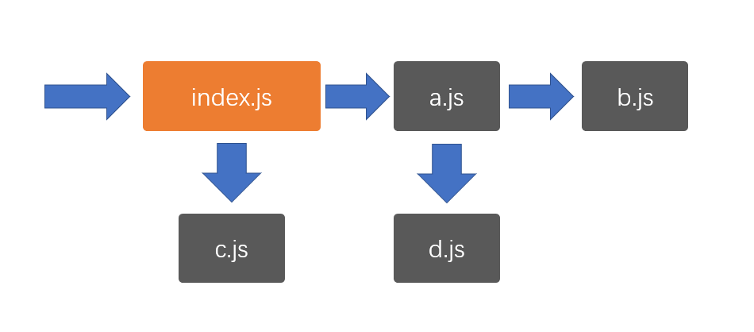

# 模块化

## 1.JavaScript 模块化发展史

### 第一阶段

在 JavaScript 语言刚刚诞生的时候，它仅仅用于实现页面中的一些小效果
那个时候，一个页面所用到的 JS 可能只有区区几百行的代码
在这种情况下，语言本身所存在的一些缺陷往往被大家有意的忽略，因为程序的规模实在太小，只要开发人员小心谨慎，往往不会造成什么问题
在这个阶段，也不存在专业的前端工程师，由于前端要做的事情实在太少，因此这一部分工作往往由后端工程师顺带完成
第一阶段发生的大事件：

- 1996 年，NetScape 将 JavaScript 语言提交给欧洲的一个标准制定组织 ECMA（欧洲计算机制造商协会）
- 1998 年，NetScape 在与微软浏览器 IE 的竞争中失利，宣布破产

### 第二阶段

ajax 的出现，逐渐改变了 JavaScript 在浏览器中扮演的角色。现在，它不仅可以实现小的效果，还可以和服务器之间进行交互，以更好的体验来改变数据
JS 代码的数量开始逐渐增长，从最初的几百行，到后来的几万行，前端程序逐渐变得复杂
后端开发者压力逐渐增加，致使一些公司开始招募专业的前端开发者
但此时，前端开发者的待遇远不及后端开发者，因为前端开发者承担的开发任务相对于后端开发来说，还是比较简单的，通过短短一个月的时间集训，就可以成为满足前端开发的需要
究其根本原因，是因为前端开发还有几个大的问题没有解决，这些问题都严重的制约了前端程序的规模进一步扩大：

1. **浏览器解释执行 JS 的速度太慢**
2. **用户端的电脑配置不足**
3. 更多的代码带来了全局变量污染、依赖关系混乱等问题

上面三个问题，就像是阿喀琉斯之踵，成为前端开发挥之不去的阴影和原罪。
在这个阶段，前端开发处在一个非常尴尬的境地，它在传统的开发模式和前后端分离之间无助的徘徊
第二阶段的大事件：

1. IE 浏览器制霸市场后，几乎不再更新
2. ES4.0 流产，导致 JS 语言 10 年间几乎毫无变化
3. 2008 年 ES5 发布，仅解决了一些 JS API 不足的糟糕局面

### 第三阶段

时间继续向前推移，到了 2008 年，谷歌的 V8 引擎发布(面试），将 JS 的执行速度推上了一个新的台阶，甚至可以和后端语言媲美。
摩尔定律持续发酵，个人电脑的配置开始飞跃
突然间，制约前端发展的两大问题得以解决，此时，只剩下最后一个问题还在负隅顽抗，即**全局变量污染和依赖混乱**的问题，解决了它，前端便可以突破一切障碍，未来无可限量。
于是，全世界的前端开发者在社区中激烈的讨论，想要为这个问题寻求解决之道......
2008 年，有一个名叫 Ryan Dahl 小伙子正在为一件事焦头烂额，它需要在服务器端手写一个高性能的 web 服务，该服务对于性能要求之高，以至于目前市面上已有的 web 服务产品都满足不了需求。

> 服务器开发

新浪的服务器（电脑）收到请求
其中一个应用程序在做以下的事情 web 服务

1. 监听 80 端口
2. 将请求进行分析
3. 将分析的结果交给相应的程序（php，Java）进行处理
4. 把程序处理的结果返还给客户端

经过分析，它确定，如果要实现高性能，那么必须要尽可能的减少线程，而要减少线程，避免不了要实用异步的处理方案。
一开始，他打算自己实用 C/C++语言来编写，可是这一过程实在太痛苦。
就在他一筹莫展的时候，谷歌 V8 引擎的发布引起了他的注意，他突然发现，JS 不就是最好的实现 web 服务的语言吗？它天生就是单线程，并且是基于异步的！有了 V8 引擎的支撑，它的执行速度完全可以撑起一个服务器。而且 V8 是鼎鼎大名的谷歌公司发布的，谷歌一定会不断的优化 V8，有这种又省钱又省力的好事，我干嘛还要自己去写呢？
典型异步场景

```javascript
setTimeout(function () {
  console.log("a");
}, 1000);
//后面不会阻塞
//JS单线程指的是执行线程，不代表浏览器单线程
```

于是，它基于开源的 V8 引擎，对源代码作了一些修改，便快速的完成了该项目。
2009 年，Ryan 推出了该 web 服务项目，命名为 nodejs。
从此，JS 第一次堂堂正正的入主后端，不再是必须附属于浏览器的“玩具”语言了。
也是从此刻开始，人们认识到，JS（ES）是一门真正的语言，它依附于运行环境（运行时）（宿主程序）而执行


nodejs 的诞生，便把 JS 中的最后一个问题放到了台前，即**全局变量污染和依赖混乱**问题
要直到，nodejs 是服务器端，如果不解决这个问题，分模块开发就无从实现，而模块化开发是所有后端程序必不可少的内容
经过社区的激烈讨论，最终，形成了一个模块化方案，即鼎鼎大名的 CommonJS，该方案，彻底解决了全局变量污染和依赖混乱的问题
该方案一出，立即被 nodejs 支持，于是，nodejs 成为了第一个为 JS 语言实现模块化的平台，为前端接下来的迅猛发展奠定了实践基础
该阶段发生的大事件：

- 2008 年，V8 发布
- IE 的市场逐步被 firefox 和 chrome 蚕食，现已无力回天
- 2009 年，nodejs 发布，并附带 commonjs 模块化标准

### 第四阶段

CommonJS 的出现打开了前端开发者的思路

既然后端可以使用模块化的 JS，作为 JS 语言的老东家浏览器为什么不行呢？

于是，开始有人想办法把 CommonJS 运用到浏览器中

可是这里面存在诸多的困难（课程中详解）

办法总比困难多，有些开发者就想，既然 CommonJS 运用到浏览器困难，我们干嘛不自己重新定一个模块化的标准出来，难道就一定要用 CommonJS 标准吗？

于是很快，AMD 规范出炉，它解决的问题和 CommonJS 一样，但是可以更好的适应浏览器环境

相继的，CMD 规范出炉，它对 AMD 规范进行了改进

这些行为，都受到了 ECMA 官方的密切关注......

2015 年，ES6 发布，它提出了官方的模块化解决方案 —— ES6 模块化

从此以后，模块化成为了 JS 本身特有的性质，这门语言终于有了和其他语言较量的资本，成为了可以编写大型应用的正式语言

于此同时，很多开发者、技术厂商早已预见到 JS 的无穷潜力，于是有了下面的故事

- 既然 JS 也能编写大型应用，那么自然也需要像其他语言那样有解决复杂问题的开发框架
  - Angular、React、Vue 等前端开发框架出现
  - Express、Koa 等后端开发框架出现
  - 各种后端数据库驱动出现
- 要开发大型应用，自然少不了各种实用的第三方库的支持
  - npm 包管理器出现，实用第三方库变得极其方便
  - webpack 等构建工具出现，专门用于打包和部署
- 既然 JS 可以放到服务器环境，为什么不能放到其他终端环境呢？
  - Electron 发布，可以使用 JS 语言开发桌面应用程序
  - RN 和 Vuex 等技术发布，可以使用 JS 语言编写移动端应用程序
  - 各种小程序出现，可以使用 JS 编写依附于其他应用的小程序
  - 目前还有很多厂商致力于将 JS 应用到各种其他的终端设备，最终形成大前端生态

可以看到，模块化的出现，是 JS 通向大型应用的基石，学习好模块化，变具备了编写大型应用的基本功。

## 2. CommonJS

nodejs 遵循 EcmaScript 标准，但由于脱离了浏览器环境，因此：

1. 你可以在 nodejs 中使用 EcmaScript 标准的任何语法或 api，例如：循环、判断、数组、对象等
2. 你不能在 nodejs 中使用浏览器的 web api，例如：dom 对象、window 对象、document 对象等

由于大部分开发者是从浏览器端开发转向 nodejs 开发的，为了降低开发者的学习成本，nodejs 中提供了一些和浏览器 web api 同样的对象或函数，例如：console、setTimeout、setInterval 等

### 2-2. CommonJS

在 nodejs 中，由于有且仅有一个入口文件（启动文件），而开发一个应用肯定会涉及到多个文件配合，因此，nodejs 对模块化的需求比浏览器端要大的多

由于 nodejs 刚刚发布的时候，前端没有统一的、官方的模块化规范，因此，它选择使用社区提供的 CommonJS 作为模块化规范
在学习 CommonJS 之前，首先认识两个重要的概念：**模块的导出**和**模块的导入**

### 模块的导出

要理解模块的导出，首先要理解模块的含义
什么是模块？
模块就是一个 JS 文件，它实现了一部分功能，并隐藏自己的内部实现，同时提供了一些接口供其他模块使用
模块有两个核心要素：**隐藏**和**暴露**
**demo**

```javascript
var count = 0; //需要隐藏的内部实现
function getNumber() {
  //要暴露的接口
  count++;
  return count;
}
console.log(getNumber());
console.log(getNumber());
console.log(getNumber());
console.log(getNumber());
```

隐藏的，是自己内部的实现
暴露的，是希望外部使用的接口
任何一个正常的模块化标准，都应该默认隐藏模块中的所有实现，而通过一些语法或 api 调用来暴露接口
**暴露接口的过程即模块的导出**


### 模块的导入

当需要使用一个模块时，使用的是该模块暴露的部分（导出的部分），隐藏的部分是永远无法使用的。
**当通过某种语法或 api 去使用一个模块时，这个过程叫做模块的导入**

### CommonJS 规范

CommonJS 使用`exports`导出模块，`require`导入模块
具体规范如下：

1. 如果一个 JS 文件中存在`exports`或`require`，该 JS 文件是一个模块
2. 模块内的所有代码均为隐藏代码，包括全局变量、全局函数，这些全局的内容均不应该对全局变量造成任何污染
3. 如果一个模块需要暴露一些 API 提供给外部使用，需要通过`exports`导出，`exports`是一个空的对象，你可以为该对象添加任何需要导出的内容
4. 如果一个模块需要导入其他模块，通过`require`实现，`require`是一个函数，传入模块的路径即可返回该模块导出的整个内容

导出

```javascript
// 原本相当于exports={}
exports.getNumber = getNumber;
相当于;
// exports: {
//     getNumber: getNumber
// }
exports.abc = 123;
相当于;
// exports: {
//     getNumber: fn,
//         abc: 123
// }
```

导入

```javascript
var a = require("./util.js");
console.log(a);//a是对象
count不能访问，因为没有导出
```

## 3.AMD 和 CMD

### 3-1 浏览器端模块化的难题

本节为重点：AMD CMD 不常用了
**CommonJS 的工作原理**
当使用`require(模块路径)`导入一个模块时，node 会做以下两件事情（不考虑模块缓存）：

1. 通过模块路径找到本机文件，并读取文件内容
2. 将文件中的代码放入到一个函数环境中执行，并将执行后 module.exports 的值作为 require 函数的返回结果

正是这两个步骤，使得 CommonJS 在 node 端可以良好的被支持
可以认为，**CommonJS 是同步的**，必须要等到加载完文件并执行完代码后才能继续向后执行
**当浏览器遇到 CommonJS**
当想要把 CommonJS 放到浏览器端时，就遇到了一些挑战

1. 浏览器要加载 JS 文件，需要远程从服务器读取，而网络传输的效率远远低于 node 环境中读取本地文件的效率。由于 CommonJS 是同步的，这会极大的降低运行性能
2. 如果需要读取 JS 文件内容并把它放入到一个环境中执行，需要浏览器厂商的支持，可是浏览器厂商不愿意提供支持，最大的原因是 CommonJS 属于社区标准，并非官方标准

**新的规范**
基于以上两点原因，浏览器无法支持模块化
可这并不代表模块化不能在浏览器中实现
要在浏览器中实现模块化，只要能解决上面的两个问题就行了
解决办法其实很简单：

1. 远程加载 JS 浪费了时间？做成异步即可，加载完成后调用一个回调就行了

```javascript
require("./a.js", function () {}); //回调
```

2. 模块中的代码需要放置到函数中执行？编写模块时，直接放函数中就行了

基于这种简单有效的思路，出现了 AMD 和 CMD 规范，有效的解决了浏览器模块化的问题。

### 3-2AMD

全称是 Asynchronous Module Definition，即异步模块加载机制
require.js 实现了 AMD 规范

```html
<script data-main="./js/index.js" src="./js/require.js"></script>
<!-- index.js入口 , 必须引用require.js-->
```

在 AMD 中，导入和导出模块的代码，都必须放置在 define 函数中

```javascript
define([依赖的模块列表], function (模块名称列表) {
  //模块内部的代码
  return 导出的内容;
});
```

require.js 里面提供了个全局方法 define()
写法：

```javascript
define(123); //导出123
define({ a: 1, b: 2 }); //导出对象
define(function () {
  var a = 1; //不会污染
  var b = 234;
  return {
    name: "b模块",
    data: "b模块的数据",
  };
});
```

### 3-3CMD

全称是 Common Module Definition，公共模块定义规范
sea.js 实现了 CMD 规范

```html
<script src="./js/sea.js"></script>
<script>
  seajs.use("./js/index");
</script>
```

在 CMD 中，导入和导出模块的代码，都必须放置在 define 函数中

```javascript
define(function (require, exports, module) {
  //模块内部的代码
});
```

可以使用异步

```javascript
define((require, exports, module) => {
  require.async("a", function (a) {
    console.log(a);
  });
  require.async("b", function (b) {
    console.log(b);
  });
});
```

## 4.es6 模块化

### 4-1.ES6 模块化简介

ECMA 组织参考了众多社区模块化标准，终于在 2015 年，随着 ES6 发布了官方的模块化标准，后成为 ES6 模块化
ES6 模块化具有以下的特点

1. 使用依赖**预声明**的方式导入模块
   1. 依赖延迟声明（commonjs）
      1. 优点：某些时候可以提高效率
      2. 缺点：无法在一开始确定模块依赖关系（比较模糊）
   2. 依赖预声明（AMD）
      1. 优点：在一开始可以确定模块依赖关系
      2. 缺点：某些时候效率较低
2. 灵活的多种导入导出方式(相对于 module.export 较简单）
3. 规范的路径表示法：所有路径必须以./或../开头

### 4-2.基本导入导出

### 模块的引入

**注意：这一部分非模块化标准**
目前，浏览器使用以下方式引入一个 ES6 模块文件

```html
<script src="入口文件" type="module">
  //module作为模块运行
  //当成了模块，就不会污染全局变量
```

#### 模块的基本导出和导入

ES6 中的模块导入导出分为两种：

1. 基本导入导出
2. 默认导入导出


#### 基本导出

类似于 `exports.xxx = xxxx`
基本导出可以有多个，每个必须有名称
基本导出的语法如下：

```javascript
export 声明表达式  //必须是声明语句
```

举例

```javascript
export var a = 1; //导出a，值为1，类似于CommonJS中的exports.a = 1
export function test() {
  //导出test，值为一个函数，类似于CommonJS中的exports.test = function (){}
}
export class Person {}

export const name = "abc";
```

或

```javascript
export { 具名符号 }; // 大括号不是对象
```

举例

```javascript
var age = 18;
var sex = 1;

export { age, sex }; //将age变量的名称作为导出的名称，age变量的值，作为导出的值
```

由于基本导出必须具有名称，所以要求导出内容必须跟上**声明表达式**或**具名符号**

#### 基本导入

由于使用的是**依赖预加载**，因此，导入任何其他模块，导入代码必须放置到所有代码之前
对于基本导出，如果要进行导入，使用下面的代码

```javascript
import { 导入的符号列表 } from "模块路径";
```

举例

```javascript
import { name, age } from "./a.js";
```

注意以下细节：

- 导入时，可以通过关键字`as`对导入的符号进行重命名

```javascript
import { name as name1, age as age1 } from "./a.js";
var b = 3;
console.log(b2);
console.log(name1, age);
console.log(b);
```

- 导入时使用的符号是常量，不可修改
- 可以使用\*号导入所有的基本导出，形成一个对象

```javascript
import * as a from "./a.js";
```

```javascript
import "./b.js"; //这条导入语句，仅会运行模块，不适用它内部的任何导出
// 适用于初始化代码init
```

### 4-3. 默认导入导出


#### 默认导出

每个模块，除了允许有多个基本导出之外，还允许有一个默认导出
默认导出类似于 CommonJS 中的`module.exports`，由于只有一个，因此无需具名
具体的语法是

```javascript
export default 默认导出的数据;
```

举例

```javascript
export default 123;
export default a;
export default {
  fn: function () { },
  name: "adsfaf"
}
```

或

```javascript
export { 默认导出的数据 as default };
```

举例

```javascript
export { a as abc };
```

由于每个模块仅允许有一个默认导出，因此，每个模块不能出现多个默认导出语句

#### 默认导入

需要想要导入一个模块的默认导出，需要使用下面的语法

```javascript
import {导入的符号列表} from "模块路径”
```

举例

```javascript
import data from "./a.js"; //将a.js模块中的默认导出放置到常量data中
```

类似于 CommonJS 中的

```javascript
var 接受变量名 = require("模块路径	");
```

由于默认导入时变量名是自行定义的，因此没有别名一说
如果希望同时导入某个模块的默认导出和基本导出，可以使用下面的语法

```javascript
import 接收默认导出的变量，{接收基本导出的变量} from "模块变量"
```

注：如果使用\*号，会将所有基本导出和默认导出聚合到一个对象中，默认导出会作为属性 default 存在

```javascript
import data, { a, b } from "./a.js";
// a里面默认导出放在data里面，基本导出放在a,b里面
```

### 4-4.ES6 模块化的其他细节

1. **尽量导出不可变值**

当导出一个内容时，尽量保证该内容是不可变的（大部分情况都是如此）
因为，虽然导入后，无法更改导入内容，但是在导入的模块内部却有可能发生更改，这将导致一些无法预料的事情发生

```javascript
export const name = "模块a"; //用const更加坐实了这点
```

2. **可以使用无绑定的导入用于执行一些初始化代码**

如果我们只是想执行模块中的一些代码，而不需要导入它的任何内容，可以使用无绑定的导入：

```javascript
import "模块路径";
```

举例
arrayPatcher.js

```javascript
Array.prototype.print = function () {
  console.log(this);
};
//一些其他的代码
```

```javascript
import "./arrayPatcher.js"; //无绑定的导入
var arr = [3, 4, 6, 6, 7];
arr.print();
```

3. **可以使用绑定再导出，来重新导出来自另一个模块的内容**

有的时候，我们可能需要用一个模块封装多个模块，然后有选择的将多个模块的内容分别导出，可以使用下面的语法轻松完成

```javascript
export { 绑定的标识符 } from "模块路径";
```


举例

```javascript
export { a, b } from "./m1.js";
export { k, default, a as m2a } from "./m2.js";
export const r = "m-r";
```
