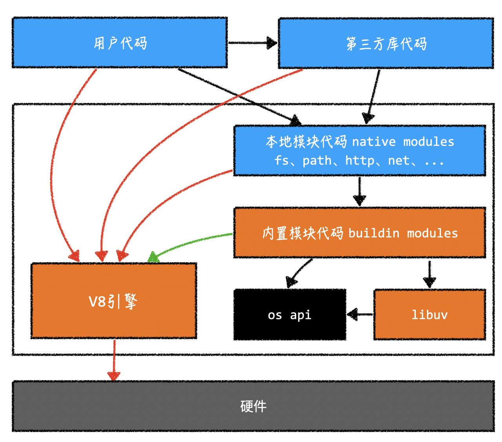

# Node 组成原理

Node.js 是一个开源的、跨平台的 JavaScript 运行环境，依赖于 Google V8 引擎，用于构建高性能的网络应用程序。Node.js 采用事件驱动、非阻塞 I/O 模型，使得它能够处理大量并发连接，适用于构建实时应用、高吞吐量的后端服务和网络代理等。

Node.js 广泛应用于 Web 开发、服务器端开发、实时通信、大数据处理等领域，被许多大型互联网公司和开发者使用和推崇。

## Node.js 的特点包括：

1. 单线程和事件驱动：Node.js 采用单线程的事件循环模型，通过异步 I/O 和事件驱动处理并发请求，避免了传统多线程模型中的线程切换和资源开销，提高了性能和可扩展性。
2. 跨平台：Node.js 可运行于多个操作系统平台，包括 Windows、Linux 和 Mac OS 等。
3. 高性能：由于基于 V8 引擎和非阻塞 I/O 模型，Node.js 具有快速的执行速度和高吞吐量，适用于处理大量并发请求的场景。
4. 模块化和包管理：Node.js 支持模块化开发，可以通过 npm（Node Package Manager）进行包的管理和发布，方便了代码的组织和复用。
5. 强大的社区支持：Node.js 拥有庞大的开发者社区，提供了丰富的第三方模块和工具，方便开发者进行开发和调试。

## Node.js 组成

1. 用户代码：JS 代码，开发者编写的
2. 第三方库：大部分仍然是 JS 代码，由其他开发者编写
3. 本地模块：Node.js 内置了一些核心模块，这些模块提供了基础的功能，如文件操作(fs 模块)、网络通信(http 模块)、加密(crypto 模块)、操作系统信息(os 模块)等。这些模块可以直接通过 require 函数进行引入使用。
4. 内置模块：Node.js 有一个丰富的第三方模块生态系统，开发者可以通过 NPM 安装这些模块，并在自己的项目中引入使用。
5. libuv：libuv 是一个跨平台的异步 I/O 库，它为 Node.js 提供了非阻塞的事件驱动的 I/O 操作。它可以处理文件系统操作、网络请求、定时器等等，在 Node.js 中用于处理事件循环。
6. os api：将 Node.js 可运行于多个操作系统平台，包括 Windows、Linux 和 Mac OS 等。
7. V8 引擎：Node.js 使用了 Google 开发的 V8 引擎作为其 JavaScript 执行引擎。V8 引擎可以将 JavaScript 代码直接转化为机器码，以提供高性能的执行效率。(c/c++代码，作用：把 JS 代码解释成为机器码。可以通过 v8 引擎的某种机制，扩展其功能。V8 引擎的扩展和对扩展的编译，是通过一个工具：gyp 工具。某些第三方库需要使用 node-gyp 工具进行构建，因此需要先安装 node-gyp)

## 其他资料

https://github.com/theanarkh/understand-nodejs
