# 前端性能优化方法论

https://juejin.cn/post/6993137683841155080

我们可以从两个方面来看性能优化的意义：

1. 用户角度：网站优化能够让页面加载得更快，响应更加及时，极大提升用户体验。
2. 服务商角度：优化会减少页面资源请求数，减小请求资源所占带宽大小，从而节省可观的带宽资源。

网站优化的目标就是减少网站加载时间，提高响应速度。
Google 和亚马逊的研究表明，Google 页面加载的时间从 0.4 秒提升到 0.9 秒导致丢失了 20% 流量和广告收入，对于亚马逊，页面加载时间每增加 100ms 就意味着 1% 的销售额损失。
可见，页面的加载速度对于用户有着至关重要的影响。

## Webpack 优化

如何分析打包结果？`webpack-bundle-analyzer`

### 1. 构建性能

:::tip
这里所说的构建性能，是指在开发阶段的构建性能，而不是生产环境的构建性能

优化的目标，是降低从打包开始，到代码效果呈现所经过的时间

构建性能会影响开发效率。构建性能越高，开发过程中时间的浪费越少
:::

#### 1.1 减少模块解析

模块解析包括：抽象语法树分析、依赖分析、模块语法替换

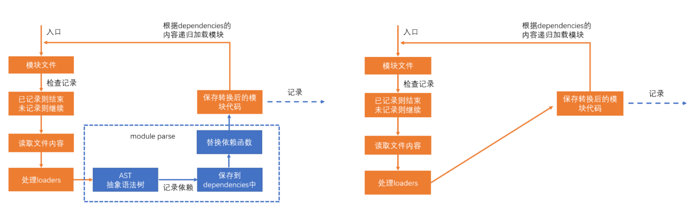

如果某个模块不做解析，该模块经过 loader 处理后的代码就是最终代码。

如果没有 loader 对该模块进行处理，该模块的源码就是最终打包结果的代码。

如果不对某个模块进行解析，可以缩短构建时间，那么哪些模块不需要解析呢？

模块中无其他依赖：一些已经打包好的第三方库，比如 jquery，所以可以配置 module.noParse，它是一个正则，被正则匹配到的模块不会解析

```js
module.exports = {
  mode: "development",
  module: {
    noParse: /jquery/,
  },
};
```

#### 1.2 优化 loader 性能

1. 进一步限制 loader 的应用范围。对于某些库，不使用 loader

例如：babel-loader 可以转换 ES6 或更高版本的语法，可是有些库本身就是用 ES5 语法书写的，不需要转换，使用 babel-loader 反而会浪费构建时间
lodash 就是这样的一个库，lodash 是在 ES5 之前出现的库，使用的是 ES3 语法
通过 module.rule.exclude 或 module.rule.include，排除或仅包含需要应用 loader 的场景

```js
module.exports = {
  module: {
    rules: [
      {
        test: /\.js$/,
        exclude: /lodash/,
        use: "babel-loader",
      },
    ],
  },
};
```

如果暴力一点，甚至可以排除掉 node_modules 目录中的模块，或仅转换 src 目录的模块

```js
module.exports = {
  module: {
    rules: [
      {
        test: /\.js$/,
        exclude: /node_modules/,
        //或
        // include: /src/,
        use: "babel-loader",
      },
    ],
  },
};
```

这种做法是对 loader 的范围进行进一步的限制，和 noParse 不冲突

2. 缓存 loader 的结果

我们可以基于一种假设：如果某个文件内容不变，经过相同的 loader 解析后，解析后的结果也不变
于是，可以将 loader 的解析结果保存下来，让后续的解析直接使用保存的结果
cache-loader 可以实现这样的功能：第一次打包会慢，因为有缓存的过程，以后就快了

```js
module.exports = {
  module: {
    rules: [
      {
        test: /\.js$/,
        use: ["cache-loader", ...loaders],
      },
    ],
  },
};
```

有趣的是，cache-loader 放到最前面，却能够决定后续的 loader 是否运行。实际上，loader 的运行过程中，还包含一个过程，即 pitch

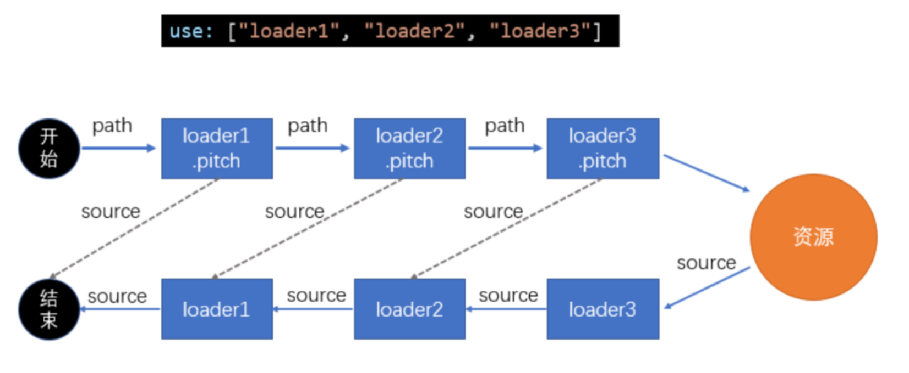

cache-loader 还可以实现各自自定义的配置，具体方式见文档

3. 为 loader 的运行开启多线程

thread-loader 会开启一个线程池，线程池中包含**适量**的线程

它会把后续的 loader 放到线程池的线程中运行，以提高构建效率。由于后续的 loader 会放到新的线程中，所以，后续的 loader 不能：

- 使用 webpack api 生成文件
- 无法使用自定义的 plugin api
- 无法访问 webpack options

在实际的开发中，可以进行测试，来决定 thread-loader 放到什么位置

特别注意，开启和管理线程需要消耗时间，在小型项目中使用 thread-loader 反而会增加构建时间

HappyPack：受限于 Node 是单线程运行的，所以 Webpack 在打包的过程中也是单线程的，特别是在执行 Loader 的时候，长时间编译的任务很多，这样就会导致等待的情况。

HappyPack 可以将 Loader 的同步执行转换为并行的，这样就能充分利用系统资源来加快打包效率了

```js
module: {
  loaders: [
    {
      test: /\.js$/,
      include: [resolve('src')],
      exclude: /node_modules/,
      // id 后面的内容对应下面
      loader: 'happypack/loader?id=happybabel'
    }
  ]
},
plugins: [
  new HappyPack({
    id: 'happybabel',
    loaders: ['babel-loader?cacheDirectory'],
    // 开启 4 个线程
    threads: 4
  })
]
```

#### 1.3 热替换 HMR

热替换并不能降低构建时间（可能还会稍微增加），但可以降低代码改动到效果呈现的时间
当使用 webpack-dev-server 时，考虑代码改动到效果呈现的过程

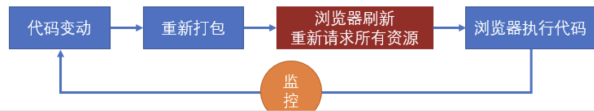

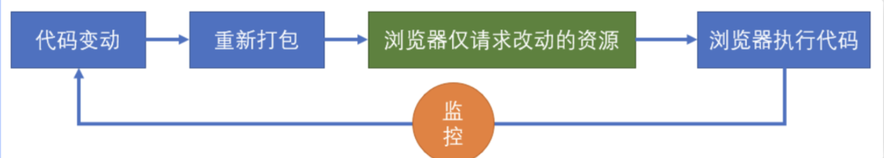

原理

1. 更改配置

```js
module.exports = {
  devServer: {
    hot: true, // 开启HMR
  },
  plugins: [
    // 可选
    new webpack.HotModuleReplacementPlugin(),
  ],
};
```

2. 更改代码

```js
// index.js

if (module.hot) {
  // 是否开启了热更新
  module.hot.accept(); // 接受热更新
}
```

首先，这段代码会参与最终运行！当开启了热更新后，`webpack-dev-server`会向打包结果中注入`module.hot`属性。默认情况下，`webpack-dev-server`不管是否开启了热更新，当重新打包后，都会调用`location.reload`刷新页面

但如果运行了`module.hot.accept()`，将改变这一行为`module.hot.accept()`的作用是让`webpack-dev-server`通过 socket 管道，把服务器更新的内容发送到浏览器


然后，将结果交给插件`HotModuleReplacementPlugin`注入的代码执行
插件`HotModuleReplacementPlugin`会根据覆盖原始代码，然后让代码重新执行
所以，**热替换发生在代码运行期**

**样式热替换**

对于样式也是可以使用热替换的，但需要使用`style-loader`

因为热替换发生时，`HotModuleReplacementPlugin`只会简单的重新运行模块代码

因此`style-loader`的代码一运行，就会重新设置 style 元素中的样式

而`mini-css-extract-plugin`，由于它生成文件是在构建期间，运行期间并会也无法改动文件，因此它对于热替换是无效的

**思考：webpack 的热更新是如何做到的？说明其原理？**

webpack 的热更新又称热替换（Hot Module Replacement），缩写为 HMR。 这个机制可以做到不用刷新浏览器而将新变更的模块替换掉旧的模块。

**原理：**

首先要知道 server 端和 client 端都做了处理工作

1. 第一步，在 webpack 的 watch 模式下，文件系统中某一个文件发生修改，webpack 监听到文件变化，根据配置文件对模块重新编译打包，并将打包后的代码通过简单的 JavaScript 对象保存在内存中。
2. 第二步是 webpack-dev-server 和 webpack 之间的接口交互，而在这一步，主要是 dev-server 的中间件 webpack-dev-middleware 和 webpack 之间的交互，webpack-dev-middleware 调用 webpack 暴露的 API 对代码变化进行监控，并且告诉 webpack，将代码打包到内存中。
3. 第三步是 webpack-dev-server 对文件变化的一个监控，这一步不同于第一步，并不是监控代码变化重新打包。当我们在配置文件中配置了 devServer.watchContentBase 为 true 的时候，Server 会监听这些配置文件夹中静态文件的变化，变化后会通知浏览器端对应用进行 live reload。注意，这儿是浏览器刷新，和 HMR 是两个概念。
4. 第四步也是 webpack-dev-server 代码的工作，该步骤主要是通过 sockjs（webpack-dev-server 的依赖）在浏览器端和服务端之间建立一个 websocket 长连接，将 webpack 编译打包的各个阶段的状态信息告知浏览器端，同时也包括第三步中 Server 监听静态文件变化的信息。浏览器端根据这些 socket 消息进行不同的操作。当然服务端传递的最主要信息还是新模块的 hash 值，后面的步骤根据这一 hash 值来进行模块热替换。
5. webpack-dev-server/client 端并不能够请求更新的代码，也不会执行热更模块操作，而把这些工作又交回给了 webpack，webpack/hot/dev-server 的工作就是根据 webpack-dev-server/client 传给它的信息以及 dev-server 的配置决定是刷新浏览器呢还是进行模块热更新。当然如果仅仅是刷新浏览器，也就没有后面那些步骤了。
6. HotModuleReplacement.runtime 是客户端 HMR 的中枢，它接收到上一步传递给他的新模块的 hash 值，它通过 JsonpMainTemplate.runtime 向 server 端发送 Ajax 请求，服务端返回一个 json，该 json 包含了所有要更新的模块的 hash 值，获取到更新列表后，该模块再次通过 jsonp 请求，获取到最新的模块代码。这就是上图中 7、8、9 步骤。
7. 而第 10 步是决定 HMR 成功与否的关键步骤，在该步骤中，HotModulePlugin 将会对新旧模块进行对比，决定是否更新模块，在决定更新模块后，检查模块之间的依赖关系，更新模块的同时更新模块间的依赖引用。
8. 最后一步，当 HMR 失败后，回退到 live reload 操作，也就是进行浏览器刷新来获取最新打包代码。

#### 1.4 其他提升构建性能

1. 多⼊⼝情况下，使⽤ `CommonsChunkPlugin` 来提取公共代码
2. 通过 `externals` 配置来提取常⽤库
3. 利⽤ `DllPlugin` 和 `DllReferencePlugin` 预编译资源模块 通过 `DllPlugin` 来对那些我们引⽤但是绝对不会修改的 npm 包来进⾏预编译，再通过 `DllReferencePlugin` 将预编译的模块加载进来。
4. 使⽤ `Happypack` 实现多线程加速编译
5. 使⽤ `webpack-uglify-parallel` 来提升 `uglifyPlugin` 的压缩速度。 原理上 `webpack-uglify-parallel` 采⽤了多核并⾏压缩来提升压缩速度
6. 使⽤ `Tree-shaking` 和 `Scope Hoisting` 来剔除多余代码

**思考：如何利用 webpack 来优化前端性能？（提高性能和体验）**

用 webpack 优化前端性能是指优化 webpack 的输出结果，让打包的最终结果在浏览器运行快速高效。

- 压缩代码。删除多余的代码、注释、简化代码的写法等等方式。可以利用 webpack 的 UglifyJsPlugin 和 ParallelUglifyPlugin 来压缩 JS 文件， 利用 cssnano（css-loader?minimize）来压缩 css
- 利用 CDN 加速。在构建过程中，将引用的静态资源路径修改为 CDN 上对应的路径。可以利用 webpack 对于 output 参数和各 loader 的 publicPath 参数来修改资源路径
- 删除死代码（Tree Shaking）。将代码中永远不会走到的片段删除掉。可以通过在启动 webpack 时追加参数--optimize-minimize 来实现
- 提取公共代码。

**思考：如何提高 webpack 的构建速度？**

1. 多入口情况下，使用 CommonsChunkPlugin 来提取公共代码
2. 通过 externals 配置来提取常用库
3. 利用 DllPlugin 和 DllReferencePlugin 预编译资源模块 通过 DllPlugin 来对那些我们引用但是绝对不会修改的 npm 包来进行预编译，再通过 DllReferencePlugin 将预编译的模块加载进来。
4. 使用 Happypack 实现多线程加速编译
5. 使用 webpack-uglify-parallel 来提升 uglifyPlugin 的压缩速度。 原理上 webpack-uglify-parallel 采用了多核并行压缩来提升压缩速度
6. 使用 Tree-shaking 和 Scope Hoisting 来剔除多余代码

### 2. 传输性能

:::tip
传输性能是指，打包后的 JS 代码传输到浏览器经过的时间，在优化传输性能时要考虑到：

1. 总传输量：所有需要传输的 JS 文件的内容加起来，就是总传输量，重复代码越少，总传输量越少
2. 文件数量：当访问页面时，需要传输的 JS 文件数量，文件数量越多，http 请求越多，响应速度越慢
3. 浏览器缓存：JS 文件会被浏览器缓存，被缓存的文件不会再进行传输
   :::

#### 2.1 手动分包（极大提升构建性能）

默认情况下，`vue-cli`会利用`webpack`将`src`目录中的所有代码打包成一个`bundle`

这样就导致访问一个页面时，需要加载所有页面的 js 代码

我们可以利用 webpack 对动态 import 的支持，从而达到把不同页面的代码打包到不同文件中

```js
// routes
export default [
  {
    name: "Home",
    path: "/",
    component: () => import(/* webpackChunkName: "home" */ "@/views/Home"),
  },
  {
    name: "About",
    path: "/about",
    component: () => import(/* webpackChunkName: "about" */ "@/views/About"),
  },
];
```

什么是分包：将一个整体的代码,分布到不同的打包文件中

什么时候要分包？

- 多个 chunk 引入了公共模块
- 公共模块体积较大或较少的变动

**基本原理**

手动分包的总体思路是：

1. 先单独的打包公共模块

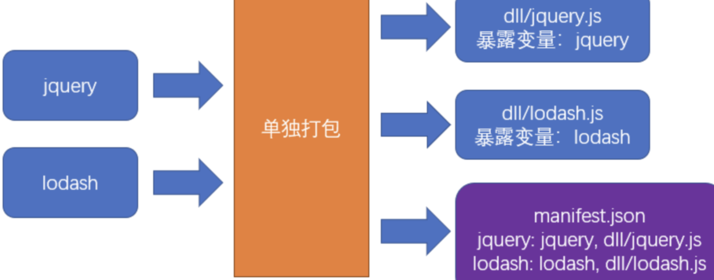

公共模块会被打包成为动态链接库(dll Dynamic Link Library)，并生成资源清单

2. 根据入口模块进行正常打包

打包时，如果发现模块中使用了资源清单中描述的模块，则不会形成下面的代码结构

```js
//源码，入口文件index.js
import $ from "jquery";
import _ from "lodash";
_.isArray($(".red"));
```

由于资源清单中包含 jquery 和 lodash 两个模块，因此打包结果的大致格式是：

```js
(function (modules) {
  //...
})({
  // index.js文件的打包结果并没有变化
  "./src/index.js": function (module, exports, __webpack_require__) {
    var $ = __webpack_require__("./node_modules/jquery/index.js");
    var _ = __webpack_require__("./node_modules/lodash/index.js");
    _.isArray($(".red"));
  },
  // 由于资源清单中存在，jquery的代码并不会出现在这里
  "./node_modules/jquery/index.js": function (
    module,
    exports,
    __webpack_require__
  ) {
    module.exports = jquery; // 直接导出资源清单的名字
  },
  // 由于资源清单中存在，lodash的代码并不会出现在这里
  "./node_modules/lodash/index.js": function (
    module,
    exports,
    __webpack_require__
  ) {
    module.exports = lodash;
  },
});
```

3. 打包公共模块

打包公共模块是一个独立的打包过程

1. 单独打包公共模块，暴露变量名 . npm run dll

```js
// webpack.dll.config.js
module.exports = {
  mode: "production",
  entry: {
    jquery: ["jquery"], //数组
    lodash: ["lodash"],
  },
  output: {
    filename: "dll/[name].js",
    library: "[name]", // 每个bundle暴露的全局变量名
  },
};
```

利用`DllPlugin`生成资源清单

```js
// webpack.dll.config.js
module.exports = {
  plugins: [
    new webpack.DllPlugin({
      path: path.resolve(__dirname, "dll", "[name].manifest.json"), //资源清单的保存位置
      name: "[name]", //资源清单中，暴露的变量名
    }),
  ],
};
```

运行后，即可完成公共模块打包

**使用公共模块**

1. 在页面中手动引入公共模块

```html
<script src="./dll/jquery.js"></script>
<script src="./dll/lodash.js"></script>
```

重新设置`clean-webpack-plugin`。如果使用了插件`clean-webpack-plugin`，为了避免它把公共模块清除，需要做出以下配置

```js
new CleanWebpackPlugin({
  // 要清除的文件或目录
  // 排除掉dll目录本身和它里面的文件
  cleanOnceBeforeBuildPatterns: ["**/*", "!dll", "!dll/*"],
});
```

目录和文件的匹配规则使用的是[globbing patterns](https://github.com/sindresorhus/globby#globbing-patterns)语法

使用 DllReferencePlugin 控制打包结果

```js
module.exports = {
  plugins: [
    // 资源清单
    new webpack.DllReferencePlugin({
      manifest: require("./dll/jquery.manifest.json"),
    }),
    new webpack.DllReferencePlugin({
      manifest: require("./dll/lodash.manifest.json"),
    }),
  ],
};
```

**总结**

手动打包的过程：

1. 开启 output.library 暴露公共模块
2. 用 DllPlugin 创建资源清单
3. 用 DllReferencePlugin 使用资源清单

手动打包的注意事项：

1. 资源清单不参与运行，可以不放到打包目录中
2. 记得手动引入公共 JS，以及避免被删除
3. 不要对小型的公共 JS 库使用

优点：

1. 极大提升自身模块的打包速度
2. 极大的缩小了自身文件体积
3. 有利于浏览器缓存第三方库的公共代码

缺点：

1. 使用非常繁琐
2. 如果第三方库中包含重复代码，则效果不太理想

**详解 dllPlugin**

DllPlugin 可以将特定的类库提前打包然后引入。这种方式可以极大的减少打包类库的次数，只有当类库更新版本才有需要重新打包，并且也实现了将公共代码抽离成单独文件的优化方案。DllPlugin 的使用方法如下：

```js
// 单独配置在一个文件中
// webpack.dll.conf.js
const path = require("path");
const webpack = require("webpack");
module.exports = {
  entry: {
    // 想统一打包的类库
    vendor: ["react"],
  },
  output: {
    path: path.join(__dirname, "dist"),
    filename: "[name].dll.js",
    library: "[name]-[hash]",
  },
  plugins: [
    new webpack.DllPlugin({
      // name 必须和 output.library 一致
      name: "[name]-[hash]",
      // 该属性需要与 DllReferencePlugin 中一致
      context: __dirname,
      path: path.join(__dirname, "dist", "[name]-manifest.json"),
    }),
  ],
};
```

然后需要执行这个配置文件生成依赖文件，接下来需要使用 DllReferencePlugin 将依赖文件引入项目中

```js
// webpack.conf.js
module.exports = {
  // ...省略其他配置
  plugins: [
    new webpack.DllReferencePlugin({
      context: __dirname,
      // manifest 就是之前打包出来的 json 文件
      manifest: require("./dist/vendor-manifest.json"),
    }),
  ],
};
```

可以通过一些小的优化点来加快打包速度

- resolve.extensions：用来表明文件后缀列表，默认查找顺序是 ['.js', '.json']，如果你的导入文件没有添加后缀就会按照这个顺序查找文件。我们应该尽可能减少后缀列表长度，然后将出现频率高的后缀排在前面
- resolve.alias：可以通过别名的方式来映射一个路径，能让 Webpack 更快找到路径
- module.noParse：如果你确定一个文件下没有其他依赖，就可以使用该属性让 Webpack 不扫描该文件，这种方式对于大型的类库很有帮助

#### 2.2 自动分包（会降低构建效率，开发效率提升，新的模块不需要手动处理了）

1. 基本原理

不同于手动分包，自动分包是从实际的角度出发，从一个更加宏观的角度来控制分包，而一般不对具体哪个包要分出去进行控制

因此使用自动分包，不仅非常方便，而且更加贴合实际的开发需要

要控制自动分包，关键是要配置一个合理的分包策略

有了分包策略之后，不需要额外安装任何插件，webpack 会自动的按照策略进行分包

实际上，webpack 在内部是使用 SplitChunksPlugin 进行分包的 过去有一个库 CommonsChunkPlugin 也可以实现分包，不过由于该库某些地方并不完善，到了 webpack4 之后，已被 SplitChunksPlugin 取代

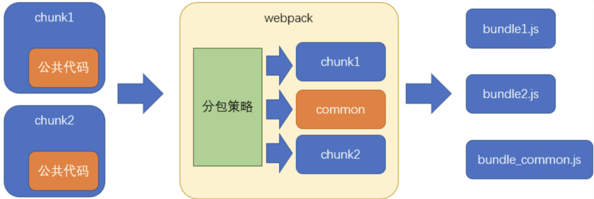

从分包流程中至少可以看出以下几点：

- 分包策略至关重要，它决定了如何分包
- 分包时，webpack 开启了一个新的 chunk，对分离的模块进行打包
- 打包结果中，公共的部分被提取出来形成了一个单独的文件，它是新 chunk 的产物

2. 分包策略的基本配置

webpack 提供了 optimization 配置项，用于配置一些优化信息

其中 splitChunks 是分包策略的配置

```js
module.exports = {
  optimization: {
    splitChunks: {
      // 分包策略
    },
  },
};
```

事实上，分包策略有其默认的配置，我们只需要轻微的改动，即可应对大部分分包场景

**chunks**

该配置项用于配置需要应用分包策略的 chunk

我们知道，分包是从已有的 chunk 中分离出新的 chunk，那么哪些 chunk 需要分离呢

chunks 有三个取值，分别是：

- all: 对于所有的 chunk 都要应用分包策略
- async：【默认】仅针对异步 chunk 应用分包策略
- initial：仅针对普通 chunk 应用分包策略

所以，你只需要配置 chunks 为 all 即可

**maxSize**

该配置可以控制包的最大字节数

如果某个包（包括分出来的包）超过了该值，则 webpack 会尽可能的将其分离成多个包

但是不要忽略的是，分包的基础单位是模块，如果一个完整的模块超过了该体积，它是无法做到再切割的，因此，尽管使用了这个配置，完全有可能某个包还是会超过这个体积

另外，该配置看上去很美妙，实际意义其实不大

因为分包的目的是提取大量的公共代码，从而减少总体积和充分利用浏览器缓存

虽然该配置可以把一些包进行再切分，但是实际的总体积和传输量并没有发生变化

如果要进一步减少公共模块的体积，只能是压缩和 tree shaking

3. 分包策略的其他配置

如果不想使用其他配置的默认值，可以手动进行配置：

- automaticNameDelimiter：新 chunk 名称的分隔符，默认值~

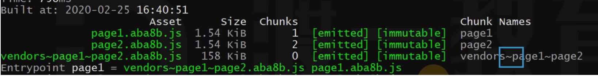

- minChunks：一个模块被多少个 chunk 使用时，才会进行分包，默认值 1。如果我自己写一个文件，默认也不分包，因为自己写的那个太小，没达到拆分的条件，所以要配合 minSize 使用。

- minSize：当分包达到多少字节后才允许被真正的拆分，默认值 30000

4. 缓存组

之前配置的分包策略是全局的

而实际上，分包策略是基于缓存组的

每个缓存组提供一套独有的策略，webpack 按照缓存组的优先级依次处理每个缓存组，被缓存组处理过的分包不需要再次分包

默认情况下，webpack 提供了两个缓存组：

```js
module.exports = {
  optimization: {
    splitChunks: {
      //全局配置
      cacheGroups: {
        // 属性名是缓存组名称，会影响到分包的chunk名
        // 属性值是缓存组的配置，缓存组继承所有的全局配置，也有自己特殊的配置
        vendors: {
          test: /[\\/]node_modules[\\/]/, // 当匹配到相应模块时，将这些模块进行单独打包
          priority: -10, // 缓存组优先级，优先级越高，该策略越先进行处理，默认值为0
        },
        default: {
          minChunks: 2, // 覆盖全局配置，将最小chunk引用数改为2
          priority: -20, // 优先级
          reuseExistingChunk: true, // 重用已经被分离出去的chunk
        },
      },
    },
  },
};
```

很多时候，缓存组对于我们来说没什么意义，因为默认的缓存组就已经够用了

但是我们同样可以利用缓存组来完成一些事情，比如对公共样式的抽离

```js
module.exports = {
  optimization: {
    splitChunks: {
      chunks: "all",
      cacheGroups: {
        styles: {
          // 样式抽离
          test: /\.css$/, // 匹配样式模块
          minSize: 0, // 覆盖默认的最小尺寸，这里仅仅是作为测试
          minChunks: 2, // 覆盖默认的最小chunk引用数
        },
      },
    },
  },
  module: {
    rules: [
      { test: /\.css$/, use: [MiniCssExtractPlugin.loader, "css-loader"] },
    ],
  },
  plugins: [
    new CleanWebpackPlugin(),
    new HtmlWebpackPlugin({
      template: "./public/index.html",
      chunks: ["index"],
    }),
    new MiniCssExtractPlugin({
      filename: "[name].[hash:5].css",
      // chunkFilename是配置来自于分割chunk的文件名
      chunkFilename: "common.[hash:5].css",
    }),
  ],
};
```

5. 配合多页应用

虽然现在单页应用是主流，但免不了还是会遇到多页应用

由于在多页应用中需要为每个 html 页面指定需要的 chunk，否则都会引入进去，这就造成了问题

```js
new HtmlWebpackPlugin({
  template: "./public/index.html",
  chunks: ["index~other", "vendors~index~other", "index"],
});
```

我们必须手动的指定被分离出去的 chunk 名称，这不是一种好办法

幸好`html-webpack-plugin`的新版本中解决了这一问题

```shell
npm i -D html-webpack-plugin@next
```

做出以下配置即可：

```js
new HtmlWebpackPlugin({
  template: "./public/index.html",
  chunks: ["index"],
});
```

它会自动的找到被 index 分离出去的 chunk，并完成引用

目前这个版本仍处于测试解决，还未正式发布

6. 原理

自动分包的原理其实并不复杂，主要经过以下步骤：

- 检查每个 chunk 编译的结果
- 根据分包策略，找到那些满足策略的模块
- 根据分包策略，生成新的 chunk 打包这些模块（代码有所变化）
- 把打包出去的模块从原始包中移除，并修正原始包代码

在代码层面，有以下变动

1. 分包的代码中，加入一个全局变量 webpackJsonp，类型为数组，其中包含公共模块的代码
2. 原始包的代码中，使用数组中的公共代码

#### 2.3 代码压缩

单模块体积优化

1. 为什么要进行代码压缩: 减少代码体积；破坏代码的可读性，提升破解成本；
2. 什么时候要进行代码压缩: 生产环境
3. 使用什么压缩工具: 目前最流行的代码压缩工具主要有两个：UglifyJs 和 Terser

UglifyJs 是一个传统的代码压缩工具，已存在多年，曾经是前端应用的必备工具，但由于它不支持 ES6 语法，所以目前的流行度已有所下降。

Terser 是一个新起的代码压缩工具，支持 ES6+语法，因此被很多构建工具内置使用。webpack 安装后会内置 Terser，当启用生产环境后即可用其进行代码压缩。

因此，我们选择 Terser

关于副作用 side effect

副作用：函数运行过程中，可能会对外部环境造成影响的功能

如果函数中包含以下代码，该函数叫做副作用函数:

- 异步代码
- localStorage
- 对外部数据的修改

如果一个函数没有副作用，同时，函数的返回结果仅依赖参数，则该函数叫做纯函数(pure function)

纯函数非常有利于压缩优化。可以手动指定那些是纯函数：pure_funcs:['Math.random']

**Terser**

在 Terser 的官网可尝试它的压缩效果

Terser 官网：https://terser.org/

webpack+Terser

webpack 自动集成了 Terser

如果你想更改、添加压缩工具，又或者是想对 Terser 进行配置，使用下面的 webpack 配置即可

```js
const TerserPlugin = require("terser-webpack-plugin");
const OptimizeCSSAssetsPlugin = require("optimize-css-assets-webpack-plugin");
module.exports = {
  optimization: {
    minimize: true, // 是否要启用压缩，默认情况下，生产环境会自动开启
    minimizer: [
      // 压缩时使用的插件，可以有多个
      new TerserPlugin(),
      new OptimizeCSSAssetsPlugin(),
    ],
  },
};
```

#### 2.4 tree shaking

压缩可以移除模块内部的无效代码 tree shaking 可以移除模块之间的无效代码

1. 背景
   某些模块导出的代码并不一定会被用到，第三方库就是个典型例子

```js
// myMath.js
export function add(a, b) {
  console.log("add");
  return a + b;
}

export function sub(a, b) {
  console.log("sub");
  return a - b;
}
// index.js
import { add } from "./myMath";
console.log(add(1, 2));
```

tree shaking 用于移除掉不会用到的导出

2. 使用

webpack2 开始就支持了 tree shaking

只要是生产环境，tree shaking 自动开启

3. 原理

webpack 会从入口模块出发寻找依赖关系

当解析一个模块时，webpack 会根据 ES6 的模块导入语句来判断，该模块依赖了另一个模块的哪个导出

webpack 之所以选择 ES6 的模块导入语句，是因为 ES6 模块有以下特点：commonjs 不具备

- 导入导出语句只能是顶层语句
- import 的模块名只能是字符串常量
- import 绑定的变量是不可变的

这些特征都非常有利于分析出稳定的依赖

在具体分析依赖时，webpack 坚持的原则是：保证代码正常运行，然后再尽量 tree shaking

所以，如果你依赖的是一个导出的对象，由于 JS 语言的动态特性，以及 webpack 还不够智能，为了保证代码正常运行，它不会移除对象中的任何信息

因此，我们在编写代码的时候，尽量：

- 使用 export xxx 导出，而不使用 export default {xxx}导出。后者会整个导出，但是不一定都需要。
- 使用 import {xxx} from "xxx"导入，而不使用 import xxx from "xxx"导入

依赖分析完毕后，webpack 会根据每个模块每个导出是否被使用，标记其他导出为 dead code，然后交给代码压缩工具处理

代码压缩工具最终移除掉那些 dead code 代码

4. 使用第三方库

某些第三方库可能使用的是 commonjs 的方式导出，比如 lodash

又或者没有提供普通的 ES6 方式导出

对于这些库，tree shaking 是无法发挥作用的

因此要寻找这些库的 es6 版本，好在很多流行但没有使用的 ES6 的第三方库，都发布了它的 ES6 版本，比如 lodash-es

5. 作用域分析

tree shaking 本身并没有完善的作用域分析，可能导致在一些 dead code 函数中的依赖仍然会被视为依赖
比如 a 引用 b，b 引用了 lodash，但是 a 没有用到 b 用 lodash 的导出代码
插件 webpack-deep-scope-plugin 提供了作用域分析，可解决这些问题

6. 副作用问题

webpack 在 tree shaking 的使用，有一个原则：一定要保证代码正确运行

在满足该原则的基础上，再来决定如何 tree shaking

因此，当 webpack 无法确定某个模块是否有副作用时，它往往将其视为有副作用

因此，某些情况可能并不是我们所想要的

```js
//common.js
var n = Math.random();

//index.js
import "./common.js";
```

虽然我们根本没用有 common.js 的导出，但 webpack 担心 common.js 有副作用，如果去掉会影响某些功能

如果要解决该问题，就需要标记该文件是没有副作用的

在 package.json 中加入 sideEffects

```json
{
  "sideEffects": false
}
```

有两种配置方式：

- false：当前工程中，所有模块都没有副作用。注意，这种写法会影响到某些 css 文件的导入
- 数组：设置哪些文件拥有副作用，例如：["!src/common.js"]，表示只要不是 src/common.js 的文件，都有副作用

```js
{
    "sideEffects": ["!src/common.js"]
}
```

这种方式我们一般不处理，通常是一些第三方库在它们自己的 package.json 中标注

webpack 无法对 css 完成 tree shaking，因为 css 跟 es6 没有半毛钱关系。

因此对 css 的 tree shaking 需要其他插件完成。例如：purgecss-webpack-plugin。注意：purgecss-webpack-plugin 对 css module 无能为力

#### 2.5 懒加载

可以理解为异步 chunk

```js
// 异步加载使用import语法
const btn = document.querySelector("button");
btn.onclick = async function () {
  //动态加载
  //import 是ES6的草案
  //浏览器会使用JSOP的方式远程去读取一个js模块
  //import()会返回一个promise   （返回结果类似于 * as obj）
  // const { chunk } = await import(/* webpackChunkName:"lodash" */"lodash-es");
  const { chunk } = await import("./util"); // 搞成静态依赖就行 所以加上了util.js
  const result = chunk([3, 5, 6, 7, 87], 2);
  console.log(result);
};

// 因为是动态的，所以tree shaking没了
// 如果想用该咋办？搞成静态依赖就行 所以加上了util.js
```

#### 2.6 gzip

gzip 是一种压缩文件的算法

**B/S 结构中的压缩传输**

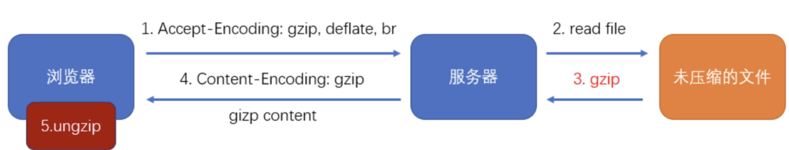

- 浏览器告诉服务器支持那些压缩方式。
- 响应头：什么方式解压->ungzip

优点：传输效率可能得到大幅提升

缺点：服务器的压缩需要时间，客户端的解压需要时间

**gzip 的原理**

gizp 压缩是一种 http 请求优化方式，通过减少文件体积来提高加载速度。html、js、css 文件甚至 json 数据都可以用它压缩，可以减小 60%以上的体积。前端配置 gzip 压缩，并且服务端使用 nginx 开启 gzip，用来减小网络传输的流量大小。

**使用 webpack 进行预压缩**

使用 compression-webpack-plugin 插件对打包结果进行预压缩，可以移除服务器的压缩时间

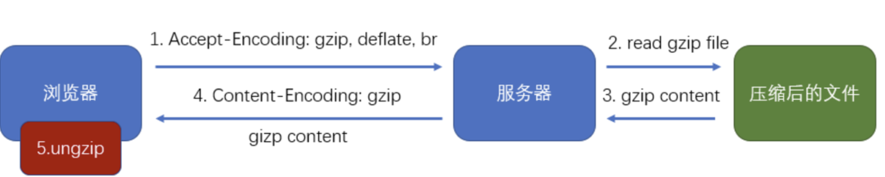

```js
plugins: [
  // 参考文档配置即可，一般取默认
  new CmpressionWebpackPlugin({
    test: /\.js/, //希望对js进行预压缩
    minRatio: 0.5, // 小于0.5才会压缩
  }),
];
```

#### 2.7 按需加载

在开发 SPA 项目的时候，项目中都会存在很多路由页面。如果将这些页面全部打包进一个 JS 文件的话，虽然将多个请求合并了，但是同样也加载了很多并不需要的代码，耗费了更长的时间。那么为了首页能更快地呈现给用户，希望首页能加载的文件体积越小越好，这时候就可以使用按需加载，将每个路由页面单独打包为一个文件。当然不仅仅路由可以按需加载，对于 lodash 这种大型类库同样可以使用这个功能。

按需加载的代码实现这里就不详细展开了，因为鉴于用的框架不同，实现起来都是不一样的。当然了，虽然他们的用法可能不同，但是底层的机制都是一样的。都是当使用的时候再去下载对应文件，返回一个 Promise，当 Promise 成功以后去执行回调。

#### 2.8 其他

- 压缩代码：删除多余的代码、注释、简化代码的写法等等⽅式。可以利⽤ webpack 的 UglifyJsPlugin 和 ParallelUglifyPlugin 来压缩 JS ⽂件， 利⽤ cssnano （css-loader?minimize）来压缩 css
- 利⽤ CDN 加速: 在构建过程中，将引⽤的静态资源路径修改为 CDN 上对应的路径。可以利⽤ webpack 对于 output 参数和各 loader 的 publicPath 参数来修改资源路径
- Code Splitting: 将代码按路由维度或者组件分块(chunk),这样做到按需加载,同时可以充分利⽤浏览器缓存
- 提取公共第三⽅库: SplitChunksPlugin 插件来进⾏公共模块抽取,利⽤浏览器缓存可以⻓期缓存这些⽆需频繁变动的公共代码

提取第三方库 vendor：
这是也是 webpack 大法的 code splitting，提取一些第三方的库，从而减小 app.js 的大小。
代码层面做好懒加载，网络层面把 CDN、本地缓存用好，前端页面问题基本解决一大半了。剩下主要就是接口层面和“视觉上的快”的优化了，骨架屏先搞起，渲染一个“假页面”占位；接口该合并的合并，该拆分的拆分，如果是可滚动的长页面，就分批次请求

**总结：如果有一个工程打包特别大-如何进行优化？**

1. CDN 如果工程中使用了一些知名的第三方库，可以考虑使用 CDN，而不进行打包
2. 抽离公共模块 如果工程中用到了一些大的公共库，可以考虑将其分割出来单独打包
3. 异步加载 对于那些不需要在一开始就执行的模块，可以考虑使用动态导入的方式异步加载它们，以尽量减少主包的体积
4. 压缩、混淆
5. tree shaking 尽量使用 ESM 语法进行导入导出，充分利用 tree shaking 去除无用代码
6. gzip 开启 gzip 压缩，进一步减少包体积
7. 环境适配 有些打包结果中包含了大量兼容性处理的代码，但在新版本浏览器中这些代码毫无意义。因此，可以把浏览器分为多个层次，为不同层次的浏览器给予不同的打包结果。

### 3. 运行性能

运行性能是指，JS 代码在浏览器端的运行速度，它主要取决于我们如何书写高性能的代码

永远不要过早的关注于性能，因为你在开发的时候，无法完全预知最终的运行性能，过早的关注性能会极大的降低开发效率
性能优化主要从上面三个维度入手，性能优化没有完美的解决方案，需要具体情况具体分析

### 4. webpack5 内置优化

1. **[webpack scope hoisting](https://webpack.docschina.org/plugins/module-concatenation-plugin/)**

scope hoisting 是 webpack 的内置优化，它是针对模块的优化，在生产环境打包时会自动开启。

在未开启 scope hoisting 时，webpack 会将每个模块的代码放置在一个独立的函数环境中，这样是为了保证模块的作用域互不干扰。

而 scope hoisting 的作用恰恰相反，是把多个模块的代码合并到一个函数环境中执行。在这一过程中，webpack 会按照顺序正确的合并模块代码，同时对涉及的标识符做适当处理以避免重名。

这样做的好处是减少了函数调用，对运行效率有一定提升，同时也降低了打包体积。

但 scope hoisting 的启用是有前提的，如果遇到某些模块多次被其他模块引用，或者使用了动态导入的模块，或者是非 ESM 的模块，都不会有 scope hoisting。

2. 清除输出目录

`webpack5`清除输出目录开箱可用，无须安装`clean-webpack-plugin`，具体做法如下：

```javascript
module.exports = {
  output: {
    clean: true,
  },
};
```

3. top-level-await

`webpack5`现在允许在模块的顶级代码中直接使用`await`

```javascript
// src/index.js
const resp = await fetch("http://www.baidu.com");
const jsonBody = await resp.json();
export default jsonBody;
```

目前，`top-level-await`还未成为正式标准，因此，对于`webpack5`而言，该功能是作为`experiments`发布的，需要在`webpack.config.js`中配置开启

```javascript
// webpack.config.js
module.exports = {
  experiments: {
    topLevelAwait: true,
  },
};
```

4. 打包体积优化

`webpack5`对模块的合并、作用域提升、`tree shaking`等处理更加智能

```javascript
// webpack.config.js
module.exports = {
  mode: "production",
  devtool: "source-map",
  entry: {
    index1: "./src/index1.js",
    index2: "./src/index2.js",
  },
};
```

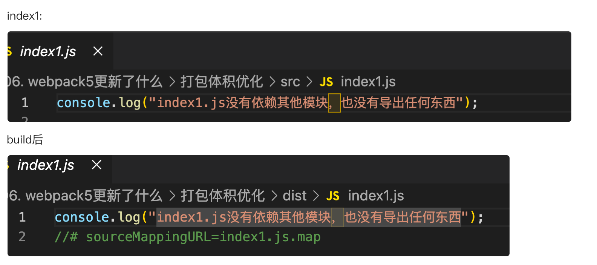

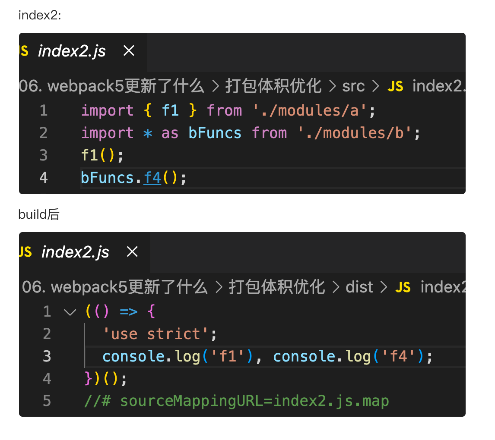

5. 打包缓存开箱即用

在`webpack4`中，需要使用`cache-loader`缓存打包结果以优化之后的打包性能

而在`webpack5`中，默认就已经开启了打包缓存，无须再安装`cache-loader`

默认情况下，`webpack5`是将模块的打包结果缓存到**内存**中，可以通过`cache`配置进行更改

```javascript
const path = require("path");

module.exports = {
  mode: "development",
  devtool: "source-map",
  entry: "./src/index.js",
  cache: {
    type: "filesystem", // 缓存类型，支持：memory、filesystem
    cacheDirectory: path.resolve(__dirname, "node_modules/.cache/webpack"), // 缓存目录，仅类型为 filesystem 有效
    // 更多配置参考：https://webpack.docschina.org/configuration/other-options/#cache
  },
};
```

> 关于`cache`的更多配置参考：[https://webpack.docschina.org/configuration/other-options/#cache](https://webpack.docschina.org/configuration/other-options/#cache)

6. 资源模块

在`webpack4`中，针对资源型文件我们通常使用`file-loader`、`url-loader`、`raw-loader`进行处理

由于大部分前端项目都会用到资源型文件，因此`webpack5`原生支持了资源型模块

详见：[https://webpack.docschina.org/guides/asset-modules/](https://webpack.docschina.org/guides/asset-modules/)

```javascript
// index.js
import bigPic from "./assets/big-pic.png"; // 期望得到路径
import smallPic from "./assets/small-pic.jpg"; // 期望得到base64
import yueyunpeng from "./assets/yueyunpeng.gif"; // 期望根据文件大小决定是路径还是base64
import raw from "./assets/raw.txt"; // 期望得到原始文件内容

console.log("big-pic.png", bigPic);
console.log("small-pic.jpg", smallPic);
console.log("yueyunpeng.gif", yueyunpeng);
console.log("raw.txt", raw);
```

```javascript
// webpack.config.js
const path = require("path");
const HtmlWebpackPlugin = require("html-webpack-plugin");
module.exports = {
  mode: "development",
  devtool: "source-map",
  entry: "./src/index.js",
  devServer: {
    port: 8080,
  },
  plugins: [new HtmlWebpackPlugin()],
  output: {
    filename: "main.js",
    path: path.resolve(__dirname, "dist"),
    assetModuleFilename: "assets/[hash:5][ext]", // 在这里自定义资源文件保存的文件名
  },
  module: {
    rules: [
      {
        test: /\.png/,
        type: "asset/resource", // 作用类似于 file-loader
      },
      {
        test: /\.jpg/,
        type: "asset/inline", // 作用类似于 url-loader 文件大小不足的场景
      },
      {
        test: /\.txt/,
        type: "asset/source", // 作用类似于 raw-loader
      },
      {
        test: /\.gif/,
        type: "asset", // 作用类似于 url-loader。在导出一个 data uri 和发送一个单独的文件之间自动选择
        generator: {
          filename: "gif/[hash:5][ext]", // 这里的配置会覆盖 assetModuleFilename
        },
        parser: {
          dataUrlCondition: {
            maxSize: 4 * 1024, // 4kb以下使用 data uri
            // 4kb以上就是文件
          },
        },
      },
    ],
  },
};
```

### 字节跳动面试题：说一下项目里有做过哪些 webpack 上的优化

1. 对传输性能的优化

- 压缩和混淆 使用 Uglifyjs 或其他类似工具对打包结果进行压缩、混淆，可以有效的减少包体积
- tree shaking 项目中尽量使用 ESM，可以有效利用 tree shaking 优化，降低包体积
- 抽离公共模块 将一些公共代码单独打包，这样可以充分利用浏览器缓存，其他代码变动后，不影响公共代码，浏览器可以直接从缓存中找到公共代码。 具体方式有多种，比如 dll、splitChunks
- 异步加载 对一些可以延迟执行的模块可以使用动态导入的方式异步加载它们，这样在打包结果中，它们会形成单独的包，同时，在页面一开始解析时并不需要加载它们，而是页面解析完成后，执行 JS 的过程中去加载它们。 这样可以显著提高页面的响应速度，在单页应用中尤其有用。
- CDN 对一些知名的库使用 CDN，不仅可以节省打包时间，还可以显著提升库的加载速度
- gzip 目前浏览器普遍支持 gzip 格式，因此可以将静态文件均使用 gzip 进行压缩
- 环境适配 有些打包结果中包含了大量兼容性处理的代码，但在新版本浏览器中这些代码毫无意义。因此，可以把浏览器分为多个层次，为不同层次的浏览器给予不同的打包结果。

2. 对打包过程的优化

- noParse 很多第三方库本身就是已经打包好的代码，对于这种代码无须再进行解析，可以使用 noParse 配置排除掉这些第三方库
- externals 对于一些知名的第三方库可以使用 CDN，这部分库可以通过 externals 配置不进行打包
- 限制 loader 的范围 在使用 loader 的时候，可以通过 exclude 排除掉一些不必要的编译，比如 babel-loader 对于那些已经完成打包的第三方库没有必要再降级一次，可以排除掉
- 开启 loader 缓存 可以利用 cache-loader 缓存 loader 的编译结果，避免在源码没有变动时反复编译
- 开启多线程编译 可以利用 thread-loader 开启多线程编译，提升编译效率
- 动态链接库 对于某些需要打包的第三方库，可以使用 dll 的方式单独对其打包，然后 DLLPlugin 将其整合到当前项目中，这样就避免了在开发中频繁去打包这些库

3. 对开发体验的优化

- lint 使用 eslint、stylelint 等工具保证团队代码风格一致
- HMR 使用热替换避免页面刷新导致的状态丢失，提升开发体验

## CSS

:::tip
CSS 渲染性能优化
:::

1. 使用 id selector 非常的高效。在使用 id selector 的时候需要注意一点：因为 id 是唯一的，所以不需要既指定 id 又指定 tagName：

```css
/* Bad  */
p#id1 {
  color: red;
}

/* Good  */
#id1 {
  color: red;
}
```

2. 不要使用 attribute selector，如：p[att1=”val1”]。这样的匹配非常慢。更不要这样写：p[id="id1"]。这样将 id selector 退化成 attribute selector。

```css
/* Bad  */
p[id="jartto"] {
  color: red;
}
p[class="blog"] {
  color: red;
}
/* Good  */
#jartto {
  color: red;
}
.blog {
  color: red;
}
```

3. 通常将浏览器前缀置于前面，将标准样式属性置于最后，类似：

```css
.foo {
  -moz-border-radius: 5px;
  border-radius: 5px;
}
```

这里推荐参阅 CSS 规范-优化方案：http://nec.netease.com/standard/css-optimize.html

4. 遵守 CSSLint 规则

font-faces 　　　　 　　　不能使用超过 5 个 web 字体

import 　　　　　　　 　　 禁止使用@import

regex-selectors 　　　　 禁止使用属性选择器中的正则表达式选择器

universal-selector 　　 　　 禁止使用通用选择器\*

unqualified-attributes 　　　禁止使用不规范的属性选择器

zero-units 　　 　　　 0 后面不要加单位

overqualified-elements 　　　使用相邻选择器时，不要使用不必要的选择器

shorthand 　　　　　　　　 简写样式属性

duplicate-background-images 相同的 url 在样式表中不超过一次

更多的 CSSLint 规则可以参阅：https://github.com/CSSLint/csslint

5. 不要使用 @import

使用 @import 引入 CSS 会影响浏览器的并行下载。使用 @import 引用的 CSS 文件只有在引用它的那个 CSS 文件被下载、解析之后，浏览器才会知道还有另外一个 CSS 需要下载，这时才去下载，然后下载后开始解析、构建 Render Tree 等一系列操作。

多个 @import 会导致下载顺序紊乱。在 IE 中，@import 会引发资源文件的下载顺序被打乱，即排列在 @import 后面的 JS 文件先于 @import 下载，并且打乱甚至破坏 @import 自身的并行下载。

6. 避免过分重排（Reflow）

所谓重排就是浏览器重新计算布局位置与大小。常见的重排元素：

```
width
height
padding
margin
display
border-width
border
top
position
font-size
float
text-align
overflow-y
font-weight
overflow
left
font-family
line-height
vertical-align
right
clear
white-space
bottom
min-height
```

7. 依赖继承。如果某些属性可以继承，那么自然没有必要在写一遍。

8. 其他：使用 id 选择器非常高效，因为 id 是唯一的；使用渐进增强的方案；值缩写；避免耗性能的属性；背景图优化合并；文件压缩

## 网络层面

### 总结

- 优化打包体积：利用一些工具压缩、混淆最终打包代码，减少包体积
- 多目标打包：利用一些打包插件，针对不同的浏览器打包出不同的兼容性版本，这样一来，每个版本中的兼容性代码就会大大减少，从而减少包体积
- 压缩：现代浏览器普遍支持压缩格式，因此服务端的各种文件可以压缩后再响应给客户端，只要解压时间小于优化的传输时间，压缩就是可行的
- CDN：利用 CDN 可以大幅缩减静态资源的访问时间，特别是对于公共库的访问，可以使用知名的 CDN 资源，这样可以实现跨越站点的缓存
- 缓存：对于除 HTML 外的所有静态资源均可以开启协商缓存，利用构建工具打包产生的文件 hash 值来置换缓存
- http2：开启 http2 后，利用其多路复用、头部压缩等特点，充分利用带宽传递大量的文件数据
- 雪碧图：对于不使用 HTTP2 的场景，可以将多个图片合并为雪碧图，以达到减少文件的目的
- defer、async：通过 defer 和 async 属性，可以让页面尽早加载 js 文件
- prefetch、preload：通过 prefetch 属性，可以让页面在空闲时预先下载其他页面可能要用到的资源；通过 preload 属性，可以让页面预先下载本页面可能要用到的资源
- 多个静态资源域：对于不使用 HTTP2 的场景，将相对独立的静态资源分到多个域中保存，可以让浏览器同时开启多个 TCP 连接，并行下载 （http2 之前，浏览器开多个 tcp，同一个域下最大数 6 个，为了多，静态资源分多个域存储，突破 6 个的限制）

### CDN

CDN（Content Delivery Network，内容分发网络）是指一种通过互联网互相连接的电脑网络系统，利用最靠近每位用户的服务器，更快、更可靠地将音乐、图片、视频、应用程序及其他文件发送给用户，来提供高性能、可扩展性及低成本的网络内容传递给用户。

典型的 CDN 系统构成：

- 分发服务系统： 最基本的工作单元就是 Cache 设备，cache（边缘 cache）负责直接响应最终用户的访问请求，把缓存在本地的内容快速地提供给用户。同时 cache 还负责与源站点进行内容同步，把更新的内容以及本地没有的内容从源站点获取并保存在本地。Cache 设备的数量、规模、总服务能力是衡量一个 CDN 系统服务能力的最基本的指标。

- 负载均衡系统： 主要功能是负责对所有发起服务请求的用户进行访问调度，确定提供给用户的最终实际访问地址。两级调度体系分为全局负载均衡（GSLB）和本地负载均衡（SLB）。全局负载均衡主要根据用户就近性原则，通过对每个服务节点进行“最优”判断，确定向用户提供服务的 cache 的物理位置。本地负载均衡主要负责节点内部的设备负载均衡

- 运营管理系统： 运营管理系统分为运营管理和网络管理子系统，负责处理业务层面的与外界系统交互所必须的收集、整理、交付工作，包含客户管理、产品管理、计费管理、统计分析等功能。

#### 作用

CDN 一般会用来托管 Web 资源（包括文本、图片和脚本等），可供下载的资源（媒体文件、软件、文档等），应用程序（门户网站等）。使用 CDN 来加速这些资源的访问。

（1）在性能方面，引入 CDN 的作用在于：

- 用户收到的内容来自最近的数据中心，延迟更低，内容加载更快
- 部分资源请求分配给了 CDN，减少了服务器的负载

（2）在安全方面，CDN 有助于防御 DDoS、MITM 等网络攻击：

- 针对 DDoS：通过监控分析异常流量，限制其请求频率
- 针对 MITM：从源服务器到 CDN 节点到 ISP（Internet Service Provider），全链路 HTTPS 通信

除此之外，CDN 作为一种基础的云服务，同样具有资源托管、按需扩展（能够应对流量高峰）等方面的优势。
CDN 还会把文件最小化或者压缩文档的优化

#### 原理

它的基本原理是：**架设多台服务器，这些服务器定期从源站拿取资源保存本地，到让不同地域的用户能够通过访问最近的服务器获得资源**

CDN 和 DNS 有着密不可分的联系，先来看一下 DNS 的解析域名过程，在浏览器输入 www.test.com 的解析过程如下：

1. 检查浏览器缓存
2. 检查操作系统缓存，常见的如 hosts 文件
3. 检查路由器缓存
4. 如果前几步都没没找到，会向 ISP(网络服务提供商)的 LDNS 服务器查询
5. 如果 LDNS 服务器没找到，会向根域名服务器(Root Server)请求解析，分为以下几步：

- 根服务器返回顶级域名(TLD)服务器如.com，.cn，.org 等的地址，该例子中会返回.com 的地址
- 接着向顶级域名服务器发送请求，然后会返回次级域名(SLD)服务器的地址，本例子会返回.test 的地址
- 接着向次级域名服务器发送请求，然后会返回通过域名查询到的目标 IP，本例子会返回www.test.com的地址
- Local DNS Server 会缓存结果，并返回给用户，缓存在系统中

CDN 的工作原理：

1. 用户未使用 CDN 缓存资源的过程：
2. 浏览器通过 DNS 对域名进行解析（就是上面的 DNS 解析过程），依次得到此域名对应的 IP 地址
3. 浏览器根据得到的 IP 地址，向域名的服务主机发送数据请求
4. 服务器向浏览器返回响应数据

（2）用户使用 CDN 缓存资源的过程：

1. 对于点击的数据的 URL，经过本地 DNS 系统的解析，发现该 URL 对应的是一个 CDN 专用的 DNS 服务器，DNS 系统就会将域名解析权交给 CNAME 指向的 CDN 专用的 DNS 服务器。
2. CND 专用 DNS 服务器将 CND 的全局负载均衡设备 IP 地址返回给用户
3. 用户向 CDN 的全局负载均衡设备发起数据请求
4. CDN 的全局负载均衡设备根据用户的 IP 地址，以及用户请求的内容 URL，选择一台用户所属区域的区域负载均衡设备，告诉用户向这台设备发起请求
5. 区域负载均衡设备选择一台合适的缓存服务器来提供服务，将该缓存服务器的 IP 地址返回给全局负载均衡设备
6. 全局负载均衡设备把服务器的 IP 地址返回给用户
7. 用户向该缓存服务器发起请求，缓存服务器响应用户的请求，将用户所需内容发送至用户终端。

如果缓存服务器没有用户想要的内容，那么缓存服务器就会向它的上一级缓存服务器请求内容，以此类推，直到获取到需要的资源。最后如果还是没有，就会回到自己的服务器去获取资源。

CNAME（意为：别名）：在域名解析中，实际上解析出来的指定域名对应的 IP 地址，或者该域名的一个 CNAME，然后再根据这个 CNAME 来查找对应的 IP 地址。

#### 使用场景

- 使用第三方的 CDN 服务：如果想要开源一些项目，可以使用第三方的 CDN 服务
- 使用 CDN 进行静态资源的缓存：将自己网站的静态资源放在 CDN 上，比如 js、css、图片等。可以将整个项目放在 CDN 上，完成一键部署。
- 直播传送：直播本质上是使用流媒体进行传送，CDN 也是支持流媒体传送的，所以直播完全可以使用 CDN 来提高访问速度。CDN 在处理流媒体的时候与处理普通静态文件有所不同，普通文件如果在边缘节点没有找到的话，就会去上一层接着寻找，但是流媒体本身数据量就非常大，如果使用回源的方式，必然会带来性能问题，所以流媒体一般采用的都是主动推送的方式来进行。

TODO：cdn 加速原理，没有缓存到哪里拿，CDN 回源策略

**分发的内容**

静态内容：即使是静态内容也不是一直保存在 cdn，源服务器发送文件给 CDN 的时候就可以利用 HTTP 头部的 cache-control 可以设置文件的缓存形式，cdn 就知道哪些内容可以保存 no-cache，那些不能 no-store，那些保存多久 max-age

动态内容：

工作流程：

静态内容：源服务器把静态内容提前备份给 cdn(push)，世界各地访问的时候就进的 cdn 服务器会把静态内容提供给用户，不需要每次劳烦源服务器。如果没有提前备份，cdn 问源服务器要(pull)，然后 cdn 备份，其他请球的用户可以马上拿到。

动态内容：源服务器很难做到提前预测到每个用户的动态内容提前给到 cdn，如果等到用户索取动态内容 cdn 再向源服务器获取，这样 cdn 提供不了加速服务。但是有些是可以提供动态服务的：时间，有些 cdn 会提供可以运行在 cdn 上的接口，让源服务器用这些 cdn 接口，而不是源服务器自己的代码，用户就可以直接从 cdn 获取时间

问：cdn 用什么方式来转移流量实现负载均衡？

和 DNS 域名解析根服务器的做法相似：任播通信：服务器对外都拥有同一个 ip 地址，如果收到了请求，请求就会由距离用户最近的服务器响应，任播技术把流量转移给没超载的服务器可以缓解。CDN 还会用 TLS/SSL 证书对网站进行保护。
我们可以把项目中的所有静态资源都放到 CDN 上（收费），也可以利用现成免费的 CDN 获取公共库的资源

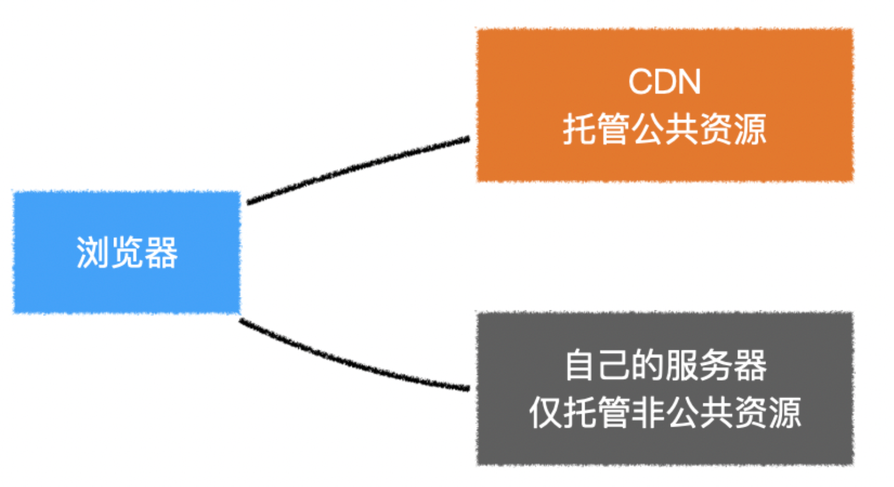

```js

首先，我们需要告诉webpack不要对公共库进行打包
// vue.config.js
module.exports = {
  configureWebpack: {
    externals: {
      vue: "Vue",
      vuex: "Vuex",
      "vue-router": "VueRouter",
    }
  },
};
然后，在页面中手动加入cdn链接，这里使用bootcn
对于vuex和vue-router，使用这种传统的方式引入的话会自动成为Vue的插件，因此需要去掉Vue.use(xxx)

我们可以使用下面的代码来进行兼容
// store.js
import Vue from "vue";
import Vuex from "vuex";

if(!window.Vuex){
  // 没有使用传统的方式引入Vuex
  Vue.use(Vuex);
}

// router.js
import VueRouter from "vue-router";
import Vue from "vue";

if(!window.VueRouter){
  // 没有使用传统的方式引入VueRouter
  Vue.use(VueRouter);
}
```

### 增加带宽

增加带宽可以提高资源的访问速度，从而提高首批的加载速度，我司项目带宽由 2M 升级到 5M，效果明显。

### http 内置优化

- Http2
  - 头部压缩：专门的 HPACK 压缩算法
    - 索引表：客户端和服务器共同维护的一张表，表的内容分为 61 位的静态表（保存常用信息，例如：host/content-type）和动态表
    - 霍夫曼编码
- 链路复用
  - Http1 建立起 Tcp 连接，发送请求之后，服务器在处理请求的等待期间，这个期间又没有数据去发送，称为空挡期。链接断开是在服务器响应回溯之后
    - keep-alive 链接保持一段时间
    - HTTP2 可以利用空档期
    - 不需要再重复建立链接
- 二进制帧
  - Http1.1 文本字符分割的数据流，解析慢且容易出错
  - 二进制帧：帧长度、帧类型、帧标识
    补充：采用 Http2 之后，可以减少资源合并的操作，因为首部压缩已经减少了多请求传输的数据量

### 数据传输层面

- 缓存：浏览器缓存
  - 强缓存
    - cache-contorl: max-age=30
    - expires: Wed, 21 Oct 2021 07:28:00 GMT
- 协商缓存
  - etag
  - last-modified
  - if-modified-since
  - if-none-match
- 压缩
  - 数据压缩：gzip
  - 代码文件压缩：HTML/CSS/JS 中的注释、空格、长变量等
  - 静态资源：字体图标，去除元数据，缩小尺寸以及分辨率
  - 头与报文
    - http1.1 中减少不必要的头
    - 减少 cookie 数据量

## Vue

### Vue 开发优化

#### 使用 key

对于通过循环生成的列表，应给每个列表项一个稳定且唯一的 key，这有利于在列表变动时，尽量少的删除、新增、改动元素

#### 使用冻结的对象

冻结的对象不会被响应化

#### 使用函数式组件

参见[函数式组件](https://v2.cn.vuejs.org/v2/guide/render-function.html#%E5%87%BD%E6%95%B0%E5%BC%8F%E7%BB%84%E4%BB%B6)

#### 使用计算属性

如果模板中某个数据会使用多次，并且该数据是通过计算得到的，使用计算属性以缓存它们

#### 非实时绑定的表单项

当使用 v-model 绑定一个表单项时，当用户改变表单项的状态时，也会随之改变数据，从而导致 vue 发生重渲染（rerender），这会带来一些性能的开销。

特别是当用户改变表单项时，页面有一些动画正在进行中，由于 JS 执行线程和浏览器渲染线程是互斥的，最终会导致动画出现卡顿。

我们可以通过使用 lazy 或不使用 v-model 的方式解决该问题，但要注意，这样可能会导致在某一个时间段内数据和表单项的值是不一致的。

#### 保持对象引用稳定

在绝大部分情况下，vue 触发 rerender 的时机是其依赖的数据发生变化

若数据没有发生变化，哪怕给数据重新赋值了，vue 也是不会做出任何处理的

下面是 vue 判断数据没有变化的源码

```js
// value 为旧值， newVal 为新值
if (newVal === value || (newVal !== newVal && value !== value)) {
  //NaN
  return;
}
```

因此，如果需要，只要能保证组件的依赖数据不发生变化，组件就不会重新渲染。

对于原始数据类型，保持其值不变即可

对于对象类型，保持其引用不变即可

从另一方面来说，由于可以通过保持属性引用稳定来避免子组件的重渲染，那么我们应该细分组件来尽量避免多余的渲染

#### 使用 v-show 替代 v-if

对于频繁切换显示状态的元素，使用 v-show 可以保证虚拟 dom 树的稳定，避免频繁的新增和删除元素，特别是对于那些内部包含大量 dom 元素的节点，这一点极其重要

关键字：频繁切换显示状态、内部包含大量 dom 元素

#### 使用延迟装载（defer）

首页白屏时间主要受到两个因素的影响：

- 打包体积过大 巨型包需要消耗大量的传输时间，导致 JS 传输完成前页面只有一个`<div>`，没有可显示的内容
  `<div id="app">好看的东西<div>`

- 需要立即渲染的内容太多 JS 传输完成后，浏览器开始执行 JS 构造页面。 但可能一开始要渲染的组件太多，不仅 JS 执行的时间很长，而且执行完后浏览器要渲染的元素过多，从而导致页面白屏

打包体积过大需要自行优化打包体积，本节不予讨论

可以进行分包

本节仅讨论渲染内容太多的问题。

一个可行的办法就是延迟装载组件，让组件按照指定的先后顺序依次一个一个渲染出来

延迟装载是一个思路，本质上就是利用 requestAnimationFrame 事件分批渲染内容，它的具体实现多种多样

#### 使用 keep-alive

keep-alive 组件是 vue 的内置组件，用于缓存内部组件实例。这样做的目的在于，keep-alive 内部的组件切回时，不用重新创建组件实例，而直接使用缓存中的实例，一方面能够避免创建组件带来的开销，另一方面可以保留组件的状态（不仅是数据的保留，还要真实 dom 的保留）。

keep-alive 具有 include 和 exclude 属性，通过它们可以控制哪些组件进入缓存。另外它还提供了 max 属性，通过它可以设置最大缓存数，当缓存的实例超过该数时，vue 会移除最久没有使用的组件缓存。

受 keep-alive 的影响，其内部所有嵌套的组件都具有两个生命周期钩子函数，分别是 activated 和 deactivated，它们分别在组件激活和失活时触发。第一次 activated 触发是在 mounted 之后

原理
在具体的实现上，keep-alive 在内部维护了一个 key 数组和一个缓存对象

```js
// keep-alive 内部的声明周期函数
created () {
  this.cache = Object.create(null)
  this.keys = []
}

```

key 数组记录目前缓存的组件 key 值，如果组件没有指定 key 值，则会为其自动生成一个唯一的 key 值
cache 对象以 key 值为键，vnode 为值，用于缓存组件对应的虚拟 DOM

在 keep-alive 的渲染函数中，其基本逻辑是判断当前渲染的 vnode 是否有对应的缓存，如果有，从缓存中读取到对应的组件实例；如果没有则将其缓存。
当缓存数量超过 max 数值时，keep-alive 会移除掉 key 数组的第一个元素

```js
render(){
  const slot = this.$slots.default; // 获取默认插槽
  const vnode = getFirstComponentChild(slot); // 得到插槽中的第一个组件的vnode
  const name = getComponentName(vnode.componentOptions); //获取组件名字
  const { cache, keys } = this; // 获取当前的缓存对象和key数组
  const key = ...; // 获取组件的key值，若没有，会按照规则自动生成
  if (cache[key]) {
    // 有缓存
    // 重用组件实例
    vnode.componentInstance = cache[key].componentInstance
    remove(keys, key); // 删除key
    // 将key加入到数组末尾，这样是为了保证最近使用的组件在数组中靠后，反之靠前
    keys.push(key);
  } else {
    // 无缓存，进行缓存
    cache[key] = vnode
    keys.push(key)
    if (this.max && keys.length > parseInt(this.max)) {
      // 超过最大缓存数量，移除第一个key对应的缓存
      pruneCacheEntry(cache, keys[0], keys, this._vnode)
    }
  }
  return vnode;
}
```

#### 长列表优化

`vue-virtual-scroller`

首先这个库在使用上是很方便的，就是它提供了一个标签，相当于是对 div 标签的一个修改，可以实现列表的渲染等等功能

#### 异步组件

在代码层面，vue 组件本质上是一个配置对象

```js
var comp = {
  props: xxx,
  data: xxx,
  computed: xxx,
  methods: xxx,
};
```

但有的时候，要得到某个组件配置对象需要一个异步的加载过程，比如：

- 需要使用 ajax 获得某个数据之后才能加载该组件
- 为了合理的分包，组件配置对象需要通过 import(xxx)动态加载

如果一个组件需要通过异步的方式得到组件配置对象，该组件可以把它做成一个异步组件

```js
/**
 * 异步组件本质上是一个函数
 * 该函数调用后返回一个Promise，Promise成功的结果是一个组件配置对象
 */
const AsyncComponent = () => import("./MyComp");

var App = {
  components: {
    /**
     * 你可以把该函数当做一个组件使用（异步组件）
     * Vue会调用该函数，并等待Promise完成，完成之前该组件位置什么也不渲染
     */
    AsyncComponent,
  },
};
```

异步组件的函数不仅可以返回一个 Promise，还支持返回一个对象

应用：异步组件通常应用在路由懒加载中，以达到更好的分包；为了提高用户体验，可以在组件配置对象加载完成之前给用户显示一些提示信息

```js
var routes = [
  {
    path: "/",
    component: async () => {
      console.log("组件开始加载");
      const HomeComp = await import("./Views/Home.vue");
      console.log("组件加载完毕");
      return HomeComp;
    },
  },
];
```

### Vue3 内置优化

#### 静态提升

下面的静态节点会被提升

- 元素节点
- 没有绑定动态内容

```js

// vue2 的静态节点
render(){
  createVNode("h1", null, "Hello World")
  // ...
}

// vue3 的静态节点
const hoisted = createVNode("h1", null, "Hello World")//这个节点永远创建一次
function render(){
  // 直接使用 hoisted 即可
}
```

**静态属性会被提升**

```js
<div class="user">
  {{user.name}}
</div>

const hoisted = { class: "user" }

function render(){
  createVNode("div", hoisted, user.name)
  // ...
}
```

#### 预字符串化

```js

<div class="menu-bar-container">
  <div class="logo">
    <h1>logo</h1>
  </div>
  <ul class="nav">
    <li><a href="">menu</a></li>
    <li><a href="">menu</a></li>
    <li><a href="">menu</a></li>
    <li><a href="">menu</a></li>
    <li><a href="">menu</a></li>
  </ul>
  <div class="user">
    <span>{{ user.name }}</span>
  </div>
</div>
```

当编译器遇到大量连续（少量则不会，目前是至少 20 个连续节点）的静态内容，会直接将其编译为一个普通字符串节点

```js
const _hoisted_2 = _createStaticVNode(
  '<div class="logo"><h1>logo</h1></div><ul class="nav"><li><a href="">menu</a></li><li><a href="">menu</a></li><li><a href="">menu</a></li><li><a href="">menu</a></li><li><a href="">menu</a></li></ul>'
);
```

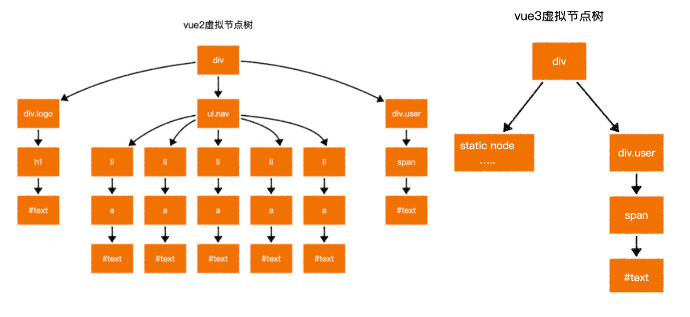

对 ssr 的作用非常明显

#### 缓存事件处理函数

```js
<button @click="count++">plus</button>

// vue2
render(ctx){
  return createVNode("button", {
    onClick: function($event){
      ctx.count++;
    }
  })
}

// vue3
render(ctx, _cache){
  return createVNode("button", {//事件处理函数不变，可以缓存一下，保证事件处理函数只生成一次
    onClick: cache[0] || (cache[0] = ($event) => (ctx.count++))//有的话，缓存；没有，count++
  })
}

```

#### Block Tree

vue2 在对比新旧树的时候，并不知道哪些节点是静态的，哪些是动态的，因此只能一层一层比较，这就浪费了大部分时间在比对静态节点上

Block 节点记录了那些是动态的节点，对比的时候只对比动态节点

```html
<form>
  <div>
    <label>账号：</label>
    <input v-model="user.loginId" />
  </div>
  <div>
    <label>密码：</label>
    <input v-model="user.loginPwd" />
  </div>
</form>
```

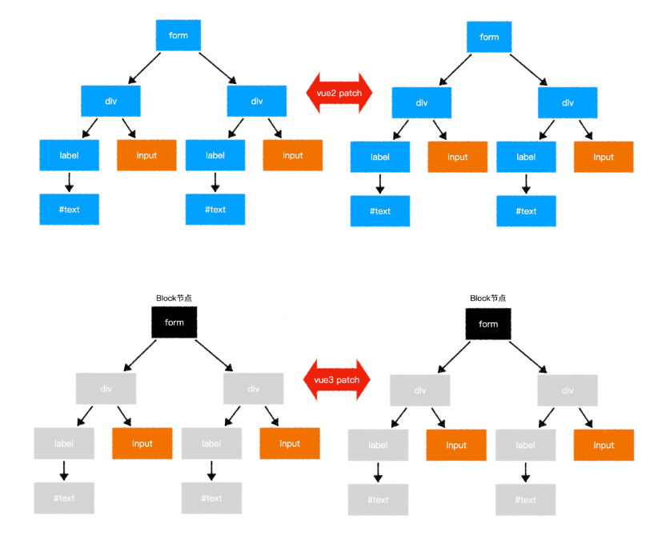

编译器 会把所有的动态节点标记，存到到根节点的数组中 ，到时候对比的时候只对比 block 动态节点。如果树不稳定，会有其他方案。

#### PatchFlag

依托于 vue3 强大的编译器。vue2 在对比每一个节点时，并不知道这个节点哪些相关信息会发生变化，因此只能将所有信息依次比对

```js
<div class="user" data-id="1" title="user name">
  {{user.name}}
</div>
```

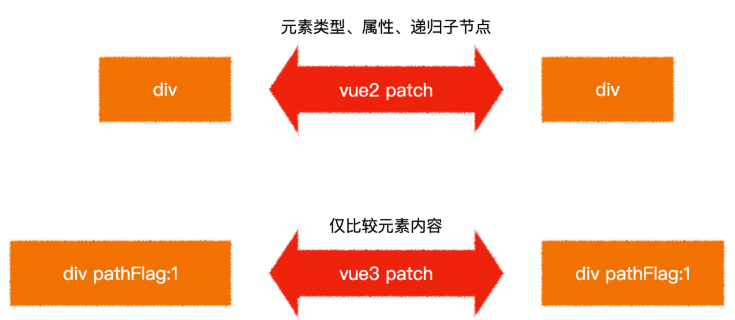

标识：

- 标识 1:代表元素内容是动态的
- 标识 2:Class
- 标识 3:class+text

#### 启用现代模式

为了兼容各种浏览器，vue-cli 在内部使用了@babel/present-env 对代码进行降级，你可以通过.browserlistrc 配置来设置需要兼容的目标浏览器

这是一种比较偷懒的办法，因为对于那些使用现代浏览器的用户，它们也被迫使用了降级之后的代码，而降低的代码中包含了大量的 polyfill，从而提升了包的体积

因此，我们希望提供两种打包结果：

1. 降级后的包（大），提供给旧浏览器用户使用
2. 未降级的包（小），提供给现代浏览器用户使用

除了应用 webpack 进行多次打包外，还可以利用 vue-cli 给我们提供的命令：

```shell
vue-cli-service build --modern
```

### 问题梳理

#### **如何实现 _vue_ 项目中的性能优化？**

> **编码阶段**
>
> - 尽量减少 _data_ 中的数据，_data_ 中的数据都会增加 _getter_ 和 _setter_，会收集对应的 _watcher_
> - _v-if_ 和 _v-for_ 不能连用
> - 如果需要使用 _v-for_ 给每项元素绑定事件时使用事件代理
> - _SPA_ 页面采用 _keep-alive_ 缓存组件
> - 在更多的情况下，使用 _v-if_ 替代 _v-show_
> - _key_ 保证唯一
> - 使用路由懒加载、异步组件
> - 防抖、节流
> - 第三方模块按需导入
> - 长列表滚动到可视区域动态加载
> - 图片懒加载

> **_SEO_ 优化**
>
> - 预渲染
> - 服务端渲染 _SSR_

> **打包优化**
>
> - 压缩代码
> - _Tree Shaking/Scope Hoisting_
> - 使用 _cdn_ 加载第三方模块
> - 多线程打包 _happypack_
> - _splitChunks_ 抽离公共文件
> - _sourceMap_ 优化

> **用户体验**
>
> - 骨架屏
> - _PWA_

> 还可以使用缓存(客户端缓存、服务端缓存)优化、服务端开启 _gzip_ 压缩等。

#### **_vue_ 中的 _spa_ 应用如何优化首屏加载速度?**

> 优化首屏加载可以从这几个方面开始：
>
> - 请求优化：CDN 将第三方的类库放到 CDN 上，能够大幅度减少生产环境中的项目体积，另外 CDN 能够实时地根据网络流量和各节点的连接、负载状况以及到用户的距离和响应时间等综合信息将用户的请求重新导向离用户最近的服务节点上。
> - 缓存：将长时间不会改变的第三方类库或者静态资源设置为强缓存，将 max-age 设置为一个非常长的时间，再将访问路径加上哈希达到哈希值变了以后保证获取到最新资源，好的缓存策略有助于减轻服务器的压力，并且显著的提升用户的体验
> - gzip：开启 gzip 压缩，通常开启 gzip 压缩能够有效的缩小传输资源的大小。
> - http2：如果系统首屏同一时间需要加载的静态资源非常多，但是浏览器对同域名的 tcp 连接数量是有限制的(chrome 为 6 个)超过规定数量的 tcp 连接，则必须要等到之前的请求收到响应后才能继续发送，而 http2 则可以在多个 tcp 连接中并发多个请求没有限制，在一些网络较差的环境开启 http2 性能提升尤为明显。
> - 懒加载：当 url 匹配到相应的路径时，通过 import 动态加载页面组件，这样首屏的代码量会大幅减少，webpack 会把动态加载的页面组件分离成单独的一个 chunk.js 文件
> - 预渲染：由于浏览器在渲染出页面之前，需要先加载和解析相应的 html、css 和 js 文件，为此会有一段白屏的时间，可以添加 loading，或者骨架屏幕尽可能的减少白屏对用户的影响体积优化
> - 合理使用第三方库：对于一些第三方 ui 框架、类库，尽量使用按需加载，减少打包体积
> - 使用可视化工具分析打包后的模块体积：webpack-bundle- analyzer 这个插件在每次打包后能够更加直观的分析打包后模块的体积，再对其中比较大的模块进行优化
> - 提高代码使用率：利用代码分割，将脚本中无需立即调用的代码在代码构建时转变为异步加载的过程
> - 封装：构建良好的项目架构，按照项目需求就行全局组件，插件，过滤器，指令，utils 等做一 些公共封装，可以有效减少我们的代码量，而且更容易维护资源优化
> - 图片懒加载：使用图片懒加载可以优化同一时间减少 http 请求开销，避免显示图片导致的画面抖动，提高用户体验
> - 使用 svg 图标：相对于用一张图片来表示图标，svg 拥有更好的图片质量，体积更小，并且不需要开启额外的 http 请求
> - 压缩图片：可以使用 image-webpack-loader，在用户肉眼分辨不清的情况下一定程度上压缩图片

## React

### 总结

shouldComponentUpdate 提供了两个参数 nextProps 和 nextState，表示下一次 props 和一次 state 的值，当函数返回 false 时候，render()方法不执行，组件也就不会渲染，返回 true 时，组件照常重渲染。此方法就是拿当前 props 中值和下一次 props 中的值进行对比，数据相等时，返回 false，反之返回 true。

需要注意，在进行新旧对比的时候，是**浅对比，**也就是说如果比较的数据时引用数据类型，只要数据的引用的地址没变，即使内容变了，也会被判定为 true。

面对这个问题，可以使用如下方法进行解决： （1）使用 setState 改变数据之前，先采用 ES6 中 assgin 进行拷贝，但是 assgin 只深拷贝的数据的第一层，所以说不是最完美的解决办法：

```javascript
const o2 = Object.assign({}, this.state.obj);
o2.student.count = "00000";
this.setState({
  obj: o2,
});
```

（2）使用 JSON.parse(JSON.stringfy())进行深拷贝，但是遇到数据为 undefined 和函数时就会错。

```javascript
const o2 = JSON.parse(JSON.stringify(this.state.obj));
o2.student.count = "00000";
this.setState({
  obj: o2,
});
```

**React 如何判断什么时候重新渲染组件？**

组件状态的改变可以因为`props`的改变，或者直接通过`setState`方法改变。组件获得新的状态，然后 React 决定是否应该重新渲染组件。只要组件的 state 发生变化，React 就会对组件进行重新渲染。这是因为 React 中的`shouldComponentUpdate`方法默认返回`true`，这就是导致每次更新都重新渲染的原因。

当 React 将要渲染组件时会执行`shouldComponentUpdate`方法来看它是否返回`true`（组件应该更新，也就是重新渲染）。所以需要重写`shouldComponentUpdate`方法让它根据情况返回`true`或者`false`来告诉 React 什么时候重新渲染什么时候跳过重新渲染。

**避免不必要的 render**

React 基于虚拟 DOM 和高效 Diff 算法的完美配合，实现了对 DOM 最小粒度的更新。大多数情况下，React 对 DOM 的渲染效率足以业务日常。但在个别复杂业务场景下，性能问题依然会困扰我们。此时需要采取一些措施来提升运行性能，其很重要的一个方向，就是避免不必要的渲染（Render）。这里提下优化的点：

- **shouldComponentUpdate 和 PureComponent**

在 React 类组件中，可以利用 shouldComponentUpdate 或者 PureComponent 来减少因父组件更新而触发子组件的 render，从而达到目的。shouldComponentUpdate 来决定是否组件是否重新渲染，如果不希望组件重新渲染，返回 false 即可。

- **利用高阶组件**

在函数组件中，并没有 shouldComponentUpdate 这个生命周期，可以利用高阶组件，封装一个类似 PureComponet 的功能

- **使用 React.memo**

React.memo 是 React 16.6 新的一个 API，用来缓存组件的渲染，避免不必要的更新，其实也是一个高阶组件，与 PureComponent 十分类似，但不同的是， React.memo 只能用于函数组件。

https://juejin.cn/post/6935584878071119885

## 高性能 JavaScript

### 开发注意

遵循严格模式："use strict"

将 JavaScript 本放在页面底部，加快渲染页面

将 JavaScript 脚本将脚本成组打包，减少请求

使用非阻塞方式下载 JavaScript 脚本

尽量使用局部变量来保存全局变量

尽量减少使用闭包

使用 window 对象属性方法时，省略 window

尽量减少对象成员嵌套

缓存 DOM 节点的访问

通过避免使用 eval() 和 Function() 构造器

给 setTimeout() 和 setInterval() 传递函数而不是字符串作为参数

尽量使用直接量创建对象和数组

最小化重绘 (repaint) 和回流 (reflow)

### 懒加载

**懒加载的概念**

懒加载也叫做延迟加载、按需加载，指的是在长网页中延迟加载图片数据，是一种较好的网页性能优化的方式。
如果使用图片的懒加载就可以解决以上问题。在滚动屏幕之前，可视化区域之外的图片不会进行加载，在滚动屏幕时才加载。这样使得网页的加载速度更快，减少了服务器的负载。懒加载适用于图片较多，页面列表较长（长列表）的场景中。

**懒加载的特点**

- 减少无用资源的加载：使用懒加载明显减少了服务器的压力和流量，同时也减小了浏览器的负担。
- 提升用户体验: 如果同时加载较多图片，可能需要等待的时间较长，这样影响了用户体验，而使用懒加载就能大大的提高用户体验。
- 防止加载过多图片而影响其他资源文件的加载 ：会影响网站应用的正常使用。

**懒加载的实现原理**

图片的加载是由 src 引起的，当对 src 赋值时，浏览器就会请求图片资源。根据这个原理，我们使用 HTML5 的 data-xxx 属性来储存图片的路径，在需要加载图片的时候，将 data-xxx 中图片的路径赋值给 src，这样就实现了图片的按需加载，即懒加载。

注意：data-xxx 中的 xxx 可以自定义，这里我们使用 data-src 来定义。
懒加载的实现重点在于确定用户需要加载哪张图片，在浏览器中，可视区域内的资源就是用户需要的资源。所以当图片出现在可视区域时，获取图片的真实地址并赋值给图片即可。

使用原生 JavaScript 实现懒加载

0. IntersectionObserver api
1. window.innerHeight 是浏览器可视区的高度
2. document.body.scrollTop || document.documentElement.scrollTop 是浏览器滚动的过的距离
3. imgs.offsetTop 是元素顶部距离文档顶部的高度（包括滚动条的距离）
4. 图片加载条件：img.offsetTop < window.innerHeight + document.body.scrollTop;

```html
<div class="container">
  
  
  
  
  
  
</div>
<script>
  var imgs = document.querySelectorAll("img");
  function lozyLoad() {
    var scrollTop =
      document.body.scrollTop || document.documentElement.scrollTop;
    var winHeight = window.innerHeight;
    for (var i = 0; i < imgs.length; i++) {
      if (imgs[i].offsetTop < scrollTop + winHeight) {
        imgs[i].src = imgs[i].getAttribute("data-src");
      }
    }
  }
  window.onscroll = lozyLoad();
</script>
```

**懒加载与预加载的区别**

这两种方式都是提高网页性能的方式，两者主要区别是一个是提前加载，一个是迟缓甚至不加载。懒加载对服务器前端有一定的缓解压力作用，预加载则会增加服务器前端压力

- 懒加载也叫延迟加载，指的是在长网页中延迟加载图片的时机，当用户需要访问时，再去加载，这样可以提高网站的首屏加载速度，提升用户的体验，并且可以减少服务器的压力。它适用于图片很多，页面很长的电商网站的场景。懒加载的实现原理是，将页面上的图片的 src 属性设置为空字符串，将图片的真实路径保存在一个自定义属性中，当页面滚动的时候，进行判断，如果图片进入页面可视区域内，则从自定义属性中取出真实路径赋值给图片的 src 属性，以此来实现图片的延迟加载。
- 预加载指的是将所需的资源提前请求加载到本地，这样后面在需要用到时就直接从缓存取资源。 通过预加载能够减少用户的等待时间，提高用户的体验。我了解的预加载的最常用的方式是使用 js 中的 image 对象，通过为 image 对象来设置 scr 属性，来实现图片的预加载。

参考：https://juejin.cn/post/6844903455048335368#heading-5

### 回流与重绘

#### 回流（重排）

当渲染树中部分或者全部元素的尺寸、结构或者属性发生变化时，浏览器会重新渲染部分或者全部文档的过程就称为回流。
下面这些操作会导致回流：

- 页面的首次渲染
- 浏览器的窗口大小发生变化
- 元素的内容发生变化
- 元素的尺寸或者位置发生变化
- 元素的字体大小发生变化
- 激活 CSS 伪类
- 查询某些属性或者调用某些方法
- 添加或者删除可见的 DOM 元素、
- 操作 class 属性
- 设置 style 属性：.style....style...----->.class{}

在触发回流（重排）的时候，由于浏览器渲染页面是基于流式布局的，所以当触发回流时，会导致周围的 DOM 元素重新排列，它的影响范围有两种：

- 全局范围：从根节点开始，对整个渲染树进行重新布局
- 局部范围：对渲染树的某部分或者一个渲染对象进行重新布局

#### 重绘

当页面中某些元素的样式发生变化，但是不会影响其在文档流中的位置时，浏览器就会对元素进行重新绘制，这个过程就是重绘。

下面这些操作会导致回流：

- color、background 相关属性：background-color、background-image 等
- outline 相关属性：outline-color、outline-width 、text-decoration
- border-radius、visibility、box-shadow

注意： 当触发回流时，一定会触发重绘，但是重绘不一定会引发回流。

#### 如何避免回流与重绘？

减少回流与重绘的措施：

- 操作 DOM 时，尽量在低层级的 DOM 节点进行操作
- 不要使用 table 布局， 一个小的改动可能会使整个 table 进行重新布局
- 使用 CSS 的表达式
- 不要频繁操作元素的样式，对于静态页面，可以修改类名，而不是样式。
- 使用 absolute 或者 fixed，使元素脱离文档流，这样他们发生变化就不会影响其他元素
- 避免频繁操作 DOM，可以创建一个文档片段 documentFragment，在它上面应用所有 DOM 操作，最后再把它添加到文档中
- 将元素先设置 display: none，操作结束后再把它显示出来。因为在 display 属性为 none 的元素上进行的 DOM 操作不会引发回流和重绘。
- 将 DOM 的多个读操作（或者写操作）放在一起，而不是读写操作穿插着写。这得益于浏览器的渲染队列机制。

浏览器针对页面的回流与重绘，进行了自身的优化——渲染队列

浏览器会将所有的回流、重绘的操作放在一个队列中，当队列中的操作到了一定的数量或者到了一定的时间间隔，浏览器就会对队列进行批处理。这样就会让多次的回流、重绘变成一次回流重绘。

上面，将多个读操作（或者写操作）放在一起，就会等所有的读操作进入队列之后执行，这样，原本应该是触发多次回流，变成了只触发一次回流。

如何优化动画？

对于如何优化动画，我们知道，一般情况下，动画需要频繁的操作 DOM，就就会导致页面的性能问题，我们可以将动画的 position 属性设置为 absolute 或者 fixed，将动画脱离文档流，这样他的回流就不会影响到页面了。

CPU 中央处理器，擅长逻辑运算

GPU 显卡，擅长图片绘制，高精度的浮点数运算。{家用，专业}，尽量少复杂动画，即少了 GPU，烧性能。

在 gpu 层面上操作：改变 opacity 或者 transform：translate3d()/translatez();

最好添加 translatez(0); 小 hack 告诉浏览器告诉浏览器另起一个层

css 1、使用 transform 替代 top 2、使用 visibility 替换 display:none ，因为前者只会引起重绘，后者会引发回流(改变了布局 3、避免使用 table 布局，可能很小的一个小改动会造成整个 table 的重新布局。 4、尽可能在 DOM 树的最末端改变 class,回流是不可避免的，但可以减少其影响。尽可能在 DOM 树的最末端改变 class，可以限制了回流的范围，使其影响尽可能少的节点。 5、避免设置多层内联样式，CSS 选择符从右往左匹配查找,避免节点层级过多。 CSS3 硬件加速(GPU 加速)，使用 css3 硬件加速，可以让 transform、opacity、filters 这些动画不会引起回流重绘。但是对于动画的其它属性，比如 background-color 这些，还是会引起回流重绘的，不过它还是可以提升这些动画的性能。 js 1、避免频繁操作样式,最好一次性重写 style 属性,或者将样式列表定义为 class 并一次性更改 class 属性。 2、避免频繁操作 DOM,创建一个 documentFragment,在它上面应用所有 DOM 操作，最后再把它添加到文档中。 3、避免频繁读取会引发回流/重绘的属性，如果确实需要多次使用，就用一个变量缓存起来。 4、对具有复杂动画的元素使用绝对定位，使它脱离文档流，否则会引起父元素及后续元素频繁回流。

新方法：`will-change:transform;`专门处理 GPU 加速问题

应用：hover 上去后才告诉浏览器要开启新层，点击才触发，总之提前一刻告诉就行

```css
div {
  width: 100px;
  height: 100px;
}
div.hover {
  will-change: transform;
}
div.active {
  transform: scale(2, 3);
}
```

浏览器刷新页面的频率 1s 60s

每 16.7mm 刷新一次

gpu 可以再一帧里渲染好页面，那么当你改动页面的元素或者实现动画的时候，将会非常流畅

documentFragment 是什么？用它跟直接操作 DOM 的区别是什么？

MDN 中对 documentFragment 的解释：

DocumentFragment，文档片段接口，一个没有父对象的最小文档对象。它被作为一个轻量版的 Document 使用，就像标准的 document 一样，存储由节点（nodes）组成的文档结构。与 document 相比，最大的区别是 DocumentFragment 不是真实 DOM 树的一部分，它的变化不会触发 DOM 树的重新渲染，且不会导致性能等问题。

当我们把一个 DocumentFragment 节点插入文档树时，插入的不是 DocumentFragment 自身，而是它的所有子孙节点。在频繁的 DOM 操作时，我们就可以将 DOM 元素插入 DocumentFragment，之后一次性的将所有的子孙节点插入文档中。和直接操作 DOM 相比，将 DocumentFragment 节点插入 DOM 树时，不会触发页面的重绘，这样就大大提高了页面的性能。

#### 防抖函数

- 按钮提交场景：防⽌多次提交按钮，只执⾏最后提交的⼀次
- 服务端验证场景：表单验证需要服务端配合，只执⾏⼀段连续的输⼊事件的最后⼀次，还有搜索联想词功能类似⽣存环境请⽤ lodash.debounce
  节流函数的适⽤场景：
- 拖拽场景：固定时间内只执⾏⼀次，防⽌超⾼频次触发位置变动
- 缩放场景：监控浏览器 resize
- 动画场景：避免短时间内多次触发动画引起性能问题

### 如何对项目中的图片进行优化？

1. 不用图片。很多时候会使用到很多修饰类图片，其实这类修饰图片完全可以用 CSS 去代替。
2. 对于移动端来说，屏幕宽度就那么点，完全没有必要去加载原图浪费带宽。一般图片都用 CDN 加载，可以计算出适配屏幕的宽度，然后去请求相应裁剪好的图片。
3. 小图使用 base64 格式
4. 将多个图标文件整合到一张图片中（雪碧图）
5. 选择正确的图片格式：

- 对于能够显示 WebP 格式的浏览器尽量使用 WebP 格式。因为 WebP 格式具有更好的图像数据压缩算法，能带来更小的图片体积，而且拥有肉眼识别无差异的图像质量，缺点就是兼容性并不好
- 小图使用 PNG，其实对于大部分图标这类图片，完全可以使用 SVG 代替
- 照片使用 JPEG

**常见的图片格式及使用场景**

（1）BMP，是无损的、既支持索引色也支持直接色的点阵图。这种图片格式几乎没有对数据进行压缩，所以 BMP 格式的图片通常是较大的文件。

（2）GIF 是无损的、采用索引色的点阵图。采用 LZW 压缩算法进行编码。文件小，是 GIF 格式的优点，同时，GIF 格式还具有支持动画以及透明的优点。但是 GIF 格式仅支持 8bit 的索引色，所以 GIF 格式适用于对色彩要求不高同时需要文件体积较小的场景。

（3）JPEG 是有损的、采用直接色的点阵图。JPEG 的图片的优点是采用了直接色，得益于更丰富的色彩，JPEG 非常适合用来存储照片，与 GIF 相比，JPEG 不适合用来存储企业 Logo、线框类的图。因为有损压缩会导致图片模糊，而直接色的选用，又会导致图片文件较 GIF 更大。

（4）PNG-8 是无损的、使用索引色的点阵图。PNG 是一种比较新的图片格式，PNG-8 是非常好的 GIF 格式替代者，在可能的情况下，应该尽可能的使用 PNG-8 而不是 GIF，因为在相同的图片效果下，PNG-8 具有更小的文件体积。除此之外，PNG-8 还支持透明度的调节，而 GIF 并不支持。除非需要动画的支持，否则没有理由使用 GIF 而不是 PNG-8。

（5）PNG-24 是无损的、使用直接色的点阵图。PNG-24 的优点在于它压缩了图片的数据，使得同样效果的图片，PNG-24 格式的文件大小要比 BMP 小得多。当然，PNG24 的图片还是要比 JPEG、GIF、PNG-8 大得多。

（6）SVG 是无损的矢量图。SVG 是矢量图意味着 SVG 图片由直线和曲线以及绘制它们的方法组成。当放大 SVG 图片时，看到的还是线和曲线，而不会出现像素点。这意味着 SVG 图片在放大时，不会失真，所以它非常适合用来绘制 Logo、Icon 等。

（7）WebP 是谷歌开发的一种新图片格式，WebP 是同时支持有损和无损压缩的、使用直接色的点阵图。从名字就可以看出来它是为 Web 而生的，什么叫为 Web 而生呢？就是说相同质量的图片，WebP 具有更小的文件体积。现在网站上充满了大量的图片，如果能够降低每一个图片的文件大小，那么将大大减少浏览器和服务器之间的数据传输量，进而降低访问延迟，提升访问体验。目前只有 Chrome 浏览器和 Opera 浏览器支持 WebP 格式，兼容性不太好。WebP 图片格式支持图片透明度，一个无损压缩的 WebP 图片，如果要支持透明度只需要 22%的格外文件大小。

## 优化首屏响应

### 觉得快

#### loading

vue 页面需要通过 js 构建，因此在 js 下载到本地之前，页面上什么也没有
一个非常简单有效的办法，即在页面中先渲染一个小的加载中效果，等到 js 下载到本地并运行后，即会自动替换

#### nprogress

源码分析地址:https://blog.csdn.net/qq_31968791/article/details/106790179
使用到的库是什么
nprogress
进度条的实现原理知道吗
Nprogress 的原理非常简单，就是页面启动的时候，构建一个方法，创建一个 div，然后这个 div 靠近最顶部，用 fixed 定位住，至于样式就是按照自个或者默认走了。
怎么使用这个库的
主要采用的两个方法是 nprogress.start 和 nprogress.done
如何使用:
在请求拦截器中调用 nprogress.start
在响应拦截器中调用 nprogress.done

#### betterScroll

https://blog.csdn.net/weixin_37719279/article/details/82084342
使用的库是什么：better-scroll

#### 骨架屏

骨架屏的原理：https://blog.csdn.net/csdn_yudong/article/details/103909178

你能说说为啥使用骨架屏吗?

现在的前端开发领域，都是前后端分离，前端框架主流的都是 SPA，MPA；这就意味着，页面渲染以及等待的白屏时间，成为我们需要解决的问题点；而且大项目，这个问题尤为突出。
webpack 可以实现按需加载，减小我们首屏需要加载的代码体积；再配合上 CDN 以及一些静态代码（框架，组件库等等…）缓存技术，可以很好的缓解这个加载渲染的时间过长的问题。
但即便如此，首屏的加载依然还是存在这个加载以及渲染的等待时间问题；
现在的前端开发领域，都是前后端分离，前端框架主流的都是 SPA，MPA；这就意味着，页面渲染以及等待的白屏时间，成为我们需要解决的问题点；而且大项目，这个问题尤为突出。
webpack 可以实现按需加载，减小我们首屏需要加载的代码体积；再配合上 CDN 以及一些静态代码（框架，组件库等等…）缓存技术，可以很好的缓解这个加载渲染的时间过长的问题。
目前主流，常见的解决方案是使用骨架屏技术，包括很多原生的 APP，在页面渲染时，也会使用骨架屏。（下图中，红圈中的部分，即为骨架屏在内容还没有出现之前的页面骨架填充，以免留白）

骨架屏的要怎么使用呢?骨架屏的原理知道吗?

1. 在 index.html 中的 div#app 中来实现骨架屏，程序渲染后就会替换掉 index.html 里面的 div#app 骨架屏内容；
2. 使用一个 Base64 的图片来作为骨架屏

使用图片作为骨架屏； 简单暴力，让 UI 同学花点功夫吧；小米商城的移动端页面采用的就是这个方法，它是使用了一个 Base64 的图片来作为骨架屏。
按照方案一的方案，将这个 Base64 的图片写在我们的 index.html 模块中的 div#app 里面。

3. 使用 .vue 文件来完成骨架屏

### 真实快

webpack 怎么进行首屏加载的优化？

1.  CDN 如果工程中使用了一些知名的第三方库，可以考虑使用 CDN，而不进行打包
2.  抽离公共模块 如果工程中用到了一些大的公共库，可以考虑将其分割出来单独打包
3.  异步加载 对于那些不需要在一开始就执行的模块，可以考虑使用动态导入的方式异步加载它们，以尽量减少主包的体积
4.  压缩、混淆
5.  tree shaking 尽量使用 ESM 语法进行导入导出，充分利用 tree shaking 去除无用代码
6.  gzip 开启 gzip 压缩，进一步减少包体积
7.  环境适配 有些打包结果中包含了大量兼容性处理的代码，但在新版本浏览器中这些代码毫无意义。因此，可以把浏览器分为多个层次，为不同层次的浏览器给予不同的打包结果。

## 补充

### DNS 预解析是什么？怎么实现？

DNS 预解析（DNS Prefetching）是⼀种⽹络性能优化技术，⽤于提前解析⽤户可能访问的域名，以减少实际请求 时的 DNS 解析时间。通过预解析，浏览器可以在⽤户实际访问⼀个链接之前就已经获取到对应的 IP 地址，从⽽降 低⽹络延迟，加快⻚⾯加载速度。
DNS 预解析主要有两种实现⽅式：
⾃动预解析：现代浏览器通常会⾃动进⾏ DNS 预解析。浏览器会根据⽤户的浏览历史和⻚⾯内容分析可能需要预 解析的域名，然后在后台进⾏ DNS 解析。这种⽅式⽆需开发者进⾏任何操作，浏览器会⾃动进⾏预解析。
⼿动预解析：开发者可以通过在 HTML ⽂档中添加标签来⼿动指定需要进⾏预解析的域名。这种⽅式可以让开发者 更精确地控制哪些域名需要进⾏预解析。示例如下：

```html
<head>
  ...
  <link rel="dns-prefetch" href="//example.com" />
  <link rel="dns-prefetch" href="//cdn.example.com" />
  ...
</head>
```

在这个示例中，使⽤标签并设置 rel 属性为 dns-prefetch，将 href 属性设置为需要预解析的域名。注意，域名前 需要加上//，表示使⽤当前⻚⾯的协议（HTTP 或 HTTPS）。
使⽤ DNS 预解析可以在⼀定程度上提⾼⽹⻚的加载速度和⽤户体验，但需要注意的是，过多的预解析可能会消耗⽤ 户的⽹络资源和带宽。因此，在实际应⽤中，应该根据实际需求合理地使⽤ DNS 预解析。
