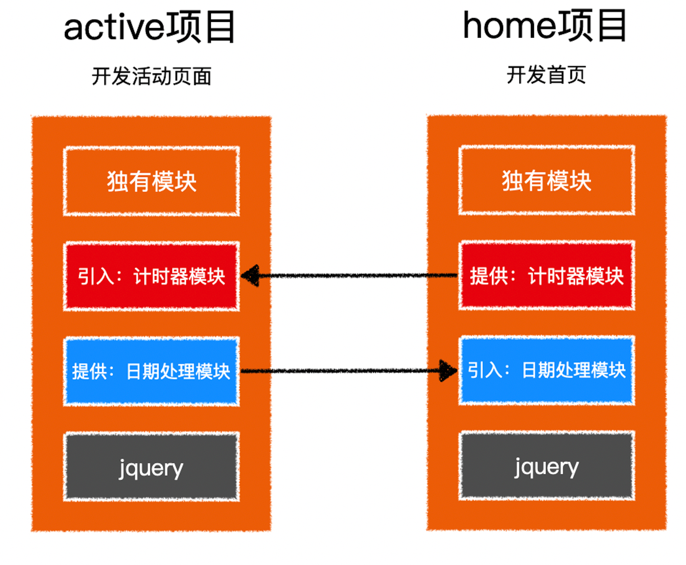

# webpack5 模块联邦

在大型项目中，往往会把项目中的某个区域或功能模块作为单独的项目开发，最终形成「微前端」架构

在微前端架构中，不同的工程可能出现下面的场景


这涉及到很多非常棘手的问题：

- 如何避免公共模块重复打包
- 如何将某个项目中一部分模块分享出去，同时还要避免重复打包
- 如何管理依赖的不同版本
- 如何更新模块
- `......`

`webpack5`尝试着通过`模块联邦`来解决此类问题

### 示例

现有两个微前端工程，它们各自独立开发、测试、部署，但它们有一些相同的公共模块，并有一些自己的模块需要分享给其他工程使用，同时又要引入其他工程的模块。




### 暴露自身模块

如果一个项目需要把一部分模块暴露给其他项目使用，可以使用`webpack5`的模块联邦将这些模块暴露出去

```javascript
// webpack.config.js
const ModuleFederationPlugin = require("webpack/lib/container/ModuleFederationPlugin");

module.exports = {
  plugins: [
    // 使用模块联邦插件
    new ModuleFederationPlugin({
      // 模块联邦的名称
      // 该名称将成为一个全部变量，通过该变量将可获取当前联邦的所有暴露模块
      name: "home", 
      // 模块联邦生成的文件名，全部变量将置入到该文件中
      filename: "home-entry.js",
      // 模块联邦暴露的所有模块
      exposes: {
        // key：相对于模块联邦的路径
        // 这里的 ./Timer 将决定该模块的访问路径为 home/Timer
        // value: 模块的具体路径
        "./Timer": "./src/Timer.js",
      },
    }),
  ]
}
```

### 使用对方暴露的模块

在模块联邦的配置中，不仅可以暴露自身模块，还可以使用其他项目暴露的模块

```javascript
// webpack.config.js
const ModuleFederationPlugin = require("webpack/lib/container/ModuleFederationPlugin");

module.exports = {
  plugins: [
    // 使用模块联邦插件
    new ModuleFederationPlugin({
      // 远程使用其他项目暴露的模块
      remotes: {
        // key: 自定义远程暴露的联邦名
        // 比如为 abc， 则之后引用该联邦的模块则使用 import "abc/模块名"
        // value: 模块联邦名@模块联邦访问地址
        // 远程访问时，将从下面的地址加载
        home: "home@http://localhost:8080/home-entry.js",
      },
    }),
  ]
}
```

### 共享模块

不同的项目可能使用了一些公共的第三方库，可以将这些第三方库作为共享模块，避免反复打包

```javascript
// webpack.config.js
const ModuleFederationPlugin = require("webpack/lib/container/ModuleFederationPlugin");

module.exports = {
  plugins: [
    // 使用模块联邦插件
    new ModuleFederationPlugin({
      shared: ["jquery", "lodash"]
    }),
  ]
}
```

`webpack`会根据需要从合适的位置引入合适的版本

