# 一文搞懂 flex:0,1,auto,none

## flex 属性介绍

首先， flex 属性其实是一种简写，是 flex-grow ， flex-shrink 和 flex-basis 的缩写形式。 默认值为 0 1 auto 。后两个属性可选。

### flex-grow

flex-grow 属性定义项目的放大比例，默认为 0 ，即如果存在剩余空间，也不放大。
如果所有项目的 flex-grow 属性都为 1，则它们将等分剩余空间（如果有的话）。
如果一个项目的 flex-grow 属性为 2，其他项目都为 1，则前者占据的剩余空间将比其他项多一倍。

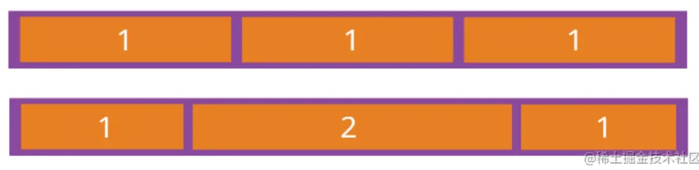

### flex-shrink

flex-shrink 属性定义了项目的缩小比例，默认为 1，即如果空间不足，该项目将缩小。
如果所有项目的 flex-shrink 属性都为 1，当空间不足时，都将等比例缩小。
如果一个项目的 flex-shrink 属性为 0，其他项目都为 1，则空间不足时，前者不缩小。

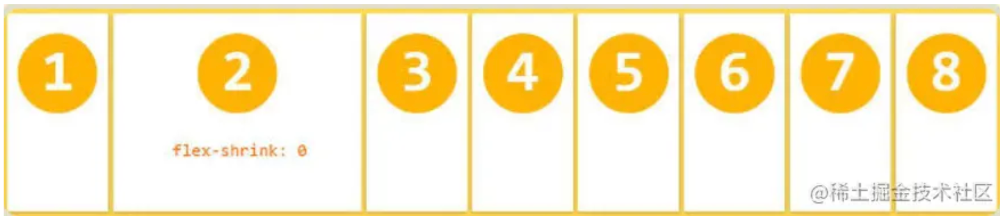

### flex-basis

flex-basis 属性定义了在分配多余空间之前，项目占据的主轴空间（main size）。
浏览器根据这个属性，计算主轴是否有多余空间。它的默认值为 auto，即项目的本来大小。
它可以设为跟 width 或 height 属性一样的值（比如 350px），则项目将占据固定空间。

## flex 缩写的等值

了解了三个属性各自的含义之后，可以看下三个属性对应的等值。

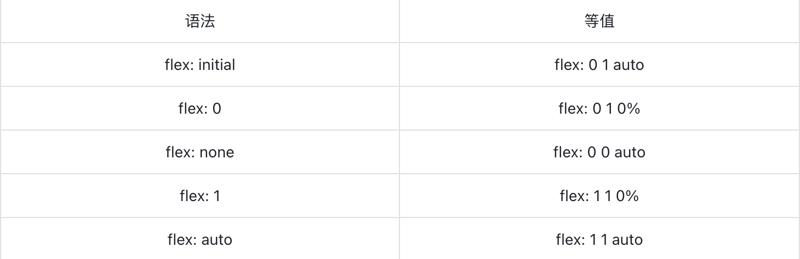

### flex: initial

flex:initial 等同于设置 flex: 0 1 auto ，是 flex 属性的默认值。

举例，外容器是红色，内里元素蓝色边框，比较少，会有下图效果，剩余空间仍有保留。剩余空间有，但是因为 flex-grow 属性是 0，所以没有填补空白。

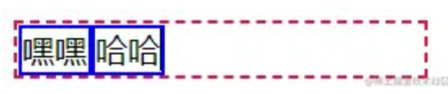

```html
<div class="container">
  <div class="item">嘿嘿</div>
  <div class="item">哈哈</div>
</div>
<style>
  .container {
    width: 200px;
    display: flex;
    border: 2px dashed crimson;
  }

  .container .item {
    border: 2px solid blue;
  }
</style>
```

如果子项内容很多，由于 flex-shrink:1 ，因此，会缩小，表现效果就是文字换行，效果如下图所示。

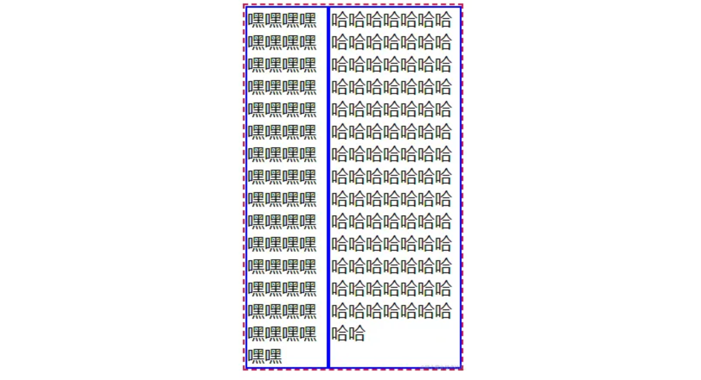

### 适用场景

`initial` 表示 CSS 属性的初始值，通常用来还原已经设置的 CSS 属性。因此日常开发不会专门设置 flex:initial 声明。flex:initial 声明适用于下图所示的布局效果。

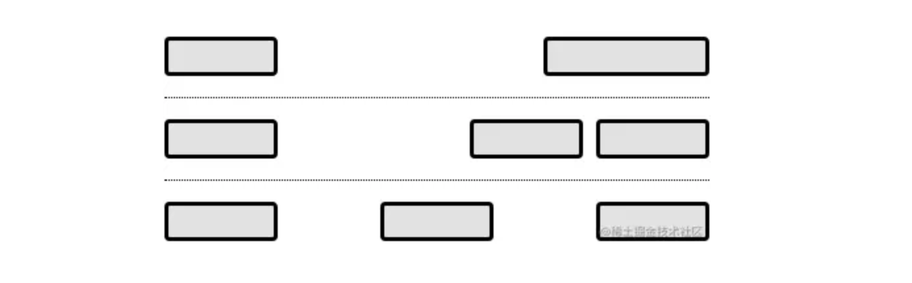

上图所示的布局效果常见于按钮、标题、小图标等小部件的排版布局，因为这些小部件的宽度都不会很宽，水平位置的控制多使用 justify-content 和 margin-left:auto/margin-right:auto 实现。

除了上图所示的布局效果外， flex:initial 声明还适用于一侧内容宽度固定，另外一侧内容宽度任意的两栏自适应布局场景，布局轮廓如图下图所示（点点点表示文本内容）。

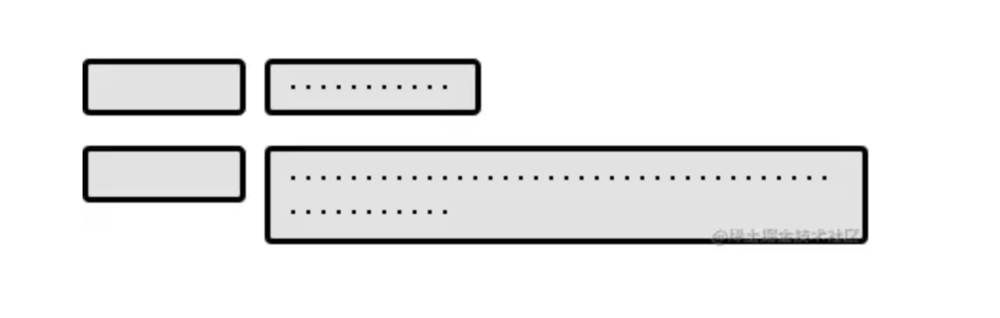

此时，无需任何其他 Flex 布局相关的 CSS 设置，只需要容器元素设置 display:flex 即可。

**总结下就是那些希望元素尺寸收缩，同时元素内容万一较多又能自动换行的场景可以不做任何 flex 属性设置。**

### flex:0 和 flex:none

flex:0 等同于设置 flex: 0 1 0% 。

```html
<div class="container">
  <div class="item">嘿嘿</div>
  <div class="item">哈哈</div>
</div>
<style>
  .container {
    width: 200px;
    display: flex;
    border: 2px dashed crimson;
  }

  .container .item {
    border: 2px solid blue;
    flex: 0;
  }
</style>
```

flex:none 等同于设置 flex: 0 0 auto 。只是把 css 中的 flex 属性设置为 none ，不再展示代码。

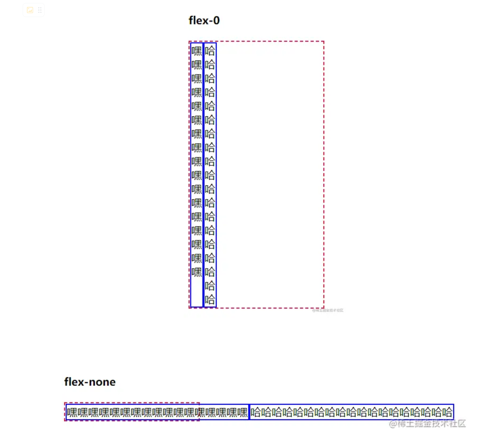

**对比看来可以看到 flex-0 时候会表现为最小内容宽度，会将高度撑高（当前没有设置高度，如果设置高度文字会超过设置的高度，如下图）flex-none 时候会表现为最大内容宽度，字数过多时候会超过容器宽度。**

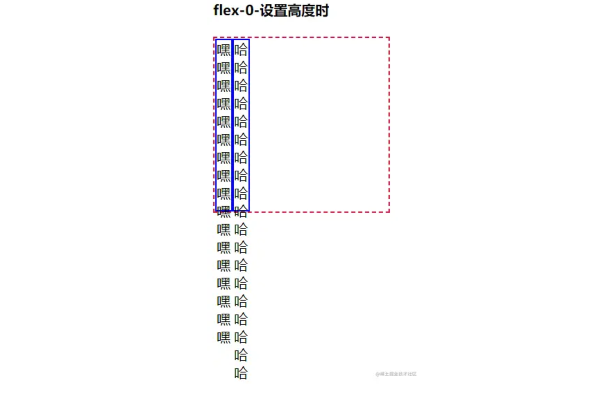

### 适用场景 flex-0

由于应用了 flex:0 的元素表现为最小内容宽度，因此，适合使用 flex:0 的场景并不多。

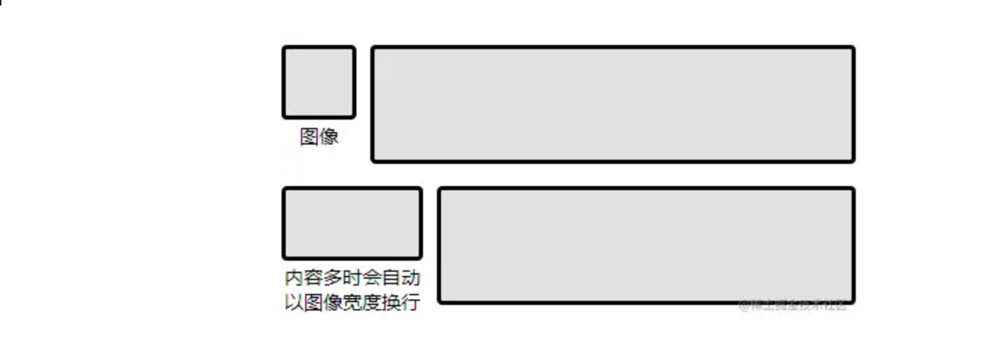

其中上图左侧部分的矩形表示一个图像，图像下方会有文字内容不定的描述信息，此时，左侧内容就适合设置 flex:0 ，这样，无论文字的内容如何设置，左侧内容的宽度都是图像的宽度。

### 适用场景 flex-none

flex-none 比 flex-0 的适用场景多，如**内容文字固定不换行，宽度为内容宽度**就适用该属性。

没设置 flex-none 代码如下：

```html
<div class="aa">
  
  <p>右侧按钮没有设置flex-none</p>
  <button>按钮</button>
</div>
<style>
  .aa {
    width: 300px;
    border: 1px solid #000;
    display: flex;
  }

  .aa img {
    width: 100px;
    height: 100px;
  }

  .aa buttton {
    height: 50px;
    align-self: center;
  }
</style>
```

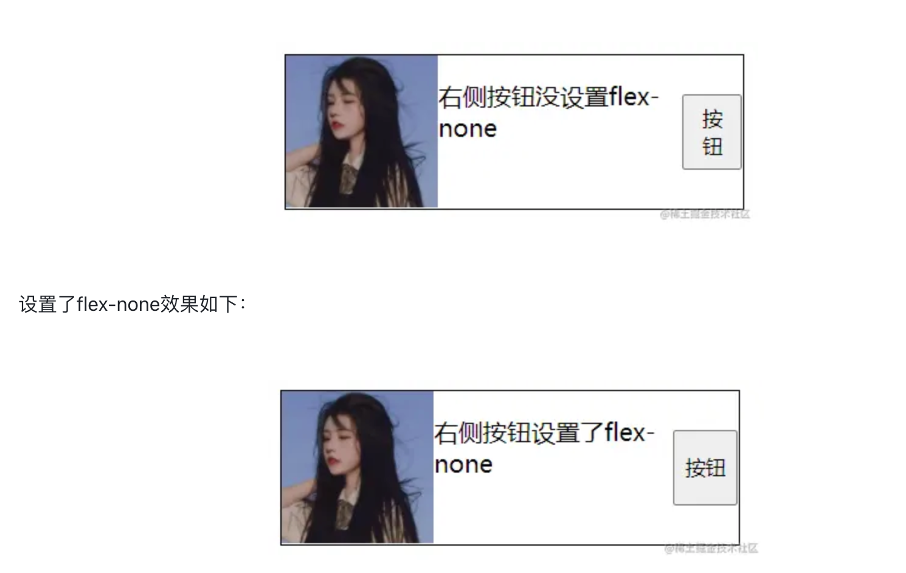

### flex:1 和 flex:auto

flex:1 时代码如下

```html
<div class="container">
  <div class="item">嘿嘿嘿嘿嘿嘿嘿嘿嘿嘿嘿嘿嘿嘿嘿嘿嘿</div>
  <div class="item">哈哈</div>
  <div class="item">呵呵</div>
</div>
<style>
  .container {
    width: 200px;
    display: flex;
    border: 2px dashed crimson;
  }

  .container .item {
    border: 2px solid blue;
    flex: 1;
  }
</style>
```

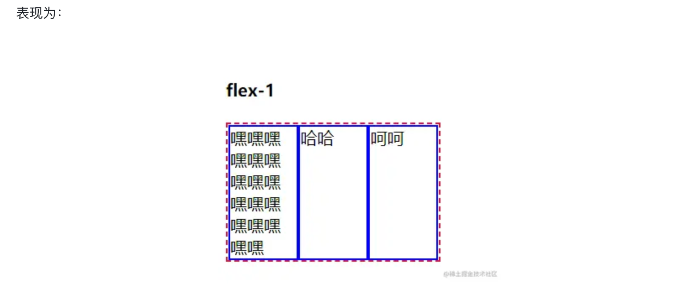

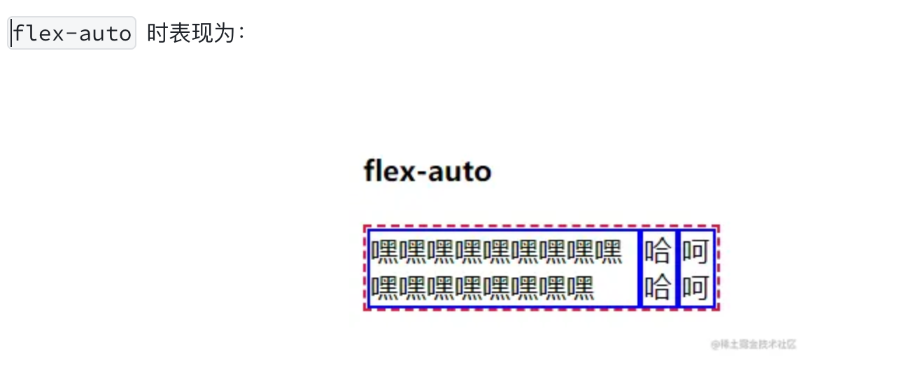

虽然都是充分分配容器的尺寸，但是 flex:1 的尺寸表现更为内敛（优先牺牲自己的尺寸）， flex:auto 的尺寸表现则更为霸道（优先扩展自己的尺寸）。

#### 适合使用 flex:1 的场景

当希望元素充分利用剩余空间，同时不会侵占其他元素应有的宽度的时候，适合使用 flex:1 ，这样的场景在 Flex 布局中非常的多。

例如所有的等分列表，或者等比例列表都适合使用 flex:1 或者其他 flex 数值，适合的布局效果轮廓如下图所示。

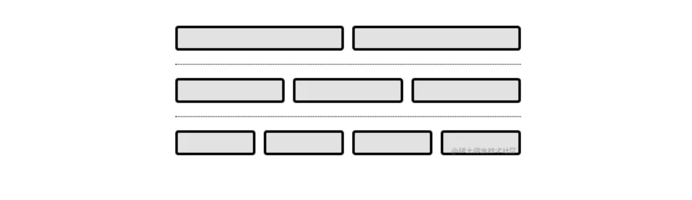

#### 适合使用 flex:auto 的场景

当希望元素充分利用剩余空间，但是各自的尺寸按照各自内容进行分配的时候，适合使用 flex:auto 。例如导航栏。整体设置为 200px，内部设置 flex:auto,会自动按照内容比例进行分配宽度。

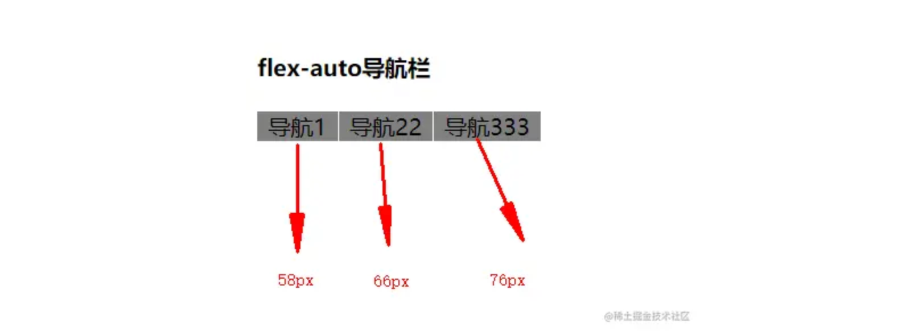
