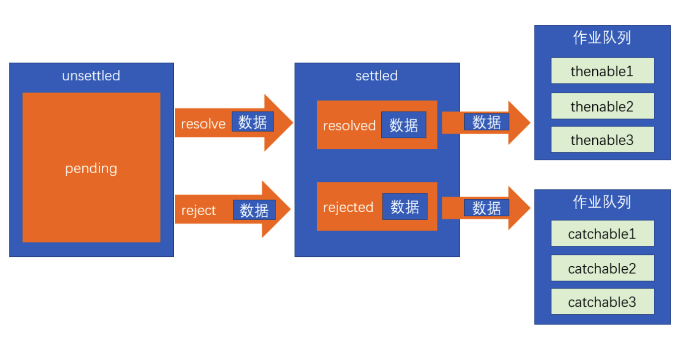

# 异步处理

## 事件循环 eventLoop
** 事件循环 **
JS 运行的环境称之为宿主环境。
JS 语言不只运行在浏览器
执行栈：call stack，一个数据结构，用于存放各种函数的执行环境，每一个函数执行之前，它的相关信息会加入到执行栈。函数调用之前，创建执行环境，然后加入到执行栈；函数调用之后，销毁执行环境。
JS 引擎永远执行的是执行栈的最顶部。

异步函数：某些函数不会立即执行，需要等到某个时机到达后才会执行，这样的函数称之为异步函数。比如事件处理函数。异步函数的执行时机，会被宿主环境控制。
浏览器宿主环境中包含 5 个线程：

1. JS 引擎：负责执行执行栈的最顶部代码
2. GUI 线程：负责渲染页面
3. 事件监听线程：负责监听各种事件
4. 计时线程：负责计时
5. 网络线程：负责网络通信
当上面的线程发生了某些事请，如果该线程发现，这件事情有处理程序，它会将该处理程序加入一个叫做事件队列的内存。当 JS 引擎发现，执行栈中已经没有了任何内容后，会将事件队列中的第一个函数加入到执行栈中执行。
JS 引擎对事件队列的取出执行方式，以及与宿主环境的配合，称之为事件循环。

[https://www.ruanyifeng.com/blog/2014/10/event-loop.html](https://www.ruanyifeng.com/blog/2014/10/event-loop.html)

事件队列在不同的宿主环境中有所差异，大部分宿主环境会将事件队列进行细分。在浏览器中，事件队列分为两种：

- 宏任务（队列）：macroTask，计时器结束的回调、事件回调、http 回调等等绝大部分异步函数进入宏队列
- 微任务（队列）：MutationObserver，Promise 产生的回调进入微队列——vip

> MutationObserver 用于监听某个 DOM 对象的变化
> 当执行栈清空时，JS 引擎首先会将微任务中的所有任务依次执行结束，如果没有微任务，则执行宏任务。


为什么先执行宏队列了：点击按钮的额时候还没有往 ul 里面加 li，所以微队列也不执行
```html
<script>
  let count = 1;
  const ul = document.getElementById("container");
  document.getElementById("btn").onclick = function A() {
    var li = document.createElement("li")
    li.innerText = count++;
    ul.appendChild(li);
    console.log("添加了一个 li")
  }

  // 监听 ul
  const observer = new MutationObserver(function B() {
    // 当监听的 dom 元素发生变化时运行的回调函数
    console.log("ul 元素发生了变化")
  })
  // 监听 ul
  observer.observe(ul, {
    attributes: true, // 监听属性的变化
    childList: true, // 监听子元素的变化
    subtree: true // 监听子树的变化
  })
</script>
```

宏队列演示

```html
<ul id="container">

</ul>

<button id="btn"> 点击 </button>
<script>
    let count = 1;
    const ul = document.getElementById("container");
    document.getElementById("btn").onclick = function A() {
        setTimeout(function C() {
            console.log("添加了一个 li")
        }, 0);
        var li = document.createElement("li")
        li.innerText = count++;
        ul.appendChild(li);
    }

    // 监听 ul
    const observer = new MutationObserver(function B() {
        // 当监听的 dom 元素发生变化时运行的回调函数
        console.log("ul 元素发生了变化")
    })
    // 监听 ul
    observer.observe(ul, {
        attributes: true, // 监听属性的变化
        childList: true, // 监听子元素的变化
        subtree: true // 监听子树的变化
    })
    // 取消监听
    // observer.disconnect();
</script>
```

## 事件和回调函数缺陷
我们习惯于使用传统的回调或事件处理来解决异步问题
事件：某个对象的属性是一个函数，当发生某一件事时，运行该函数
```javascript
dom.onclick = function () {};
```
回调：运行某个函数以实现某个功能的时候，传入一个函数作为参数，当发生某件事的时候，会运行该函数。
```javascript
dom.addEventListener("click", function () {});
```
本质上，事件和回调并没有本质的区别，只是把函数放置的位置不同而已。
一直以来，该模式都运作良好。
直到前端工程越来越复杂...
目前，该模式主要面临以下两个问题：

1. 回调地狱：某个异步操作需要等待之前的异步操作完成，无论用回调还是事件，都会陷入不断的嵌套
2. 异步之间的联系：某个异步操作要等待多个异步操作的结果，对这种联系的处理，会让代码的复杂度剧增

演示 demo
```html
<p>
    <button id="btn1"> 按钮 1：给按钮 2 注册点击事件 </button>
    <button id="btn2"> 按钮 2：给按钮 3 注册点击事件 </button>
    <button id="btn3"> 按钮 3：点击后弹出 hello</button>
</p>
<script>
    const btn1 = document.getElementById("btn1"),
          btn2 = document.getElementById("btn2"),
          btn3 = document.getElementById("btn3");
    btn1.addEventListener("click", function() {
        // 按钮 1 的其他事情
        btn2.addEventListener("click", function() {
            // 按钮 2 的其他事情
            btn3.addEventListener("click", function() {
                alert("hello");
            })
        })
    })
</script>
```

## 异步处理的通用模型

ES 官方参考了大量的异步场景，总结出了一套异步的通用模型，该模型可以覆盖几乎所有的异步场景，甚至是同步场景。
值得注意的是，为了兼容旧系统，ES6 并不打算抛弃掉过去的做法，只是基于该模型推出一个全新的 API，使用该 API，会让异步处理更加的简洁优雅。
理解该 API，最重要的，是理解它的异步模型

1. ES6 将某一件可能发生异步操作的事情，分为两个阶段：**unsettled** 和 **settled**


- unsettled： 未决阶段，表示事情还在进行前期的处理，并没有发生通向结果的那件事
- settled：已决阶段，事情已经有了一个结果，不管这个结果是好是坏，整件事情无法逆转

事情总是从 未决阶段 逐步发展到 已决阶段的。并且，未决阶段拥有控制何时通向已决阶段的能力。

2. ES6 将事情划分为三种状态： pending、resolved、rejected
- pending: 挂起，处于未决阶段，则表示这件事情还在挂起（最终的结果还没出来）
- resolved：已处理，已决阶段的一种状态，表示整件事情已经出现结果，并是一个可以按照正常逻辑进行下去的结果
- rejected：已拒绝，已决阶段的一种状态，表示整件事情已经出现结果，并是一个无法按照正常逻辑进行下去的结果，通常用于表示有一个错误

既然未决阶段有权力决定事情的走向，因此，未决阶段可以决定事情最终的状态！

我们将 把事情变为 resolved 状态的过程叫做：**resolve**，推向该状态时，可能会传递一些数据

我们将 把事情变为 rejected 状态的过程叫做：**reject**，推向该状态时，同样可能会传递一些数据，通常为错误信息

** 始终记住，无论是阶段，还是状态，是不可逆的！**


3. 当事情达到已决阶段后，通常需要进行后续处理，不同的已决状态，决定了不同的后续处理。

- resolved 状态：这是一个正常的已决状态，后续处理表示为 thenable
- rejected 状态：这是一个非正常的已决状态，后续处理表示为 catchable

后续处理可能有多个，因此会形成作业队列，这些后续处理会按照顺序，当状态到达后依次执行

4. 整件事称之为 Promise



** 理解上面的概念，对学习 Promise 至关重要！**

## Promise 的基本使用

```javascript
const pro = new Promise((resolve, reject)=>{
    // 未决阶段的处理
    // 通过调用 resolve 函数将 Promise 推向已决阶段的 resolved 状态
    // 通过调用 reject 函数将 Promise 推向已决阶段的 rejected 状态
    // resolve 和 reject 均可以传递最多一个参数，表示推向状态的数据
  // 立即执行
})

pro.then(data=>{
    // 这是 thenable 函数，如果当前的 Promise 已经是 resolved 状态，该函数会立即执行
    // 如果当前是未决阶段，则会加入到作业队列，等待到达 resolved 状态后执行
    //data 为状态数据
}, err=>{
    // 这是 catchable 函数，如果当前的 Promise 已经是 rejected 状态，该函数会立即执行
    // 如果当前是未决阶段，则会加入到作业队列，等待到达 rejected 状态后执行
    //err 为状态数据
})
```

** 细节 **

1. 未决阶段的处理函数是同步的，会立即执行
2. thenable 和 catchable 函数是异步的，就算是立即执行，也会加入到事件队列中等待执行，并且，加入的队列是微队列
3. pro.then 可以只添加 thenable 函数，pro.catch 可以单独添加 catchable 函数
4. 在未决阶段的处理函数中，如果发生未捕获的错误，会将状态推向 rejected，并会被 catchable 捕获
5. 一旦状态推向了已决阶段，无法再对状态做任何更改
6. Promise 并没有消除回调，只是让回调变得可控

创建 promise 演示
```javascript
const pro = new Promise((resolve, reject) => {
  console.log(` 邓哥向女神 1 发出来了表白短信 `);
  setTimeout(() => {
    if (Math.random() < 0.1) {
      // 女神同意
      resolve(true);
    } else {
      resolve(false);
    }
  }, 3000);
})
```

创建 promise 演示
```javascript

// 辅助函数, 把传进来的对象拼接成 url 的字符串
function toData(obj) {
  if (obj === null) {
    return obj;
  }
  let arr = [];
  for (let i in obj) {
    let str = i + "=" + obj[i];
    arr.push(str);
  }
  return arr.join("&");
}
// 封装 Ajax
function ajax(obj) {
  return new Promise((resolve, reject) => {
    // 指定提交方式的默认值
    obj.type = obj.type || "get";
    // 设置是否异步，默认为 true(异步)
    obj.async = obj.async || true;
    // 设置数据的默认值
    obj.data = obj.data || null;
    // 根据不同的浏览器创建 XHR 对象
    let xhr = null;
    if (window.XMLHttpRequest) {
      // 非 IE 浏览器
      xhr = new XMLHttpRequest();
    } else {
      // IE 浏览器
      xhr = new ActiveXObject("Microsoft.XMLHTTP");
    }
    // 区分 get 和 post, 发送 HTTP 请求
    if (obj.type === "post") {
      xhr.open(obj.type, obj.url, obj.async);
      xhr.setRequestHeader("Content-Type", "application/x-www-form-urlencoded");
      let data = toData(obj.data);
      xhr.send(data);
    } else {
      let url = obj.url + "?" + toData(obj.data);
      xhr.open(obj.type, url, obj.async);
      xhr.send();
    }
    // 接收返回过来的数据
    xhr.onreadystatechange = function () {
      if (xhr.readyState === 4) {
        if (xhr.status>= 200 && xhr.status < 300 || xhr.status == 304) {
          resolve(JSON.parse(xhr.responseText))
        } else {
          reject(xhr.status)
        }
      }
    }
  })
}

const pro = Promise((resolve, reject) => {
  ajax({
    url: "./data/students.json?name = 李华",
    // success: function(data) {
    // }
    // 速写
    success(data) {
      resolve(data);
    },
    error(err) {
      reject(error);
    }
  })
})
```
如果当前的 Promise 已经是 resolved 状态，该函数会立即执行
```javascript
const pro = new Promise((resolve, reject) => {
    console.log('未决阶段')
    resolve(123);
})
pro.then(data => {
    //pro 的状态是 resloved
    console.log(data);// 123
})
```
如果当前是未决阶段，则会加入到作业队列，等待到达 resolved 状态后执行
```javascript
const pro = new Promise((resolve, reject) => {
    console.log('未决阶段')
    setTimeout(() => {
        resolve(123);
    }, 3000)
})
pro.then(data => {
    //pro 的状态是 pending
    console.log(data);
})
// 可以注册多个 then 用来表示已决做什么
```
catchable
```javascript
const pro = new Promise((resolve, reject) => {
    console.log('未决阶段')
    setTimeout(() => {
        if (Math.random() < 0.5) {
            resolve(123)
        } else {
            reject(new Error('sanjs'));
        }
    }, 3000)
})
pro.then(data => {
    console.log(data);
}, err => {
    console.log(err);
})
```

封装初级演示 1
```javascript
function biaobai(god) {
    return new Promise((resolve, reject) => {
        console.log(` 邓哥向 ${god} 发出了表白短信 `);
        setTimeout(() => {
            if (Math.random() < 0.1) {
                // 女神同意拉
                resolve(true)// 一定 resolve 成功
            } else {
                //resolve
                resolve(false);//  一定 resolve 成功
            }
        }, 3000);
    })
}
// 一定成功，失败指的是短信发不出去
const pro = biaobai("女神 1")
pro.then(result => {
    console.log(result);
})
```
pro 去掉简化
```javascript
biaobai("女神 1").then(result => {
    console.log(result);
})
```

演示 2

```javascript
// 辅助函数, 把传进来的对象拼接成 url 的字符串
function toData(obj) {
  if (obj === null) {
    return obj;
  }
  let arr = [];
  for (let i in obj) {
    let str = i + "=" + obj[i];
    arr.push(str);
  }
  return arr.join("&");
}
// 封装 Ajax
function ajax(obj) {
  return new Promise((resolve, reject) => {// 改动处
    // 指定提交方式的默认值
    obj.type = obj.type || "get";
    // 设置是否异步，默认为 true(异步)
    obj.async = obj.async || true;
    // 设置数据的默认值
    obj.data = obj.data || null;
    // 根据不同的浏览器创建 XHR 对象
    let xhr = null;
    if (window.XMLHttpRequest) {
      // 非 IE 浏览器
      xhr = new XMLHttpRequest();
    } else {
      // IE 浏览器
      xhr = new ActiveXObject("Microsoft.XMLHTTP");
    }
    // 区分 get 和 post, 发送 HTTP 请求
    if (obj.type === "post") {
      xhr.open(obj.type, obj.url, obj.async);
      xhr.setRequestHeader("Content-Type", "application/x-www-form-urlencoded");
      let data = toData(obj.data);
      xhr.send(data);
    } else {
      let url = obj.url + "?" + toData(obj.data);
      xhr.open(obj.type, url, obj.async);
      xhr.send();
    }
    // 接收返回过来的数据
    xhr.onreadystatechange = function () {
      if (xhr.readyState === 4) {
        if (xhr.status>= 200 && xhr.status < 300 || xhr.status == 304) {
          resolve(JSON.parse(xhr.responseText))// 改动处
        } else {
          reject(xhr.status)// 改动处
        }
      }
    }
  })
}
ajax({url: "./data/students.json?name = 李华"}).then(resp => {
  console.log(resp)
}, err => {
  console.log(err)
})
```

演示 3

```html
<script>
    // const pro = new Promise((resolve, reject) => {
    //     console.log("未决阶段")
    //     resolve(123);
    // })
    // pro.then(data => {
    //     // pro 的状态是 resolved
    //     console.log(data);
    // })

    const pro = new Promise((resolve, reject) => {
        console.log("未决阶段")
        setTimeout(() => {
            resolve(123);
        }, 3000);
    })
    pro.then(data => {
        // pro 的状态是 pending
        console.log(data);
    })
    pro.then(data => {
        // pro 的状态是 pending
        console.log(data);
    })
    pro.then(data => {
        // pro 的状态是 pending
        console.log(data);
    })
</script>
```

演示 4

```html
<script>
    const pro = new Promise((resolve, reject) => {
        console.log("未决阶段")
        setTimeout(() => {
            if (Math.random < 0.5) {
                resolve(123)
            } else {
                reject(new Error("asdfasdf"));
            }
        }, 3000);
    })
    pro.then(data => {
        console.log(data);
    }, err => {
        console.log(err)
    })
</script>
```

演示 5

```html
<script>
    const pro = new Promise((resolve, reject) => {
        console.log("a")
        resolve(1);
        setTimeout(() => {
            console.log("b")
        }, 0);
    })
    //pro: resolved
    pro.then(data => {
        console.log(data)
    })
    pro.catch(err => {
        console.log(err)
    })
    console.log("c")
</script>
```

在未决阶段的处理函数中，如果发生未捕获的错误，会将状态推向 rejected，并会被 catchable 捕获

```html
<script>
    const pro = new Promise((resolve, reject) => {
        throw new Error("123"); // 导致 pro 变成 rejected
    })
    pro.then(data => {
        console.log(data)
    })
    pro.catch(err => {
        console.log(err)
    })
</script>
```

一旦状态推向了已决阶段，无法再对状态做任何更改。（未捕获的错误）

如果已经捕获了错误
```javascript
const pro = new Promise((resolve, reject) => {
    try {
        throw new Error("abc");
    } catch {
    }
    resolve(1); // 错误被捕获，有效了
    reject(2); // 无效
    resolve(3); // 无效
    reject(4); // 无效
})
pro.then(data => {
    console.log(data)
})
pro.catch(err => {
    console.log(err)
}
```
未决阶段的处理函数是同步的，会立即执行
thenable 和 catchable 函数是异步的，就算是立即执行，也会加入到事件队列中等待执行，并且，加入的队列是微队列
知识：thenable 和 catchable 函数是异步的，就算是立即执行，也会加入到事件队列中等待执行，并且，加入的队列是微队列
## Promise 的串联
当后续的 Promise 需要用到之前的 Promise 的处理结果时，需要 Promise 的串联
Promise 对象中，无论是 then 方法还是 catch 方法，它们都具有返回值，返回的是一个全新的 Promise 对象，它的状态满足下面的规则：

1. 如果当前的 Promise 是未决的，得到的新的 Promise 是挂起状态
2. 如果当前的 Promise 是已决的，会运行响应的后续处理函数，并将后续处理函数的结果（返回值）作为 resolved 状态数据，应用到新的 Promise 中；如果后续处理函数发生错误，则把返回值作为 rejected 状态数据，应用到新的 Promise 中。
```javascript
const pro = ajax({
  url: "./data/students.json"
})
const pro2 = pro.then(resp => {// 这里面要运行完 pro2 才已决
  // throw new Error('错误')// reject
  for (let i = 0; i < resp.length; i++) {
    if (resp[i].name === "李华") {
      const cid = resp[i].classId;
    }
  }
})
console.log(pro2)
```
面试题：** 后续的 Promise 一定会等到前面的 Promise 有了后续处理结果后，才会变成已决状态 **
```javascript
const pro1 = new Promise((resolve, reject) => {
  resolve(1);
})
console.log(pro1);//fulfilled
const pro2 = pro1.then(result => result * 2);
// pro2 是一个 Promise 对象
console.log(pro2)//pending
// 因为 then 是异步的，运行到打印 pro2 的时候函数还没调用 (同步代码)
```
面试题
```javascript
const pro1 = new Promise((resolve, reject) => {
  resolve(1);
})
const pro2 = pro1.then(result => result * 2);// 这里变成状态数据: 2，pro2 变成了已决
pro2.then(result => console.log(result), err => console.log(err))
```
** 面试题 **
```javascript
const pro1 = new Promise((resolve, reject) => {
  throw 1;// 推向 rejected, 导致 pro2 的 err 运行
})
const pro2 = pro1.then(result => {
  return result * 2;
}, err => err * 3);// 3, 此时 pro2 已决了
pro2.then(result => console.log(result * 2), err => console.log(err * 3))// 这里主要看上述处理有没有错误，pro2 没有错误，执行 result
结果：6
```
变式
```javascript
const pro1 = new Promise((resolve, reject) => {
  throw 1;
})
const pro2 = pro1.then(result => {
  return result * 2;
}, err => {
  throw err;
});
pro2.then(result => console.log(result * 2), err => console.log(err * 3))//3
```
思考：then 函数返回的 Promise 对象一开始一定是挂起状态：因为 then 的后序处理是异步的
```javascript
const pro1 = new Promise((resolve, reject) => {
  throw 1;
})
const pro2 = pro1.then(result => {// 这里是第一个调用 then 的，只看这里的处理函数
  return result * 2;
}, err => {
  return err * 3;//3
});
const pro3 = pro1.catch(err => {// 这里得到的是一个新的 Promise
  throw err * 2;//1*2
})
pro2.then(result => console.log(result * 2), err => console.log(err * 3)) // 输出 6，调用的是 result
pro3.then(result => console.log(result * 2), err => console.log(err * 3)) // 输出 6，调用的是 err
```
如果前面的 Promise 的后续处理，返回的是一个 Promise，则返回的新的 Promise 状态和后续处理返回的 Promise 状态保持一致。
```javascript
const pro1 = new Promise((resolve, reject) => {
  resolve(1);
})
const pro2 = new Promise((resolve, reject) => {
  resolve(2)
})
const pro3 = pro1.then(result => {
  return pro2;
}).then(result => {
  console.log(result)// 2
})
```
变式
```javascript
const pro1 = new Promise((resolve, reject) => {
  resolve(1);
})
const pro2 = new Promise((resolve, reject) => {
  setTimeout(() => {
    resolve(2)
  }, 3000)
})
const pro3 = pro1.then(result => {
  console.log("结果出来了，得到的是一个 Promise")// 一开始 Pro1 已决了，所以这个一开始就执行
  return pro2;// Pro3 要跟 pro2 状态保持一致，pro2 还没运行出来，pro3 得等着
}).then(result => {
  console.log(result)// 2；所以这里要等 3s 后才输出
})
```
简化为链式编程：便于阅读
```javascript
pro1.then(result => {
  console.log("结果出来了，得到的是一个 Promise")
  return pro2;
}).then(result => {
  console.log(result)// 这只是打印结果，对后续有影响的是函数的返回值
  // 不写，默认 return undefined
}).then(result => {
  console.log(result)// undefined
})
```
解决实战问题
```javascript
// 辅助函数, 把传进来的对象拼接成 url 的字符串
function toData(obj) {
  if (obj === null) {
    return obj;
  }
  let arr = [];
  for (let i in obj) {
    let str = i + "=" + obj[i];
    arr.push(str);
  }
  return arr.join("&");
}
// 封装 Ajax
function ajax(obj) {
  return new Promise((resolve, reject) => {
    // 指定提交方式的默认值
    obj.type = obj.type || "get";
    // 设置是否异步，默认为 true(异步)
    obj.async = obj.async || true;
    // 设置数据的默认值
    obj.data = obj.data || null;
    // 根据不同的浏览器创建 XHR 对象
    let xhr = null;
    if (window.XMLHttpRequest) {
      // 非 IE 浏览器
      xhr = new XMLHttpRequest();
    } else {
      // IE 浏览器
      xhr = new ActiveXObject("Microsoft.XMLHTTP");
    }
    // 区分 get 和 post, 发送 HTTP 请求
    if (obj.type === "post") {
      xhr.open(obj.type, obj.url, obj.async);
      xhr.setRequestHeader("Content-Type", "application/x-www-form-urlencoded");
      let data = toData(obj.data);
      xhr.send(data);
    } else {
      let url = obj.url + "?" + toData(obj.data);
      xhr.open(obj.type, url, obj.async);
      xhr.send();
    }
    // 接收返回过来的数据
    xhr.onreadystatechange = function () {
      if (xhr.readyState === 4) {
        if (xhr.status>= 200 && xhr.status < 300 || xhr.status == 304) {
          resolve(JSON.parse(xhr.responseText))
        } else {
          reject(xhr.status)
        }
      }
    }
  })
}
// 获取李华所在班级的老师的信息
//1. 获取李华的班级 id   Promise
//2. 根据班级 id 获取李华所在班级的老师 id   Promise
//3. 根据老师的 id 查询老师信息   Promise
const pro = ajax({
  url: "./data/students.json"
})
pro.then(resp => {
  for (let i = 0; i < resp.length; i++) {
    if (resp[i].name === "李华") {
      return resp[i].classId; // 班级 id
    }
  }
}).then(cid => {
  return ajax({
    url: "./data/classes.json?cid=" + cid
  }).then(cls => {
    for (let i = 0; i < cls.length; i++) {
      if (cls[i].id === cid) {
        return cls[i].teacherId;
      }
    }
  })
}).then(tid => {
  return ajax({
    url: "./data/teachers.json"
  }).then(ts => {
    for (let i = 0; i < ts.length; i++) {
      if (ts[i].id === tid) {
        return ts[i];
      }
    }
  })
}).then(teacher => {
  console.log(teacher);
})
```
实战案例
```javascript
function biaobai(god) {
  return new Promise(resolve => {
    console.log(` 邓哥向 ${god} 发出了表白短信 `);
    setTimeout(() => {
      if (Math.random() < 0.3) {
        resolve(true)
      } else {
        resolve(false);
      }
    }, 500);
  })
}
biaobai("女神 1").then(resp => {
  if (resp) {
    console.log("女神 1 同意了")
    return;
  } else {
    return biaobai("女神 2");
  }
}).then(resp => {
  if (resp === undefined) {
    return;
  } else if (resp) {
    console.log("女神 2 同意了")
    return;
  } else {
    return biaobai("女神 3");
  }
}).then(resp => {
  if (resp === undefined) {
    return;
  } else if (resp) {
    console.log("女神 3 同意了")
  } else {
    console.log("都被拒绝了！");
  }
})
// 切记：上一个处理的结果就是下一个处理的状态数据
```
优化：增加了初始化
```javascript
const gods = ["女神 1", "女神 2", "女神 3", "女神 4", "女神 5"];
let pro;
for (let i = 0; i < gods.length; i++) {
  if (i === 0) {
    pro = biaobai(gods[i]);
  }
  pro = pro.then(resp => {
    if (resp === undefined) {
      return;
    } else if (resp) {
      console.log(`${gods[i]} 同意了 `)
      return;
    } else {
      console.log(`${gods[i]} 拒绝了 `)
      if (i < gods.length - 1) {
        return biaobai(gods[i + 1]);
      }
    }
  })
}
```
## Promise 的其他 API
### 原型成员 (实例成员)

- then：注册一个后续处理函数，当 Promise 为 resolved 状态时运行该函数
- catch：注册一个后续处理函数，当 Promise 为 rejected 状态时运行该函数
- finally：[ES2018] 注册一个后续处理函数（无参），当 Promise 为已决时运行该函数
> 一个 Promise 不可能 then，catch 都执行

```javascript
const pro = new Promise((resolve, reject) => {
  reject(1);
})
pro.finally(() => console.log("finally1"))
pro.finally(() => console.log("finally2"))
pro.then(resp => console.log("then1", resp * 1));
pro.then(resp => console.log("then2", resp * 2));
pro.catch(resp => console.log("catch1", resp * 1));
pro.catch(resp => console.log("catch2", resp * 2));
```
### 构造函数成员 （静态成员）

- resolve(数据)：该方法返回一个 resolved 状态的 Promise，传递的数据作为状态数据
```javascript
const pro = new Promise((resolve, reject) => {
  resolve(1);
})
// 等效于：
const pro = Promise.resolve(1);
```
特殊情况：如果传递的数据是 Promise，则直接返回传递的 Promise 对象
```javascript
const p = new Promise((resolve, reject) => {
  resolve(3);
})
// const pro = Promise.resolve(p);
// 等效于
const pro = p;
console.log(pro === p)//true
```

- reject(数据)：该方法返回一个 rejected 状态的 Promise，传递的数据作为状态数据
```javascript
const pro = new Promise((resolve, reject) => {
  reject(1);
})
// 等效于：
const pro = Promise.reject(1);
```

- all(iterable)：这个方法返回一个新的 promise 对象，该 promise 对象在 iterable 参数对象里所有的 promise 对象都成功的时候才会触发成功，一旦有任何一个 iterable 里面的 promise 对象失败则立即触发该 promise 对象的失败。这个新的 promise 对象在触发成功状态以后，会把一个包含 iterable 里所有 promise 返回值的数组作为成功回调的返回值，顺序跟 iterable 的顺序保持一致；如果这个新的 promise 对象触发了失败状态，它会把 iterable 里第一个触发失败的 promise 对象的错误信息作为它的失败错误信息。Promise.all 方法常被用于处理多个 promise 对象的状态集合。
```javascript
function getRandom(min, max) {
  return Math.floor(Math.random() * (max - min)) + min;
}
const proms = [];
for (let i = 0; i < 10; i++) {
  proms.push(new Promise((resolve, reject) => {
    setTimeout(() => {
      if (Math.random() < 0.5) {
        console.log(i, "完成");
        resolve(i);
      } else {
        console.log(i, "失败")
        reject(i);
      }
    }, getRandom(1000, 5000));
  }))
}
// 等到所有的 promise 变成 resolved 状态后输出: 全部完成
const pro = Promise.all(proms)// 把 proms 数组传进去，返回新的 promise 对象，必须等到所有 promise 都变成 resolve 后才变成 resolve
pro.then(datas => {
  console.log("全部完成", datas);
});
pro.catch(err => {
  console.log("有失败的", err);
})
console.log(proms);// 为什么这里直接输出 promise 数组？因为这是同步代码，同步创建的 Promise, 只是 promise 状态需要等待
```

- race(iterable)：当 iterable 参数里的任意一个子 promise 被成功或失败后，父 promise 马上也会用子 promise 的成功返回值或失败详情作为参数调用父 promise 绑定的相应句柄，并返回该 promise 对象
```javascript
function getRandom(min, max) {
  return Math.floor(Math.random() * (max - min)) + min;
}
const proms = [];
for (let i = 0; i < 10; i++) {
  proms.push(new Promise((resolve, reject) => {
    setTimeout(() => {
      if (Math.random() < 0.5) {
        console.log(i, "完成");
        resolve(i);
      } else {
        console.log(i, "失败")
        reject(i);
      }
    }, getRandom(1000, 5000));
  }))
}
// 等到所有的 promise 变成 resolved 状态后输出: 全部完成
// const pro = Promise.all(proms)
//  pro.then(data => {
//    console.log("全部完成了", data);
//  })
//  pro.catch(err => {
//    console.log("有人失败了", err);
//  })
const pro = Promise.race(proms)
pro.then(data => {
  console.log("有人完成了", data);
})
pro.catch(err => {
  console.log("有人失败了", err);
})
console.log(proms);
```
应用
```javascript
function biaobai(god) {
  return new Promise((resolve, reject) => {
    console.log(` 邓哥向女神【${god}】发出了表白短信 `);
    setTimeout(() => {
      if (Math.random() < 0.05) {
        // 女神同意拉
        console.log(god, "同意")
        resolve(true);
      } else {
        console.log(god, "拒绝")
        resolve(false);
      }
    }, Math.floor(Math.random() * (3000 - 1000) + 1000));
  })
}
const proms = [];
let hasAgree = false; // 是否有女神同意
for (let i = 1; i <= 20; i++) {
  const pro = biaobai(` 女神 ${i}`).then(resp => {
    if (resp) {
      if (hasAgree) {
        console.log("发错了短信，邓哥很机智的拒绝了")
      } else {
        hasAgree = true;
        console.log("邓哥很开心，终于成功了！");
      }
    }
    return resp;
  })
  proms.push(pro);
}
Promise.all(proms).then(results => {
  console.log("日志记录", results);
})
```
## 8-7 async 和 await

async 和 await 是 ES2016 新增两个关键字，它们借鉴了 ES2015 中生成器在实际开发中的应用，目的是简化 Promise api 的使用，并非是替代 Promise。
### async
目的是简化在函数的返回值中对 Promise 的创建
async 用于修饰函数（无论是函数字面量还是函数表达式），放置在函数最开始的位置，被修饰函数的返回结果一定是 Promise 对象。
存在 setTimeout 就不能用了
```javascript
async function test(){
    console.log(1);
    return 2;// 完成时候的数据
	 // throw 2;
}
// 等效于
function test(){
    return new Promise((resolve, reject)=>{
        console.log(1);
        resolve(2);
    })
}
```
如果里面返回 Promise 就会返回这个 Promise 对象
```javascript
async function test() {
  return new Promise(resolve => {
    resolve(1);
  })
}
```
### await
**await 关键字必须出现在 async 函数中！！！！**
await 用在某个表达式之前，如果表达式是一个 Promise，则得到的是 thenable 中的状态数据。
```javascript
async function test1(){
    console.log(1);
    return 2;
}
async function test2(){
    const result = await test1();
    console.log(result);
}
test2();
```
等效于
```javascript
function test1(){
    return new Promise((resolve, reject)=>{
        console.log(1);
        resolve(2);
    })
}
function test2(){
    return new Promise((resolve, reject)=>{
        test1().then(data => {
            const result = data;
            console.log(result);
            resolve();
        })
    })
}
test2();
```

如果 await 的表达式不是 Promise，则会将其使用 Promise.resolve 包装后按照规则运行
```javascript
async function test() {
  const result = await 1;//1 不是 promise
  console.log(result)
}
// 等价于
function test() {
  return new Promise((resolve, reject) => {
    Promise.resolve(1).then(data => {
      const result = data;
      console.log(result);
      resolve();
    })
  })
}
test();
console.log(123);
// 先 123 1 返回的是 promise 不会阻塞
```
演示 4
```javascript
async function getPromise() {
  if (Math.random() < 0.5) {
    return 1;
  } else {
    throw 2;
  }
}

async function test() {
  try {
    const result = await getPromise();
    console.log("正常状态", result)
  } catch (err) {
    console.log("错误状态", err);
  }
}

test();
```
改造计时器函数
```javascript
function delay(duration) {
  return new Promise((resolve, reject) => {
    setTimeout(() => {
      resolve();
    }, duration);
  })
}

async function biaobai(god) {
  console.log(` 邓哥向 ${god} 发出了表白短信 `);
  await delay(500);
  return Math.random() < 0.3;
}
```

## 异步
单线程的主要优势是不需要考虑线程调度，降低了程序的复杂性
但在单线程中如果要处理需要等待的任务时，就必须要考虑阻塞的问题。
考虑下面的伪代码：
```javascript
var dom = document.getElementById("name"); // 获取某个 dom 元素
var name = syncConnect("http://server/getname"); // 以同步的方式向服务器获取名字
dom.innerHTML = name;
otherTask(); // 其他无关任务
```


因此，JS 引入异步来处理该问题

```javascript
var dom = document.getElementById("name"); // 获取某个 dom 元素
asyncConnect("http://server/getname", function callback(result){ // 以异步的方式向服务器获取名字
  dom.innerHTML = result;
});
otherTask(); // 其他无关任务
```


# 执行栈
要想执行必须有执行上下文
JS 执行引擎只会执行栈顶端的东西
实例 1
```javascript
function A() {
  console.log("A");// 函数调用，新建 log 上下文，入栈，执行完出栈
  B();// 建立 B 的上下文
}
function B() {
  console.log("B");// log 上下文
}
A();// 创建 A 的上下文，入栈。JS 执行引擎只会执行栈顶端的东西，所以不执行下一句，而是执行 A
console.log("global");
// 答案：A B global
```

3. ** 如何理解 JS 的单线程 **

我们之所以称 JS 为单线程的语言，是因为它的执行引擎只有一个线程，并且不会在执行期间开启新的线程。而并非浏览器是单线程的。

单线程的应用程序具有以下的特点：

- 易于学习和理解：所有代码都是按照顺序从上到下执行的
- 易于掌控程序：由于代码都按照顺序执行，不会出现中断，也没有共享资源的争夺问题，极大的降低了开发难度。
- 更加合理的利用计算机资源：创建新的线程和销毁线程都会耗费额外的 CPU 和内存资源，没有良好的线程设计，将导致程序运行效率低下。而单线程的应用不受此影响


# JS 异步解决方案发展历程
 1、回调函数 (callback)
优点: 解决了同步的问题 (只要有一个任务耗时很长, 后面的任务都必须排队, 等着, 会拖延整个程序的执行。)
缺点: 回调地狱, 不能用 try catch 捕获错误, 不能 return
 2, Promise
优点: 解决了回调地狱的问题
缺点: 无法取消 Promise, 错误需要通过回调函数来捕获
 3, Generator
特点: 可以控制函数的执行, 可以配合 co 函数库使用
 4, Async/await
优点: 代码清晰, 不用像 Promise 写一大堆 then 链, 处理了回调地狱的问题缺点: await 将异步代码改造成同步代码, 如果多个异步操作没有依赖性而使用 await 会导致性能上的降低。


Promise 缺点
**await 后面接什么？Promise 对象 **
[https://developer.mozilla.org/zh-CN/docs/Web/JavaScript/Reference/Operators/await](https://developer.mozilla.org/zh-CN/docs/Web/JavaScript/Reference/Operators/await)
不用 then, 用 catch，能不能模拟 then 效果
Promse 缺点：无法取消
axios 请求也是 Promise, 怎么取消请求的 cancalToken
const a = await 1; // 有 await 和没有有啥不一样：await 要等待状态。一定使得 a=? 异步执行
console.log(999)
// promise 的 await 使代码具有传染性，不管 await 是什么，都会变成异步，好不好？
// 关于 API 设计，想时异步时同步（stateState) 还是永远异步（await）还是 node 的可以同步可以异步？

1. 并发与并行的区别？
2. 什么是回调函数？回调函数有什么缺点？如何解决回调地狱问题？
3. setTimeout、setInterval、requestAnimationFrame 各有什么特点？
- 理解 async/await 以及对 Generator 的优势

asyncawait 是用来解决异步的，async 函数是 Generator 函数的语法糖
使用关键字 async 来表示，在函数内部使用 await 来表示异步
async 函数返回一个 Promise 对象，可以使用 then 方法添加回调函数
当函数执行的时候，一旦遇到 await 就会先返回，等到异步操作完成，再接着执行函数体内后面的语句
async 较 Generator 的优势：
（1）内置执行器。Generator 函数的执行必须依靠执行器，而 Aysnc 函数自带执行器，调用方式跟普通函数的调用一样
（2）更好的语义。async 和 await 相较于 * 和 yield 更加语义化
（3）更广的适用性。yield 命令后面只能是 Thunk 函数或 Promise 对象，async 函数的 await 后面可以是 Promise 也可以是原始类型的值
（4）返回值是 Promise。async 函数返回的是 Promise 对象，比 Generator 函数返回的 Iterator 对象方便，可以直接使用 then() 方法进行调用
Promise 优缺点
```javascript
setTimeout(() => {
  console.log(1)
}, 0);

var pro = new Promise(resolve => {
  console.log(2);
  resolve(3);
  console.log(4)
  reject(5);
  console.log(6)
})

pro.then(data => {
  console.log(data)
}, err => {
  console.log(err)
})
console.log(7)
```

## 演练场

::: tip
怎样理解 JS 的异步？
:::

答案：事件发生、等待网络通信完成、等待计时结束等等。如果在执行线程上去等待，就浪费线程的宝贵执行时间，** 阻塞后续操作 **。更可怕的是，由于浏览器 **GUI 线程和 JS 执行线程是互斥的 **，这就导致浏览器界面会因为 JS 的等待处于卡死状态。因此，JS 通过异步来解决这个问题，当需要等待的时候，通知宿主的其他线程去做处理，执行线程则继续后续执行。当其他线程完成处理后，会发出通知，此时执行线程转而去执行事先定义好的回调函数即可。异步的方式充分了解放了执行线程，让执行线程可以毫无阻塞的运行，也就避免了浏览器宿主因为等待操作完成出现的卡死现象。

考点：GUI 线程怎么渲染的？
JS 社区提出了 `Promise A+` 规范，希望把异步规范化，并消除回调地狱
再后来，ES6 官方标准中提出了 `Promise API` 来处理异步，它满足 `Promise A+` 规范
由于异步处理变得标准了，就给 ES 官方提供了进一步改进的空间，于是在 ES7 中出现了新的语法 `async await`，它更加完美的解决了异步处理问题


1. 高仿 setTimeout
```javascript
function delay(duration) {
  return new Promise((resolve) => {
    setTimeout(() => {
      resolve();
    }, duration)
  });
}
async function test() {
  console.log(1);
  await delay(1000);
  console.log(2);
  await delay(1000);
  console.log(3)
}
test()
```
高仿 setInterval
```javascript
function delay(duration) {
  return new Promise((resolve) => {
    setTimeout(() => {
      resolve();
    }, duration)
  });
}
async function test() {
  var count = 0;
  while (true) {
    await delay(1000);
    console.log(count++);
  }
}
test()
```