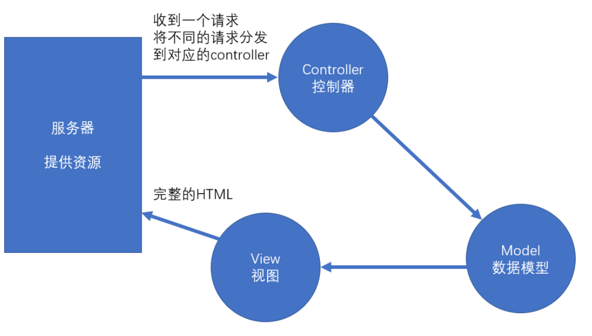
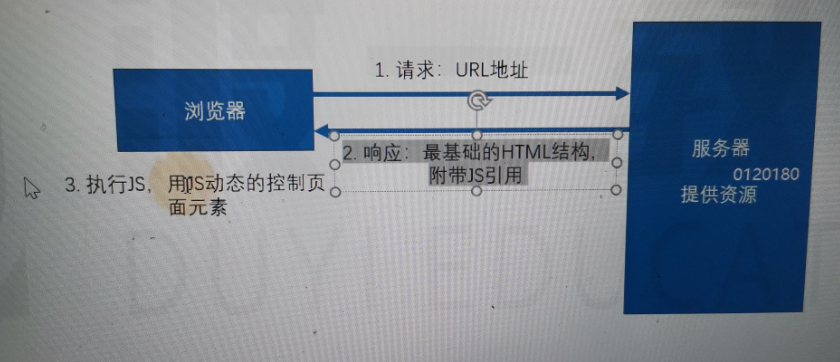
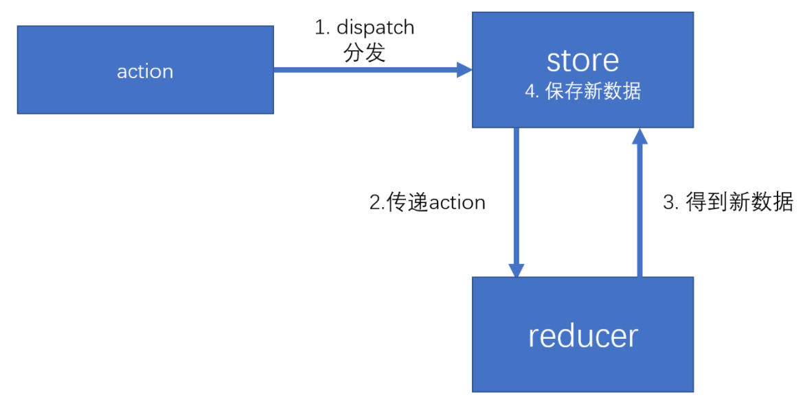

# Redux

# Redux 核心概念

action  reducer  store

## MVC

它是一个 UI 的解决方案，用于降低 UI，以及 UI 关联的数据的复杂度。

**传统的服务器端的 MVC**


环境：

1. 服务端需要响应一个完整的 HTML
2. 该 HTML 中包含页面需要的数据
3. 浏览器仅承担渲染页面的作用

以上的这种方式叫做**服务端渲染**，即服务器端将完整的页面组装好之后，一起发送给客户端。

服务器端需要处理 UI 中要用到的数据，并且要将数据嵌入到页面中，最终生成一个完整的 HTML 页面响应。

为了降低处理这个过程的复杂度，出现了 MVC 模式。


**Controller**: 处理请求，组装这次请求需要的数据
**Model**：需要用于 UI 渲染的数据模型
**View**：视图，用于将模型组装到界面中

**前后端分离**

**前端 MVC 模式的困难**

React 解决了   数据 -> 视图   的问题

> 解决了 MVC 的 V

1. 前端的 controller 要比服务器复杂很多，因为前端中的 controller 处理的是用户的操作，而用户的操作场景是复杂的。
2. 对于那些组件化的框架（比如 vue、react），它们使用的是单向数据流。若需要共享数据，则必须将数据提升到顶层组件，然后数据再一层一层传递，极其繁琐。 虽然可以使用上下文来提供共享数据，但对数据的操作难以监控，容易导致调试错误的困难，以及数据还原的困难。并且，若开发一个大中型项目，共享的数据很多，会导致上下文中的数据变得非常复杂。

比如，上下文中有如下格式的数据：

```javascript
value = {
  users: [{}, {}, {}],
  addUser: function (u) {},
  deleteUser: function (u) {},
  updateUser: function (u) {},
  //  这些方法都可能改变数据，发生错误难以调试
};
```

## 前端需要一个独立的数据解决方案

> 独立：可不一定是 react,根本就没关系

**Flux**

Facebook 提出的数据解决方案，它的最大历史意义，在于它引入了 action 的概念

action 是一个普通的对象，用于描述要干什么。**action 是触发数据变化的唯一原因**

store 表示数据仓库，用于存储共享数据。还可以根据不同的 action 更改仓库中的数据

示例：

```javascript
var loginAction = {
  type: "login",
  payload: {
    loginId: "admin",
    loginPwd: "123123",
  },
};

var deleteAction = {
  type: "delete",
  payload: 1, // 用户id为1
};
```

**Redux**

在 Flux 基础上，引入了 reducer 的概念

reducer：处理器，用于根据 action 来处理数据，处理后的数据会被仓库重新保存。



# Action

1. action 是一个 plain-object（平面对象）
   1. 它的**proto**指向 Object.prototype
2. 通常，使用 payload 属性表示附加数据（没有强制要求）
3. action 中必须有 type 属性，该属性用于描述操作的类型
   1. 但是，没有对 type 的类型做出要求
4. 在大型项目，由于操作类型非常多，为了避免硬编码（hard code），会将 action 的类型存放到一个或一些单独的文件中(样板代码)。


5. 为了方面传递 action，通常会使用 action 创建函数(action creator)来创建 action

1. action 创建函数应为无副作用的纯函数
   1. 不能以任何形式改动参数
   2. 不可以有异步
   3. 不可以对外部环境中的数据造成影响
1. 为了方便利用 action 创建函数来分发（触发）action，redux 提供了一个函数`bindActionCreators`，该函数用于增强 action 创建函数的功能，使它不仅可以创建 action，并且创建后会自动完成分发。

# Reducer

Reducer 是用于改变数据的函数

1. 一个数据仓库，有且仅有一个 reducer，并且通常情况下，一个工程只有一个仓库，因此，一个系统，只有一个 reducer
2. 为了方便管理，通常会将 reducer 放到单独的文件中。
3. reducer 被调用的时机
   1. 通过 store.dispatch，分发了一个 action，此时，会调用 reducer
   2. 当创建一个 store 的时候，会调用一次 reducer
      1. 可以利用这一点，用 reducer 初始化状态
      2. 创建仓库时，不传递任何默认状态
      3. 将 reducer 的参数 state 设置一个默认值。创建仓库不写默认值，传递 reducer 的时候传递默认值
4. reducer 内部通常使用 switch 来判断 type 值
5. **reducer 必须是一个没有副作用的纯函数**
   1. 为什么需要纯函数
      1. 纯函数有利于测试和调式
      2. 有利于还原数据
      3. 有利于将来和 react 结合时的优化
   2. 具体要求
      1. 不能改变参数，因此若要让状态变化，必须得到一个新的状态
      2. 不能有异步
      3. 不能对外部环境造成影响
6. 由于在大中型项目中，操作比较复杂，数据结构也比较复杂，因此，需要对 reducer 进行细分。
   1. redux 提供了方法，可以帮助我们更加方便的合并 reducer
   2. combineReducers: 合并 reducer，得到一个新的 reducer，该新的 reducer 管理一个对象，该对象中的每一个属性交给对应的 reducer 管理。

# Store

Store：用于保存数据

通过 createStore 方法创建的对象。

该对象的成员：

- dispatch：分发一个 action
- getState：得到仓库中当前的状态
- replaceReducer：替换掉当前的 reducer
- subscribe：注册一个监听器，监听器是一个无参函数，该分发一个 action 之后，会运行注册的监听器。该函数会返回一个函数，用于取消监听。可以注册多个监听器

# createStore

返回一个对象：

- dispatch：分发一个 action
- getState：得到仓库中当前的状态
- subscribe：注册一个监听器，监听器是一个无参函数，该分发一个 action 之后，会运行注册的监听器。该函数会返回一个函数，用于取消监听

# bindActionCreators

# combineReducers

组装 reducers，返回一个 reducer，数据使用一个对象表示，对象的属性名与传递的参数对象保持一致

# Redux 中间件（Middleware）

中间件：类似于插件，可以在不影响原本功能、并且不改动原本代码的基础上，对其功能进行增强。在 Redux 中，中间件主要用于增强 dispatch 函数。

实现 Redux 中间件的基本原理，是更改仓库中的 dispatch 函数。

Redux 中间件书写：

- 中间件本身是一个函数，该函数接收一个 store 参数，表示创建的仓库，该仓库并非一个完整的仓库对象，仅包含 getState，dispatch。该函数运行的时间，是在仓库创建之后运行。
  - 由于创建仓库后需要自动运行设置的中间件函数，因此，需要在创建仓库时，告诉仓库有哪些中间件
  - 需要调用 applyMiddleware 函数，将函数的返回结果作为 createStore 的第二或第三个参数。
- 中间件函数必须返回一个 dispatch 创建函数
- applyMiddleware 函数，用于记录有哪些中间件，它会返回一个函数
  - 该函数用于记录创建仓库的方法，然后又返回一个函数

# redux-actions

不维护了：https://github.com/redux-utilities/redux-actions#looking-for-maintainers

> 该库用于简化 action-types、action-creator 以及 reducer
> 官网文档：[https://redux-actions.js.org/](https://redux-actions.js.org/)

## createAction(s)

### createAction

该函数用于帮助你创建一个 action 创建函数（action creator）

### createActions

该函数用于帮助你创建多个 action 创建函数

## handleAction(s)

### handleAction

简化针对单个 action 类型的 reducer 处理，当它**匹配到对应的 action 类型后，会执行对应的函数**

### handleActions

简化针对多个 action 类型的 reducre 处理

## combineActions

配合 createActions 和 handleActions 两个函数，用于处理多个 action-type 对应同一个 reducer 处理函数。
