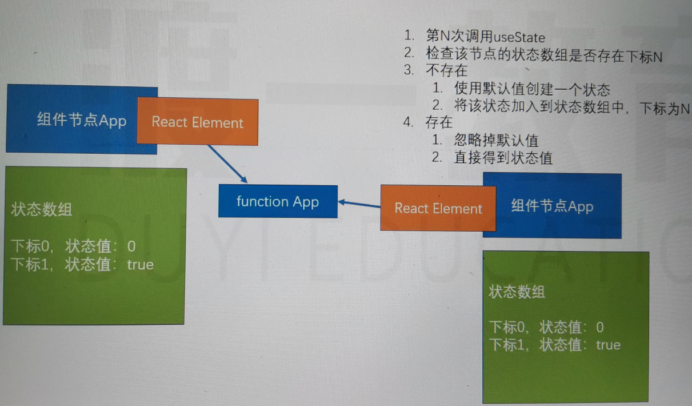
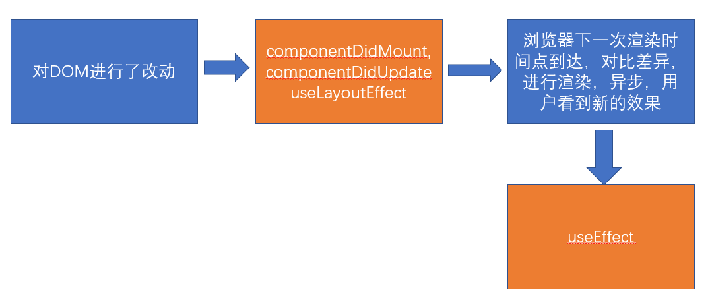

## HOOK 简介

组件：无状态组件（函数组件）、类组件
类组件中的麻烦：

1.  this 指向问题
2.  繁琐的生命周期
3.  其他问题

HOOK 专门用于增强函数组件的功能（HOOK 在类组件中是不能使用的），使之理论上可以成为类组件的替代品
官方强调：没有必要更改已经完成的类组件，官方目前没有计划取消类组件，只是鼓励使用函数组件
HOOK（钩子）本质上是一个函数(命名上总是以**use**开头)，该函数可以挂载任何功能
HOOK 种类：

1. useState 解决状态
2. useEffect 解决生命周期函数
3. 其他...

不同 HOOK 能解决某一方面的功能

### State Hook

State Hook 是一个在函数组件中使用的函数（useState），用于在函数组件中使用状态

useState

- 函数有一个参数，这个参数的值表示状态的默认值
- 函数的返回值是一个数组，该数组一定包含两项
  - 第一项：当前状态的值
  - 第二项：改变状态的函数

一个函数组件中可以有多个状态，这种做法非常有利于横向切分关注点。
函数组件的写法

```jsx
import React, { useState } from "react";
// 函数组件的写法
export default function App() {
  // const arr = useState(0); // 不填默认undefined。使用一个状态，该状态默认值是0
  // const n = arr[0]; //得到状态的值
  // const setN = arr[1]; //得到一个函数，改函数用于改变状态
  // 解构语法简化：
  const [n, setN] = useState(0);
  return (
    <div>
      <button
        onClick={() => {
          setN(n - 1);
        }}
      >
        -
      </button>
      <span>{n}</span>
      <button
        onClick={() => {
          setN(n + 1);
        }}
      >
        +
      </button>
    </div>
  );
}
```

原理



**注意的细节**

1. useState 最好写到函数的起始位置，便于阅读
2. useState 严禁出现在代码块（判断、循环）中
3. useState 返回的函数（数组的第二项），引用不变（节约内存空间）
4. 使用函数改变数据，若数据和之前的数据完全相等（使用 Object.is 比较），不会导致重新渲染，以达到优化效率的目的。
5. 使用函数改变数据，传入的值不会和原来的数据进行合并，而是直接替换。不要直接改变对象。setState 是用混合。
   > 应该横切开来，写第二个状态。如果的确需要在一起，就用展开运算符

```jsx
export default function App() {
  const [data, setData] = useState({
    x: 1,
    y: 2,
  });
  return (
    <p>
      x:{data.x},y:{data.y}
      <button
        onClick={() => {
          setData({
            ...data,
            x: data.x + 1,
          });
        }}
      >
        x+1
      </button>
    </p>
  );
}
```

6. 如果要实现强制刷新组件

类组件：使用 forceUpdate 函数。不运行 shouldComponentUpdate
函数组件：使用一个空对象的 useState

```jsx
import React, { useState } from "react";
export default function App() {
  console.log("App render");
  const [, forceUpdate] = useState({});
  return (
    <div>
      <p>
        <button
          onClick={() => {
            forceUpdate({});
          }}
        >
          强制刷新
        </button>
      </p>
    </div>
  );
}
```

7. **如果某些状态之间没有必然的联系，应该分化为不同的状态，而不要合并成一个对象**
8. 和类组件的状态一样，函数组件中改变状态可能是异步的（在 DOM 事件中），多个状态变化会合并以提高效率，此时，不能信任之前的状态，而应该使用回调函数的方式改变状态。如果状态变化要使用到之前的状态，尽量传递函数。

```jsx
import React, { useState } from "react";
export default function App() {
  console.log("render"); //两次改变合并成一个，只运行一次
  const [n, setN] = useState(0);
  return (
    <div>
      <span>{n}</span>
      <button
        onClick={() => {
          // setN(n + 1); // 不会立即改变，事件运行完成后一起改变
          // setN(n + 1); // 此时n仍是0
          setN((prevN) => prevN + 1); // 传入的函数，在事件完成后统一运行
          setN((prevN) => prevN + 1);
        }}
      >
        +
      </button>
    </div>
  );
}
```

### Effect Hook

副作用：生命周期 componentDidMount，componentDidUpdate，componentWillUnmount 才能有副作用，其他都不能，因为都可能调用两遍，服务端渲染可能出问题

Effect Hook：用于在函数组件中处理副作用
副作用：

1. ajax 请求
2. 计时器
3. 其他异步操作
4. 更改真实 DOM 对象
5. 本地存储
6. 其他会对外部产生影响的操作

函数：useEffect，该函数接收一个函数作为参数，接收的函数就是需要进行副作用操作的函数

```jsx
export default function EffectHook() {
  const [n, setN] = useState(0);
  useEffect(() => {
    document.title = n;
  });
  return (
    <div>
      <button onClick={() => setN(n + 1)}>+</button>
      {n}
    </div>
  );
}
```

**细节**

1. 副作用函数的运行时间点，是在页面完成真实的 UI 渲染之后。因此它的执行是异步的，并且不会阻塞浏览器 。所以会有些延迟

与类组件中 componentDidMount 和 componentDidUpdate 的区别
componentDidMount 和 componentDidUpdate，更改了真实 DOM，但是用户还没有看到 UI 更新，同步的。
useEffect 中的副作用函数，更改了真实 DOM，并且用户已经看到了 UI 更新，异步的。

2. 每个函数组件中，可以多次使用 useEffect，但不要放入判断或循环等代码块中。
3. useEffect 中的副作用函数，可以有返回值，返回值必须是一个函数，该函数叫做清理函数
   1. 该函数运行时间点，在每次运行副作用函数之前
   2. 首次渲染组件不会运行
   3. **组件被销毁时一定会运行 window.timer => null**
4. useEffect 函数，可以传递第二个参数
   1. 第二个参数是一个数组
   2. 数组中记录该副作用的依赖数据
   3. 当组件重新渲染后，只有依赖数据与上一次不一样的时，才会执行副作用
   4. 所以，当传递了依赖数据之后，如果数据没有发生变化
      1. 副作用函数仅在第一次渲染后运行
      2. 清理函数仅在卸载组件后运行
5. 副作用函数中，如果使用了函数上下文中的变量，则由于闭包的影响，会导致副作用函数中变量不会实时变化。
   

6. 副作用函数在每次注册时，会覆盖掉之前的副作用函数，因此，尽量保持副作用函数稳定，否则控制起来会比较复杂。

### 自定义 Hook

State Hook： useState
Effect Hook：useEffect

自定义 Hook：将一些常用的、跨越多个组件的 Hook 功能，抽离出去形成一个函数，该函数就是自定义 Hook，自定义 Hook，由于其内部需要使用 Hook 功能，所以它本身也需要按照 Hook 的规则实现：

1. 函数名必须以 use 开头
2. 调用自定义 Hook 函数时，应该放到顶层

例如：

1. 很多组件都需要在第一次加载完成后，获取所有学生数据
2. 很多组件都需要在第一次加载完成后，启动一个计时器，然后在组件销毁时卸载

> 使用 Hook 的时候，如果没有严格按照 Hook 的规则进行，eslint 的一个插件（eslint-plugin-react-hooks）会报出警告

### Reducer Hook

Flux：Facebook 出品的一个数据流框架

1. 规定了数据是单向流动的
2. 数据存储在数据仓库中（目前，可以认为 state 就是一个存储数据的仓库）
3. **action 是改变数据的唯一原因**（本质上就是一个对象，action 有两个属性）
   1. type：字符串，动作的类型
   2. payload：任意类型，动作发生后的附加信息
   3. 例如，如果是添加一个学生，action 可以描述为：
      1. `{ type:"addStudent", payload: {学生对象的各种信息} }`
   4. 例如，如果要删除一个学生，action 可以描述为：
      1. `{ type:"deleteStudent", payload: 学生id }`
4. **具体改变数据**的是一个函数，该函数叫做**reducer**
   1. 该函数接收两个参数
      1. state：表示当前数据仓库中的数据
      2. action：描述了如何去改变数据，以及改变数据的一些附加信息
   2. 该函数必须有一个返回结果，用于表示数据仓库变化之后的数据
      1. Flux 要求，对象是不可变的，如果返回对象，必须创建新的对象
   3. reducer 必须是纯函数，不能有任何副作用
5. 如果要触发 reducer，**不可以直接调用**，而是应该调用一个辅助函数**dispatch**
   1. 该函数仅接收一个参数：action
   2. 该函数会间接去调用 reducer，以达到改变数据的目的

### Context Hook

用于获取上下文数据

### Callback Hook

函数名：useCallback

用于得到一个固定引用值的函数，通常用它进行性能优化

useCallback:

该函数有两个参数：

1. 函数，useCallback 会固定该函数的引用，**只要依赖项没有发生变化，则始终返回之前函数的地址**
2. 数组，记录依赖项

该函数返回：引用相对固定的函数地址

### Memo Hook

用于保持一些比较稳定的数据，通常用于性能优化

**如果 React 元素本身的引用没有发生变化，一定不会重新渲染**

### Ref Hook

useRef 函数：

1. 一个参数：默认值
2. 返回一个**固定的对象**，`{current: 值}`

**可以做到每一个组件有一个唯一地址**

### ImperativeHandle Hook

函数：useImperativeHandleHook

### LayoutEffect Hook



useEffect：浏览器渲染完成后，用户看到新的渲染结果之后

useLayoutEffectHook：完成了**DOM**改动，但还没有呈现给用户运行

**应该尽量使用 useEffect，因为它不会导致渲染阻塞**，如果出现了问题，再考虑使用 useLayoutEffectHook。使用上和 useEffect 没有区别

### DebugValue Hook

useDebugValue：用于将自定义 Hook 的关联数据显示到调试栏

如果创建的自定义 Hook 通用性比较高，可以选择使用 useDebugValue 方便调试

# Hooks

### 对 React Hook 的理解，它的实现原理是什么

**（1）类组件：** 所谓类组件，就是基于 ES6 Class 这种写法，通过继承 React.Component 得来的 React 组件。内部预置了相当多的“现成的东西”等着我们去调度/定制，state 和生命周期就是这些“现成东西”中的典型。要想得到这些东西，难度也不大，只需要继承一个 React.Component 即可。使得**类组件内部的逻辑难以实现拆分和复用。**

**（2）函数组件**：函数组件就是以函数的形态存在的 React 组件。

类组件和函数组件之间，是面向对象和函数式编程这两套不同的设计思想之间的差异。而函数组件更加契合 React 框架的设计理念

React 组件本身的定位就是函数，一个输入数据、输出 UI 的函数。作为开发者，我们编写的是声明式的代码，而 React 框架的主要工作，就是及时地把声明式的代码转换为命令式的 DOM 操作，把数据层面的描述映射到用户可见的 UI 变化中去。这就意味着从原则上来讲，React 的数据应该总是紧紧地和渲染绑定在一起的，而类组件做不到这一点。**函数组件就真正地将数据和渲染绑定到了一起。函数组件是一个更加匹配其设计理念、也更有利于逻辑拆分与重用的组件表达形式。**

**（1）在组件之间复用状态逻辑很难**

React 没有提供将可复用性行为“附加”到组件的途径（例如，把组件连接到 store）解决此类问题可以使用 render props 和 高阶组件。但是这类方案需要重新组织组件结构，这可能会很麻烦，并且会使代码难以理解。由 providers，consumers，高阶组件，render props 等其他抽象层组成的组件会形成“嵌套地狱”。尽管可以在 DevTools 过滤掉它们，但这说明了一个更深层次的问题：React 需要为共享状态逻辑提供更好的原生途径。

可以使用 Hook 从组件中提取状态逻辑，使得这些逻辑可以单独测试并复用。Hook 使我们在无需修改组件结构的情况下复用状态逻辑。 这使得在组件间或社区内共享 Hook 变得更便捷。

**（2）复杂组件变得难以理解**

在组件中，每个生命周期常常包含一些不相关的逻辑。例如，组件常常在 componentDidMount 和 componentDidUpdate 中获取数据。但是，同一个 componentDidMount 中可能也包含很多其它的逻辑，如设置事件监听，而之后需在 componentWillUnmount 中清除。相互关联且需要对照修改的代码被进行了拆分，而完全不相关的代码却在同一个方法中组合在一起。如此很容易产生 bug，并且导致逻辑不一致。

在多数情况下，不可能将组件拆分为更小的粒度，因为状态逻辑无处不在。这也给测试带来了一定挑战。同时，这也是很多人将 React 与状态管理库结合使用的原因之一。但是，这往往会引入了很多抽象概念，需要你在不同的文件之间来回切换，使得复用变得更加困难。

为了解决这个问题，Hook 将组件中相互关联的部分拆分成更小的函数（比如设置订阅或请求数据），而并非强制按照生命周期划分。你还可以使用 reducer 来管理组件的内部状态，使其更加可预测。

**（3）难以理解的 class**

### 为什么 useState 要使用数组而不是对象

- 如果 useState 返回的是数组，那么使用者可以对数组中的元素命名，代码看起来也比较干净
- 如果 useState 返回的是对象，在解构对象的时候必须要和 useState 内部实现返回的对象同名，想要使用多次的话，必须得设置别名才能使用返回值

下面来看看如果 useState 返回对象的情况：

```javascript
// 第一次使用
const { state, setState } = useState(false);
// 第二次使用
const { state: counter, setState: setCounter } = useState(0);
```

这里可以看到，返回对象的使用方式还是挺麻烦的，更何况实际项目中会使用的更频繁。 \*_总结：\_\_useState 返回的是 array 而不是 object 的原因就是为了\_\_降低使用的复杂度_，返回数组的话可以直接根据顺序解构，而返回对象的话要想使用多次就需要定义别名了

### React Hook 的使用限制

React Hooks 的限制主要有两条：

- 不要在循环、条件或嵌套函数中调用 Hook；
- 在 React 的函数组件中调用 Hook。

那为什么会有这样的限制呢？Hooks 的设计初衷是为了改进 React 组件的开发模式。在旧有的开发模式下遇到了三个问题。

- 组件之间难以复用状态逻辑。过去常见的解决方案是高阶组件、render props 及状态管理框架。
- 复杂的组件变得难以理解。生命周期函数与业务逻辑耦合太深，导致关联部分难以拆分。
- 人和机器都很容易混淆类。常见的有 this 的问题，但在 React 团队中还有类难以优化的问题，希望在编译优化层面做出一些改进。

这三个问题在一定程度上阻碍了 React 的后续发展，所以为了解决这三个问题，Hooks **基于函数组件**开始设计。然而第三个问题决定了 Hooks 只支持函数组件。

那为什么不要在循环、条件或嵌套函数中调用 Hook 呢？因为 Hooks 的设计是基于数组实现。在调用时按顺序加入数组中，如果使用循环、条件或嵌套函数很有可能导致数组取值错位，执行错误的 Hook。当然，实质上 React 的源码里不是数组，是链表。

这些限制会在编码上造成一定程度的心智负担，新手可能会写错，为了避免这样的情况，可以引入 ESLint 的 Hooks 检查插件进行预防。

### useEffect 与 useLayoutEffect 的区别

**（1）共同点**

- **运用效果：** useEffect 与 useLayoutEffect 两者都是用于处理副作用，这些副作用包括改变 DOM、设置订阅、操作定时器等。在函数组件内部操作副作用是不被允许的，所以需要使用这两个函数去处理。
- **使用方式：** useEffect 与 useLayoutEffect 两者底层的函数签名是完全一致的，都是调用的 mountEffectImpl 方法，在使用上也没什么差异，基本可以直接替换。

**（2）不同点**

- **使用场景：** useEffect 在 React 的渲染过程中是被异步调用的，用于绝大多数场景；而 useLayoutEffect 会在所有的 DOM 变更之后同步调用，主要用于处理 DOM 操作、调整样式、避免页面闪烁等问题。也正因为是同步处理，所以需要避免在 useLayoutEffect 做计算量较大的耗时任务从而造成阻塞。
- **使用效果：** useEffect 是按照顺序执行代码的，改变屏幕像素之后执行（先渲染，后改变 DOM），当改变屏幕内容时可能会产生闪烁；useLayoutEffect 是改变屏幕像素之前就执行了（会推迟页面显示的事件，先改变 DOM 后渲染），不会产生闪烁。**useLayoutEffect 总是比 useEffect 先执行。**

在未来的趋势上，两个 API 是会长期共存的，暂时没有删减合并的计划，需要开发者根据场景去自行选择。React 团队的建议非常实用，如果实在分不清，先用 useEffect，一般问题不大；如果页面有异常，再直接替换为 useLayoutEffect 即可。

### 在平时开发中需要注意的问题和原因

（1）**不要在循环，条件或嵌套函数中调用 Hook，必须始终在 React 函数的顶层使用 Hook**

这是因为 React 需要利用调用顺序来正确更新相应的状态，以及调用相应的钩子函数。一旦在循环或条件分支语句中调用 Hook，就容易导致调用顺序的不一致性，从而产生难以预料到的后果。

**（2）使用 useState 时候，使用 push，pop，splice 等直接更改数组对象的坑**

使用 push 直接更改数组无法获取到新值，应该采用析构方式，但是在 class 里面不会有这个问题。

（3）**useState 设置状态的时候，只有第一次生效，后期需要更新状态，必须通过 useEffect**

TableDeail 是一个公共组件，在调用它的父组件里面，我们通过 set 改变 columns 的值，以为传递给 TableDeail 的 columns 是最新的值，所以 tabColumn 每次也是最新的值，但是实际 tabColumn 是最开始的值，不会随着 columns 的更新而更新

**（4）善用 useCallback**

父组件传递给子组件事件句柄时，如果我们没有任何参数变动可能会选用 useMemo。但是每一次父组件渲染子组件即使没变化也会跟着渲染一次。

**（5）不要滥用 useContext**

可以使用基于 useContext 封装的状态管理工具。

### React Hooks 和生命周期的关系？

**函数组件** 的本质是函数，没有 state 的概念的，因此**不存在生命周期**一说，仅仅是一个 **render 函数**而已。 但是引入 **Hooks** 之后就变得不同了，它能让组件在不使用 class 的情况下拥有 state，所以就有了生命周期的概念，所谓的生命周期其实就是 `useState`、 `useEffect()` 和 `useLayoutEffect()` 。

即：**Hooks 组件（使用了 Hooks 的函数组件）有生命周期，而函数组件（未使用 Hooks 的函数组件）是没有生命周期的**。

下面是具体的 class 与 Hooks 的**生命周期对应关系**：

- `constructor`：函数组件不需要构造函数，可以通过调用 `**useState 来初始化 state**`。如果计算的代价比较昂贵，也可以传一个函数给 `useState`。

```javascript
const [num, UpdateNum] = useState(0);
```

- `getDerivedStateFromProps`：一般情况下，我们不需要使用它，可以在**渲染过程中更新 state**，以达到实现 `getDerivedStateFromProps` 的目的。

```javascript
function ScrollView({ row }) {
  let [isScrollingDown, setIsScrollingDown] = useState(false);
  let [prevRow, setPrevRow] = useState(null);
  if (row !== prevRow) {
    // Row 自上次渲染以来发生过改变。更新 isScrollingDown。
    setIsScrollingDown(prevRow !== null && row > prevRow);
    setPrevRow(row);
  }
  return `Scrolling down: ${isScrollingDown}`;
}
```

React 会立即退出第一次渲染并用更新后的 state 重新运行组件以避免耗费太多性能。

- `shouldComponentUpdate`：可以用 `React.memo` 包裹一个组件来对它的 `props` 进行浅比较

```javascript
const Button = React.memo((props) => {  // 具体的组件});

```

注意：`React.memo 等效于`PureComponent`，它只浅比较 props。这里也可以使用`useMemo` 优化每一个节点。

- `render`：这是函数组件体本身。
- `componentDidMount`, `componentDidUpdate`： `useLayoutEffect` 与它们两的调用阶段是一样的。但是，我们推荐你**一开始先用 useEffect**，只有当它出问题的时候再尝试使用 `useLayoutEffect`。`useEffect` 可以表达所有这些的组合。

```javascript
// componentDidMount
useEffect(() => {
  // 需要在 componentDidMount 执行的内容
}, []);
useEffect(() => {
  // 在 componentDidMount，以及 count 更改时 componentDidUpdate 执行的内容
  document.title = `You clicked ${count} times`;
  return () => {
    // 需要在 count 更改时 componentDidUpdate（先于 document.title = ... 执行，遵守先清理后更新）
    // 以及 componentWillUnmount 执行的内容
  }; // 当函数中 Cleanup 函数会按照在代码中定义的顺序先后执行，与函数本身的特性无关
}, [count]); // 仅在 count 更改时更新
```

**请记得 React 会等待浏览器完成画面渲染之后才会延迟调用 ，因此会使得额外操作很方便**

- `componentWillUnmount`：相当于 `useEffect`里面返回的 `cleanup` 函数

```javascript
// componentDidMount/componentWillUnmount
useEffect(() => {
  // 需要在 componentDidMount 执行的内容
  return function cleanup() {
    // 需要在 componentWillUnmount 执行的内容
  };
}, []);
```

- `componentDidCatch` and `getDerivedStateFromError`：目前**还没有**这些方法的 Hook 等价写法，但很快会加上。
  | **class 组件** | **Hooks 组件** |
  | --- | --- |
  | constructor | useState |
  | getDerivedStateFromProps | useState 里面 update 函数 |
  | shouldComponentUpdate | useMemo |
  | render | 函数本身 |
  | componentDidMount | useEffect |
  | componentDidUpdate | useEffect |
  | componentWillUnmount | useEffect 里面返回的函数 |
  | componentDidCatch | 无 |
  | getDerivedStateFromError | 无 |

## 虚拟 DOM

### 对虚拟 DOM 的理解？

Virtual Dom 是一个 JavaScript 对象，通过对象的方式来表示 DOM 结构。将页面的状态抽象为 JS 对象的形式，配合不同的渲染工具，使跨平台渲染成为可能。通过事务处理机制，将多次 DOM 修改的结果一次性的更新到页面上，从而有效的减少页面渲染的次数，减少修改 DOM 的重绘重排次数，提高渲染性能。

虚拟 DOM 是对 DOM 的抽象，这个对象是更加轻量级的对 DOM 的描述。它设计的最初目的，**就是更好的跨平台**，比如 node.js 就没有 DOM，如果想实现 SSR，那么一个方式就是借助虚拟 dom，因为虚拟 dom 本身是 js 对象。 在代码渲染到页面之前，vue 或者 react 会把代码转换成一个对象（虚拟 DOM）。以对象的形式来描述真实 dom 结构，最终渲染到页面。在每次数据发生变化前，虚拟 dom 都会缓存一份，变化之时，现在的虚拟 dom 会与缓存的虚拟 dom 进行比较。在 vue 或者 react 内部封装了 diff 算法，通过这个算法来进行比较，渲染时修改改变的变化，原先没有发生改变的通过原先的数据进行渲染。

另外现代前端框架的一个基本要求就是无须手动操作 DOM，一方面是因为手动操作 DOM 无法保证程序性能，多人协作的项目中如果 review 不严格，可能会有开发者写出性能较低的代码，另一方面更重要的是省略手动 DOM 操作可以大大提高开发效率。

**为什么要用 Virtual DOM：**

**（1）保证性能下限，在不进行手动优化的情况下，提供过得去的性能**

下面对比一下修改 DOM 时真实 DOM 操作和 Virtual DOM 的过程，来看一下它们重排重绘的性能消耗 ∶

- 真实 DOM∶ 生成 HTML 字符串＋ 重建所有的 DOM 元素
- Virtual DOM∶ 生成 vNode ＋ DOMDiff ＋必要的 DOM 更新

Virtual DOM 的更新 DOM 的准备工作耗费更多的时间，也就是 JS 层面，相比于更多的 DOM 操作它的消费是极其便宜的。尤雨溪在社区论坛中说道 ∶ 框架给你的保证是，你不需要手动优化的情况下，我依然可以给你提供过得去的性能。 **（2）跨平台** Virtual DOM 本质上是 JavaScript 的对象，它可以很方便的跨平台操作，比如服务端渲染、uniapp 等。

### React diff 算法的原理是什么？

实际上，diff 算法探讨的就是虚拟 DOM 树发生变化后，生成 DOM 树更新补丁的方式。它通过对比新旧两株虚拟 DOM 树的变更差异，将更新补丁作用于真实 DOM，以最小成本完成视图更新。

具体的流程如下：

- 真实的 DOM 首先会映射为虚拟 DOM；
- 当虚拟 DOM 发生变化后，就会根据差距计算生成 patch，这个 patch 是一个结构化的数据，内容包含了增加、更新、移除等；
- 根据 patch 去更新真实的 DOM，反馈到用户的界面上。
  一个简单的例子：

```javascript
import React from "react";
export default class ExampleComponent extends React.Component {
  render() {
    if (this.props.isVisible) {
      return <div className="visible">visbile</div>;
    }
    return <div className="hidden">hidden</div>;
  }
}
```

这里，首先假定 ExampleComponent 可见，然后再改变它的状态，让它不可见 。映射为真实的 DOM 操作是这样的，React 会创建一个 div 节点。

```javascript
<div class="visible">visbile</div>
```

当把 visbile 的值变为 false 时，就会替换 class 属性为 hidden，并重写内部的 innerText 为 hidden。**这样一个生成补丁、更新差异的过程统称为 diff 算法。**

diff 算法可以总结为三个策略，分别从树、组件及元素三个层面进行复杂度的优化：

**策略一：忽略节点跨层级操作场景，提升比对效率。（基于树进行对比）**

这一策略需要进行树比对，即对树进行分层比较。树比对的处理手法是非常“暴力”的，即两棵树只对同一层次的节点进行比较，如果发现节点已经不存在了，则该节点及其子节点会被完全删除掉，不会用于进一步的比较，这就提升了比对效率。

**策略二：如果组件的 class 一致，则默认为相似的树结构，否则默认为不同的树结构。（基于组件进行对比）**

在组件比对的过程中：

- 如果组件是同一类型则进行树比对；
- 如果不是则直接放入补丁中。

只要父组件类型不同，就会被重新渲染。这也就是为什么 shouldComponentUpdate、PureComponent 及 React.memo 可以提高性能的原因。

**策略三：同一层级的子节点，可以通过标记 key 的方式进行列表对比。（基于节点进行对比）**

元素比对主要发生在同层级中，通过标记节点操作生成补丁。节点操作包含了插入、移动、删除等。其中节点重新排序同时涉及插入、移动、删除三个操作，所以效率消耗最大，此时策略三起到了至关重要的作用。通过标记 key 的方式，React 可以直接移动 DOM 节点，降低内耗。

### React key

Keys 是 React 用于追踪哪些列表中元素被修改、被添加或者被移除的辅助标识。在开发过程中，我们需要保证某个元素的 key 在其同级元素中具有唯一性。

在 React Diff 算法中 React 会借助元素的 Key 值来判断该元素是新近创建的还是被移动而来的元素，从而减少不必要的元素重渲染此外，React 还需要借助 Key 值来判断元素与本地状态的关联关系。

注意事项：

- key 值一定要和具体的元素—一对应；
- 尽量不要用数组的 index 去作为 key；
- 不要在 render 的时候用随机数或者其他操作给元素加上不稳定的 key，这样造成的性能开销比不加 key 的情况下更糟糕。

### 虚拟 DOM 的引入与直接操作原生 DOM 相比，哪一个效率更高，为什么

**虚拟 DOM 相对原生的 DOM 不一定是效率更高**，如果只修改一个按钮的文案，那么虚拟 DOM 的操作无论如何都不可能比真实的 DOM 操作更快。在首次渲染大量 DOM 时，由于多了一层虚拟 DOM 的计算，虚拟 DOM 也会比 innerHTML 插入慢。它能保证性能下限，在真实 DOM 操作的时候进行针对性的优化时，还是更快的。所以要根据具体的场景进行探讨。

**在整个 DOM 操作的演化过程中，其实主要矛盾并不在于性能**，而在于开发者写得爽不爽，在于研发体验/研发效率。虚拟 DOM 不是别的，正是前端开发们为了追求更好的研发体验和研发效率而创造出来的高阶产物。虚拟 DOM 并不一定会带来更好的性能，React 官方也从来没有把虚拟 DOM 作为性能层面的卖点对外输出过。**虚拟 DOM 的优越之处在于，它能够在提供更爽、更高效的研发模式（也就是函数式的 UI 编程方式）的同时，仍然保持一个还不错的性能。**

### React 与 Vue 的 diff 算法

diff 算法是指生成更新补丁的方式，主要应用于虚拟 DOM 树变化后，更新真实 DOM。所以 diff 算法一定存在这样一个过程：触发更新 → 生成补丁 → 应用补丁。

React 的 diff 算法，触发更新的时机主要在 state 变化与 hooks 调用之后。此时触发虚拟 DOM 树变更遍历，采用了深度优先遍历算法。但传统的遍历方式，效率较低。为了优化效率，使用了分治的方式。将单一节点比对转化为了 3 种类型节点的比对，分别是树、组件及元素，以此提升效率。

- 树比对：由于网页视图中较少有跨层级节点移动，两株虚拟 DOM 树只对同一层次的节点进行比较。
- 组件比对：如果组件是同一类型，则进行树比对，如果不是，则直接放入到补丁中。
- 元素比对：主要发生在同层级中，通过标记节点操作生成补丁，节点操作对应真实的 DOM 剪裁操作。

以上是经典的 React diff 算法内容。自 React 16 起，引入了 Fiber 架构。为了使整个更新过程可随时暂停恢复，节点与树分别采用了 FiberNode 与 FiberTree 进行重构。fiberNode 使用了双链表的结构，可以直接找到兄弟节点与子节点。整个更新过程由 current 与 workInProgress 两株树双缓冲完成。workInProgress 更新完成后，再通过修改 current 相关指针指向新节点。

Vue 的整体 diff 策略与 React 对齐，虽然缺乏时间切片能力，但这并不意味着 Vue 的性能更差，因为在 Vue 3 初期引入过，后期因为收益不高移除掉了。除了高帧率动画，在 Vue 中其他的场景几乎都可以使用防抖和节流去提高响应性能。
