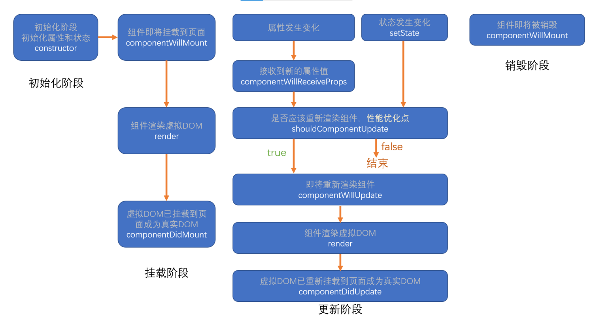

# React OnePage

React 是由**Facebook**研发的、用于**解决 UI 复杂度**的开源**JavaScript 库**，目前由 React 联合社区维护。

> 它不是框架，只是为了解决 UI 复杂度而诞生的一个库，并不是 MVVM MVC

## React 的特点

- 轻量：React 的开发版所有源码（包含注释）仅 3000 多行
- 原生：所有的 React 的代码都是用原生 JS 书写而成的，不依赖其他任何库
- 易扩展：React 对代码的封装程度较低，也没有过多的使用魔法，所以 React 中的很多功能都可以扩展。
- 不依赖宿主环境：React 只依赖原生 JS 语言，不依赖任何其他东西，包括运行环境。因此，它可以被轻松的移植到浏览器、桌面应用、移动端。
- 渐近式：React 并非框架，对整个工程没有强制约束力。这对与那些已存在的工程，可以逐步的将其改造为 React，而不需要全盘重写。
- 单向数据流：所有的数据自顶而下的流动
- 用 JS 代码声明界面
- 组件化

## Hello World

```html
<!-- React的核心库，与宿主环境无关 -->
<script
  crossorigin
  src="https://unpkg.com/react@16/umd/react.development.js"
></script>
<!-- 依赖核心库，将核心的功能与页面结合 -->
<script
  crossorigin
  src="https://unpkg.com/react-dom@16/umd/react-dom.development.js"
></script>
crossorigin跨域。script本身可以跨域，为何还要加呢？报错会显示详细信息
```

## React.createElement

创建一个**React 元素**，称作虚拟 DOM，**本质上是一个对象**

1. 参数 1：元素类型，如果是字符串，一个普通的 HTML 元素
2. 参数 2：元素的属性，一个对象
3. 后续参数：元素的子节点

最原始的写法：

```javascript
// 创建一个span元素
var span = React.createElement("span", {}, "一个span元素");
// 创建一个h1元素
创建一个H1元素;
var h1 = React.createElement(
  "h1",
  {
    title: "第一个React元素",
  },
  "Hello",
  "World",
  span
);
ReactDOM.render(h1, document.getElementById("root"));
```

> React 本质：createElement 创建一个对象，把这些对象形成一种结构，最终交给 ReactDOM 渲染到页面上

## JSX

JS 的扩展语法，需要使用 babel 进行转义。

```html
<!-- 编译JSX -->
<script src="https://unpkg.com/babel-standalone@6/babel.min.js"></script>
<script type="text/babel">
  // 创建一个span元素
  var span = <span>一个span元素</span>;
  // 创建一个H1元素
  var h1 = (
    <h1 title="第一个React元素">
      Hello World <span>一个span元素</span>
    </h1>
  );
  console.log(h1);
  // 等价于直接写    最终都会转成React.createElement来执行
  // ReactDOM.render(<h1 title="第一个React元素">Hello World <span>一个span元素</span></h1>, document.getElementById("root"));
</script>
```

emmet 配置：emmet 语法书写代码

```json
"javascript": "javascriptreact"
```

ESLint：代码风格检查：合适的时候提出警告

ES7 React/Redux/GraphQL/React-Native snippets：快速代码编写

React Developer Tools

## 什么是 JSX

- Facebook 起草的 JS 扩展语法
- 本质是一个 JS 对象，会被 babel 编译，最终会被转换为 React.createElement
- 每个 JSX 表达式，有且仅有一个根节点。原因：最终 React.createElement。

  - React.Fragment 简写为 <></>
  - 每个 JSX 元素必须结束（XML 规范）

- 在 JSX 中嵌入表达式
- 将表达式作为内容的一部分
  - null、undefined、false 不会显示
  - 普通对象，不可以作为子元素
  - 可以放置 React 元素对象
  - 数组：遍历数组，把数组的每一个元素当成子元素加进来，undefined null false 不会算，放普通对象会出错
- 将表达式作为元素属性
- 属性使用小驼峰命名法
- 防止注入攻击
  - 自动编码
  - dangerouslySetInnerHTML

```javascript
import React from "react";
import ReactDOM from "react-dom";
const a = 1234,
  b = 2345;

const div = (
  <h1>
    {a} * {b} = {a * b};
  </h1>
);
// 底层实现上
// const div = React.createElement("div",{},`${a}*${b} = ${a*b}`)
ReactDOM.render(div, document.getElementById("root"));
```

## 元素的不可变性

- 虽然 JSX 元素是一个对象，但是该对象中的所有属性不可更改

```javascript
div.props.num = 2;
div.props.title = "sac";
// 不能重新设置的原因：Object.freeze了
```

- 如果确实需要更改元素的属性，需要重新创建 JSX 元素

```javascript
import React from "react";
import ReactDOM from "react-dom";
let num = 0;
setInterval(() => {
  num++;
  const div = <div title="asa">{num}</div>;
  ReactDOM.render(div, document.getElementById("root"));
}, 1000);
```

> DOM 优化：效率很高，只变动 div 的内容

1. 函数组件

返回一个 React 元素

2. 类组件

必须继承 React.Component
必须提供 render 函数，用于渲染组件

## 组件的属性

1. 对于函数组件，属性会作为一个对象的属性，传递给函数的参数
2. 对于类组件，属性会作为一个对象的属性，传递给构造函数的参数

注意：组件的属性，应该使用小驼峰命名法

**组件无法改变自身的属性**。（只读）

之前学习的 React 元素，本质上，就是一个组件（内置组件） （都只读）

React 中的哲学：数据属于谁，谁才有权力改动（父组件也无权改）

**React 中的数据，自顶而下流动**

## 组件状态

组件状态：组件可以自行维护的数据

组件状态仅在类组件中有效

状态（state），本质上是类组件的一个属性，是一个对象

### 状态初始化

方法 1

```javascript
class Demo {
  constructor(props) {
    super(props);
    this.state = {
      left: this.props.left,
    };
  }
}
```

方法 2

```javascript
state = {
  left: this.props.number,
};
```

### 状态的变化

不能直接改变状态：因为 React 无法监控到状态发生了变化
必须使用 this.setState({})改变状态
一旦调用了 this.setState，会导致当前组件重新渲染

**组件中的数据**

1. props：该数据是由组件的使用者传递的数据，所有权不属于组件自身，因此组件无法改变该数据
2. state：该数据是由组件自身创建的，所有权属于组件自身，因此组件有权改变该数据。只有组件自身可以改

## 事件

在 React 中，组件的事件，本质上就是一个属性
**如果没有特殊处理，在事件处理函数中，this 指向 undefined**

1. 使用 bind 函数，绑定 this
2. 使用箭头函数

## 深入认识 setState

setState，它对状态的改变，**可能**是异步的

> 如果改变状态的代码处于某个 HTML 元素的事件中，则其是异步的，否则是同步

如果遇到某个事件中，需要同步调用多次，需要使用函数的方式得到最新状态

最佳实践：

1. 把所有的 setState 当作是异步的
2. 永远不要信任 setState 调用之后的状态
3. 如果要使用改变之后的状态，需要使用回调函数（setState 的第二个参数）
4. 如果新的状态要根据之前的状态进行运算，使用函数的方式改变状态（setState 的第一个函数）

React 会对异步的 setState 进行优化，将多次 setState 进行合并（将多次状态改变完成后，再统一对 state 进行改变，然后触发 render）

## 生命周期

生命周期：组件从诞生到销毁会经历一系列的过程，该过程就叫做生命周期。React 在组件的生命周期中提供了一系列的钩子函数（类似于事件），可以让开发者在函数中注入代码，这些代码会在适当的时候运行。
**生命周期仅存在于类组件中，函数组件每次调用都是重新运行函数，旧的组件即刻被销毁**

## 旧版生命周期

React < 16.0.0

1. constructor
   1. 同一个组件对象只会创建一次
   2. 不能在第一次挂载到页面之前，调用 setState，为了避免问题，构造函数中严禁使用 setState

- 因为 setState 会导致重新渲染，在挂载之前，没必要重新渲染

2. componentWillMount

   1. 正常情况下，和构造函数一样，它只会运行一次
   2. 可以使用 setState，但是为了避免 bug，不允许使用，因为在某些特殊情况下，该函数可能被调用多次

3. **render**

   1. 返回一个虚拟 DOM，会被挂载到虚拟 DOM 树中，最终渲染到页面的真实 DOM 中
   2. render 可能不只运行一次，只要需要重新渲染，就会重新运行
   3. 严禁使用 setState，因为可能会导致无限递归渲染

4. **componentDidMount**

   1. 只会执行一次
   2. 可以使用 setState
   3. 通常情况下，会将网络请求、启动计时器等一开始需要的操作，书写到该函数中

5. 组件进入活跃状态
6. componentWillReceiveProps

   1. 即将接收新的属性值
   2. 参数为新的属性对象
   3. 该函数可能会导致一些 bug，所以不推荐使用

7. **shouldComponentUpdate**

   1. 指示 React 是否要重新渲染该组件，通过返回 true 和 false 来指定
   2. 默认情况下，会直接返回 true
   3. 属性直接被赋值了，不一定要值变化

8. componentWillUpdate

   1. 组件即将被重新渲染

9. componentDidUpdate

   1. 往往在该函数中使用 dom 操作，改变元素

10. **componentWillUnmount**
11. 通常在该函数中销毁一些组件依赖的资源，比如计时器



## 新版生命周期

React >= 16.0.0

React 官方认为，某个数据的来源必须是单一的。要么来自属性，要么来自状态。

1. getDerivedStateFromProps

   1. 通过参数可以获取新的属性和状态
   2. 该函数是静态的
   3. 该函数的返回值会覆盖掉组件状态
   4. 该函数几乎是没有什么用

2. getSnapshotBeforeUpdate
   1. 运行时间：真实的 DOM 构建完成，但还未实际渲染到页面中。
   2. 在该函数中，通常用于实现一些附加的 dom 操作
   3. 该函数的返回值，会作为 componentDidUpdate 的第三个参数
   4. 配合 componentDidUpdate 使用


# 传递元素内容

内置组件：div、h1、p

```html
<div>asdfafasfafasdfasdf</div>
```

index.js

```jsx
ReactDOM.render(<New html={<h1>sss</h1>} />, document.getElementById("root"));
```

new.js

```jsx
export default function New(props) {
  return <div className="comp">{props.html}</div>;
}
```

如果给自定义组件传递元素内容，则 React 会将元素内容作为 children 属性传递过去。
传递多个：

```jsx
export default function Comp(props) {
  return (
    <div>
      {props.children}
      {props.content1}
      {props.content2}
    </div>
  );
}

function Test() {
  return (
    <div>
      <Comp content1={<h1>demo</h1>} content2={<h2>demo</h2>}>
        <div>children</div>
      </Comp>
    </div>
  );
}
```

# 表单

受控组件和非受控组件

受控组件：组件的使用者，有能力完全控制该组件的行为和内容。通常情况下，受控组件往往没有自身的状态，其内容完全收到属性的控制。

非受控组件：组件的使用者，没有能力控制该组件的行为和内容，组件的行为和内容完全自行控制。

**表单组件，默认情况下是非受控组件，一旦设置了表单组件的 value 属性，则其变为受控组件(单选和多选框需要设置 checked)**

# 属性默认值 和 类型检查

## 属性默认值

之前是用混入解决的：Object.assign({},defaultProps,props)
通过一个静态属性`defaultProps`告知 react 属性默认值
函数本身的属性：函数也是对象
混合完成时间：

1. 函数组件：调用函数之前就完成了
2. 类组件：运行构造函数之前完成

```javascript
// 函数组件

export default function Comp(props) {
    console.log(props)// 已经完成了混合
    return (
        <div>Comp</div>
    )
}
Comp.defaultProps = {
    a: 1,
    b: 2
}

/// 类组件
export default class Comp extends Component {
    // static defaultProps = {
    //     a: 1,
    //     b: 2
    // }
    render() {
        return (
            <div>index</div>
        )
    }
}
// 类的本质也是函数
Comp.defaultProps = {
    a: 1
}

```

## 属性类型检查

使用库：`prop-types`
对组件使用静态属性`propTypes`告知 react 如何检查属性
如果不按照类型传递属性的话，报警告，不影响代码执行。（只在开发阶段报警告）
可以不传递，但是一旦传递，必须正确

```javascript
PropTypes.any：//任意类型  通常用在列出所有属性，方便阅读；可以设置必填
PropTypes.array：//数组类型
PropTypes.bool：//布尔类型
PropTypes.func：//函数类型  事件
PropTypes.number：//数字类型
PropTypes.object：//对象类型
PropTypes.string：//字符串类型
PropTypes.symbol：//符号类型

PropTypes.node：
//任何可以被渲染的内容，字符串、数字、React元素。如果传递null undefined，没有报错，因为没有进行非空验证
PropTypes.element：//react元素
PropTypes.elementType：//react元素类型
PropTypes.instanceOf(构造函数)：//必须是指定构造函数的实例
PropTypes.oneOf([xxx, xxx])：//枚举
PropTypes.oneOfType([xxx, xxx]);  //属性类型必须是数组中的其中一个
PropTypes.arrayOf(PropTypes.XXX)：//必须是某一类型组成的数组
PropTypes.objectOf(PropTypes.XXX)：//对象由某一类型的值组成
PropTypes.shape(对象): //属性必须是对象，并且满足指定的对象要求
PropTypes.exact({...})：//和shape一样，只是exact要求对象必须精确匹配传递的数据

//自定义属性检查，如果有错误，返回错误对象即可
属性: function(props, propName, componentName) {
}
export default class Comp extends Component {
    static propTypes = {
        score: function (props, propName, componentName) {
            const val = props[propName];
            // 必填
            if (val === undefined || val === null) return new Error('Invalid')
            // 必须是数字
            if (typeof val !== 'number') return new Error('Invalid')
        }
    }
    render() {
        return (
            <div>
                {this.props.score}
            </div>
        )
    }
}
```

# HOC 高阶组件

HOF：Higher-Order Function, 高阶函数，以函数作为参数，并返回一个函数

HOC: Higher-Order Component, 高阶组件，以组件作为参数，并返回一个组件

通常，可以利用 HOC 实现横切关注点。

> 举例：20 个组件，每个组件在创建组件和销毁组件时，需要作日志记录
> 20 个组件，它们需要显示一些内容，得到的数据结构完全一致

**注意**

1. 不要在 render 中使用高阶组件。在 render 内部的话重新创建，失去状态，浪费效率。在 render 外部则使用的是同一个类。
2. 不要在高阶组件内部更改传入的组件（防止混乱）

# ref

场景：希望直接使用 dom 元素中的某个方法，或者希望直接使用自定义组件中的某个方法

1. ref 作用于内置的 html 组件，得到的将是真实的 dom 对象
2. ref 作用于类组件，得到的将是类的实例
3. ref 不能作用于函数组件

```jsx
import React, { Component } from "react";

/**
 * 类组件
 */
class A extends Component {
  method() {
    console.log("调用了A组件的方法");
  }
  render() {
    return <h1>组件A</h1>;
  }
}

/**
 * 内置html组件
 */
export default class Comp extends Component {
  handleClick = () => {
    // console.log(this)
    this.refs.txt.focus();
    this.refs.compA.method();
  };
  render() {
    return (
      <div>
        <input type="text" ref="txt" />
        <A ref="compA" />
        <button onClick={this.handleClick}>聚焦</button>
      </div>
    );
  }
}
```

以上：ref 不再推荐使用字符串赋值，字符串赋值的方式将来可能会被移出。（效率低）
目前，ref 推荐使用对象或者是函数
**对象**
通过 React.createRef 函数创建

```jsx
import React, { Component } from "react";

export default class Comp extends Component {
  constructor(props) {
    super(props);
    /* 
            方法2：这样创建对象也可以
          this.txt = {
            current: null
        } */
    // 方法1 createRef
    this.txt = React.createRef();
    console.log(this.txt); //{current: null}
    // 第一次渲染的时候会给current赋值
    // current: input
  }
  handleClick = () => {
    // console.log(this)
    this.txt.current.focus();
  };
  render() {
    return (
      <div>
        <input ref={this.txt} type="txt" />
        <button onClick={this.handleClick}>聚焦</button>
      </div>
    );
  }
}
```

**函数**
函数的调用时间：

1. componentDidMount 的时候会调用该函数
   1. 在 componentDidMount 事件中可以使用 ref
2. 如果 ref 的值发生了变动（旧的函数被新的函数替代），分别调用旧的函数以及新的函数，时间点出现在 componentDidUpdate 之前
   1. 旧的函数被调用时，传递 null
   2. 新的函数被调用时，传递对象
3. 如果 ref 所在的组件被卸载，会调用函数

**谨慎使用 ref**

能够使用属性和状态进行控制，就不要使用 ref。

1. 调用真实的 DOM 对象中的方法
2. 某个时候需要调用类组件的方法

# Ref 转发

forwardRef
forwardRef 方法：

1. 参数，传递的是函数组件，不能是类组件，并且，函数组件需要有第二个参数来得到 ref
2. 返回值，返回一个新的组件

```jsx
import React, { Component } from "react";

function A(props, ref) {
  // console.log(props, ref)
  /*  return <h1>组件A
         <span>{props.word}</span>
     </h1> */
  return (
    <h1 ref={ref}>
      组件A
      <span>{props.word}</span>
    </h1>
  );
}
// 传递函数组件A，得到一个新组件NewA
const NewA = React.forwardRef(A); //一旦经过了这个操作，ref代表的就由函数组件自己控制了

export default class App extends Component {
  ARef = React.createRef();
  // componentDidMount() {
  //     console.log(this.ARef)//null  啥都得不到，让我自己去控制。依靠第二个参数了
  // }

  render() {
    return (
      <div>
        {/* <A ref={this.ARef} /> */}
        {/* 木得：this.ARef.current:h1即组件内部的根元素 */}
        <NewA ref={this.ARef} word="aa" />
      </div>
    );
  }
}
```

类组件咋办呢？

方法 1

```jsx
import React, { Component } from "react";

/**
 * ref:就是一个对象
 * ref:{
 *  current:null
 * }
 */
class A extends React.Component {
  render() {
    return (
      <h1 ref={this.props.ref1}>
        组件A
        <span>{this.props.words}</span>
      </h1>
    );
  }
}
export default class App extends Component {
  ARef = React.createRef();
  componentDidMount() {
    console.log(this.ARef);
  }
  render() {
    return (
      <div>
        <A ref1={this.ARef} words="aa" />
      </div>
    );
  }
}
```

方法 2

```jsx
import React, { Component } from "react";

class A extends React.Component {
  render() {
    return (
      <h1 ref={this.props.abc}>
        组件A
        <span>{this.props.words}</span>
      </h1>
    );
  }
}
/**
 * 函数包装一下
 */
const NewA = React.forwardRef((props, ref) => {
  return <A {...props} abc={ref} />;
});
export default class App extends Component {
  ARef = React.createRef();
  componentDidMount() {
    console.log(this.ARef);
  }

  render() {
    return (
      <div>
        <NewA ref={this.ARef} words="aa" />
      </div>
    );
  }
}
```

**高阶组件**

```jsx
import React from "react";
import { A } from "./components/Comp";
import withLog from "./HOC/withLog";
let AComp = withLog(A);

export default class App extends React.Component {
  myRef = React.createRef();
  componentDidMount() {
    console.log(this.myRef); //logwrapper
  }
  render() {
    return (
      <div>
        {/* ref:代表了日志记录了，但是我想代表A */}
        <AComp ref={this.myRef} />
      </div>
    );
  }
}
```

改装 withLog.js

```javascript
import React from "react";

/**
 * 高阶组件
 * @param {*} comp 组件
 */
export default function withLog(Comp) {
  class LogWrapper extends React.Component {
    componentDidMount() {
      console.log(`日志：组件${Comp.name}被创建了！${Date.now()}`);
    }
    componentWillUnmount() {
      console.log(`日志：组件${Comp.name}被销毁了！${Date.now()}`);
    }
    render() {
      //正常的属性
      //forwardRef代表要转发的ref  {current:null}
      const { forwardRef, ...rest } = this.props;
      return (
        <>
          <Comp ref={forwardRef} {...rest} /> 最终，current指向他
        </>
      );
    }
  }

  return React.forwardRef((props, ref) => {
    return <LogWrapper {...props} forwardRef={ref} />;
  });
}
```

## PureComponent

纯组件：用于避免不必要的渲染（运行 render），从而提高效率

优化：如果一个组件的属性和状态，都没有发生变化，该组件的重新渲染是没有必要的

PureComponent 是一个组件，如果某个组件继承自该组件，则该组件的 shouldComponentUpdate 会进行优化，对属性和状态进行钱比较。相等就不会重新渲染

注意场景：改动之前的数组，地址不会变化，浅比较会认为没发生变化。所以尽量不改动原数组，应该创建新数组

1. 为了效率，尽量用纯组件
2. 不要改变之前的状态，永远是创建新的状态覆盖之前的状态（Immutable 不可变对象）

```jsx
// 加入要改变对象的某个值，不要改变原对象
obj:{
	...this.state.obj,
    b:500
}
// 或者

Object.assign({},this.state.obj, {b:500})
```

3. 有一个第三方库，Immutable.js 专门用于制作不可变对象

函数组件没有生命周期，每次需要重新调用函数，要防止重新调用函数，使用 React.memo 函数制作纯组件

```jsx
export default React.memo(Task); //高阶组件  套了一层类组件
```

实现原理

```jsx
function memo(FuncComp) {
  return class Memo extends PureComponent {
    render() {
      // return <FuncComp  {...this.props}/>
      return <>{FuncComp(this.props)}</>;
    }
  };
}
```

## render props

[Render Props – React](https://zh-hans.reactjs.org/docs/render-props.html)

[https://www.bilibili.com/video/BV13k4y117UG/?spm_id_from=333.788.recommend_more_video.1&vd_source=5ca956a1f37d0ed72cd1c453c15a3c03](https://www.bilibili.com/video/BV13k4y117UG/?spm_id_from=333.788.recommend_more_video.1&vd_source=5ca956a1f37d0ed72cd1c453c15a3c03)

有时候，某些组件的各种功能及其处理逻辑几乎完全相同，只是显示的界面不一样，建议下面的方式认选其一来解决重复代码的问题（横切关注点）

1. render props
   1. 某个组件，需要某个属性
   2. 该属性是一个函数，函数的返回值用于渲染
   3. 函数的参数会传递为需要的数据
   4. 注意纯组件的属性（尽量避免每次传递的 render props 的地址不一致，应该把函数提出来）
   5. 通常该属性的名字叫做 render
2. HOC

## Portals

插槽：将一个 React 元素渲染到指定的 DOM 容器中
ReactDOM.createPortal(React 元素, 真实的 DOM 容器)，该函数返回一个 React 元素

```jsx
import React from "react";
import ReactDOM from "react-dom";
function ChildA() {
  return ReactDOM.createPortal(
    <div className="child-a">
      <h1>ChildA</h1>
      <ChildB />
    </div>,
    document.querySelector(".modal")
  );
}
function ChildB() {
  return (
    <div className="child-b">
      <h1>ChildB</h1>
    </div>
  );
}
export default function App() {
  return (
    <div className="app">
      <h1>App</h1>
      <ChildA />
    </div>
  );
}
```

现象：真实的 DOM 结构变成了代码那样，但是组件结构变化。说明 React 虚拟 DOM 树和真实 DOM 树可以有差异
**注意事件冒泡**

1. React 中的事件是包装过的
2. 它的事件冒泡是根据虚拟 DOM 树（组件结构）来冒泡的，与真实的 DOM 树无关。

```jsx
import React from "react";
import ReactDOM from "react-dom";
function ChildA() {
  return ReactDOM.createPortal(
    <div
      className="child-a"
      style={{
        marginTop: 200,
      }}
    >
      <h1>ChildA</h1>
      <ChildB />
    </div>,
    document.querySelector(".modal")
  );
}
function ChildB() {
  return (
    <div className="child-b">
      <h1>ChildB</h1>
    </div>
  );
}
export default function App() {
  return (
    <div
      className="app"
      onClick={(e) => {
        console.log("App被点击了", e.target);
      }}
    >
      <h1>App</h1>
      <ChildA />
    </div>
  );
}
```

## 错误边界

默认情况下，若一个组件在**渲染期间**（render）发生错误，会导致整个组件树全部被卸载

错误边界：是一个组件，该组件会捕获到渲染期间（render）子组件发生的错误，并有能力阻止错误继续传播

**让某个组件捕获错误**

1. 编写生命周期函数 getDerivedStateFromError
   1. 静态函数
   2. 运行时间点：渲染子组件的过程中，发生错误之后，在更新页面之前
   3. **注意：只有子组件发生错误，才会运行该函数。自己发生错误处理不了**
   4. 该函数返回一个对象，React 会将该对象的属性覆盖掉当前组件的 state
   5. 参数：错误对象
   6. 通常，该函数用于改变状态
2. 编写生命周期函数 componentDidCatch
   1. 实例方法
   2. 运行时间点：渲染子组件的过程中，发生错误，更新页面之后，由于其运行时间点比较靠后，因此不太会在该函数中改变状态
   3. 通常，该函数用于记录错误消息

**细节**

某些错误，错误边界组件无法捕获

1. 自身的错误
2. 异步的错误
3. 事件中的错误

这些错误，需要用 try catch 处理

总结：仅处理渲染子组件期间的同步错误

## React 中的事件

这里的事件：React 内置的 DOM 组件中的事件

1. 给 document 注册事件
2. 几乎所有的元素的事件处理，均在 document 的事件中处理
   1. 一些不冒泡的事件，是直接在元素上监听
   2. 一些 document 上面没有的事件，直接在元素上监听
3. 在 document 的事件处理，React 会根据虚拟 DOM 树的完成事件函数的调用
4. React 的事件参数，并非真实的 DOM 事件参数，是 React 合成的一个对象，该对象类似于真实 DOM 的事件参数
   1. stopPropagation，阻止事件在虚拟 DOM 树中冒泡
   2. nativeEvent，可以得到真实的 DOM 事件对象
   3. 为了提高执行效率，React 使用事件对象池来处理事件对象

**注意事项**

1. 如果给真实的 DOM 注册事件，阻止了事件冒泡，则会导致 react 的相应事件无法触发
2. 如果给真实的 DOM 注册事件，事件会先于 React 事件运行
3. 通过 React 的事件中阻止事件冒泡，无法阻止真实的 DOM 事件冒泡
4. 可以通过 nativeEvent.stopImmediatePropagation()，阻止 document 上剩余事件的执行
5. 在事件处理程序中，不要异步的使用事件对象，如果一定要使用，需要调用 persist 函数
