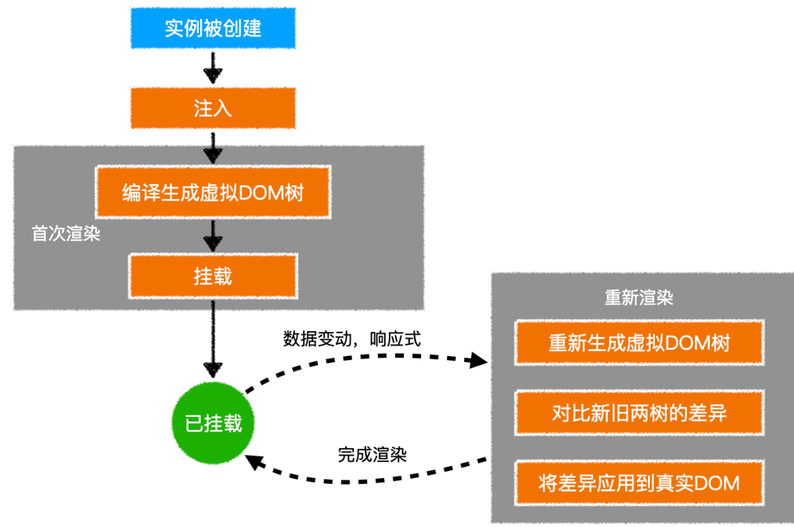

# 虚拟 DOM 详解

## 什么是虚拟 dom？

虚拟 dom 本质上就是一个普通的 JS 对象，用于描述视图的界面结构
在 vue 中，每个组件都有一个`render`函数，每个`render`函数都会返回一个虚拟 dom 树，这也就意味着每个组件都对应一棵虚拟 DOM 树

查看虚拟 DOM：

```javascript
mounted() {
  console.log(this._vnode);
},
```

vdom 结构：

```javascript
var vnode = {
  tag: "h1",
  children: [{ tag: undefined, text: "第一个vue应用：Hello World" }],
};
```

上面的对象描述了：有一个标签名为 h1 的节点，它有一个子节点，该子节点是一个文本，内容为第一个 vue 应用：Hello World


## 为什么需要虚拟 dom？

在`vue`中，渲染视图会调用`render`函数，这种渲染不仅发生在组件创建时，同时发生在视图依赖的数据更新时。如果在渲染时，直接使用真实`DOM`，由于真实`DOM`的创建、更新、插入等操作会带来大量的性能损耗，从而就会极大的降低渲染效率。
因此，`vue`在渲染时，使用虚拟 dom 来替代真实 dom，主要为解决渲染效率的问题。

对比 JS 对象和真实 DOM 对象

```javascript
var times = 10000000;
console.time(`js object`);
for (var i = 0; i < times; i++) {
  var obj = {};
}
console.timeEnd("js object");
console.time(`dom object`);
for (var i = 0; i < times; i++) {
  var obj = document.createElement("div");
}
console.timeEnd("dom object");
```

## 虚拟 dom 是如何转换为真实 dom 的？

在一个组件实例首次被渲染时，它先生成虚拟 dom 树，然后根据虚拟 dom 树创建真实 dom，并把真实 dom 挂载到页面中合适的位置，此时，每个虚拟 dom 便会对应一个真实的 dom。**这时候虚拟 dom 多一个创建虚拟 dom 树的过程，所以效率比真实 dom 低。**

如果一个组件受响应式数据变化的影响，需要重新渲染时，它仍然会重新调用 render 函数，创建出一个新的虚拟 dom 树，用新树和旧树对比，通过对比，vue 会找到**最小更新量**，然后**更新必要的虚拟 dom 节点**，最后，这些更新过的虚拟节点，会去修改它们对应的真实 dom

> 实际直接使用新树，抛弃旧树，只更新必要的真实 dom
> 这样一来，就保证了对真实 dom 达到最小的改动。


虚拟 DOM 树会最终生成为真实的 DOM 树，这个过程叫渲染
当数据变化后，将引发重新渲染，vue 会比较新旧两棵 vnode tree，找出差异，然后仅把差异部分应用到真实 dom tree 中。对比的是对象，效率很高

**可见，在 vue 中，要得到最终的界面，必须要生成一个 vnode tree**

**渲染的本质:render 生成虚拟 DOM**

## 模板和虚拟 dom 的关系

vue 框架中有一个`compile`模块，它主要负责将模板(实际上是字符串)转换为`render`函数，而`render`函数调用后将得到虚拟 dom。

编译的过程分两步：

a. 将模板字符串转换成为`AST`抽象语法树

b. 将`AST`转换为`render`函数

:::info AST 是什么？
一句话概括：使用 js 树形结构描述原始代码
:::

- 如果使用传统的引入方式(script 的 src)，则编译时间发生在组件第一次加载时，这称之为运行时编译。

- 如果是在`vue-cli`的默认配置下，编译发生在打包时，这称之为模板预编译。（打包的时候编译完成）

- 编译是一个极其耗费性能的操作，预编译可以有效的提高运行时的性能，而且，由于运行的时候已不需要编译，`vue-cli`在打包时会排除掉`vue`中的`compile`模块，以减少打包体积

```javascript
//vue config.js
module.export = {
  runtimeCompiler: true, //打包的时候要不要包含运行时候编译，默认false，不建议使用true
};
```

模板的存在，仅仅是为了让开发人员更加方便的书写界面代码

**vue 最终运行的时候，最终需要的是 render 函数，而不是模板，因此，模板中的各种语法，在虚拟 dom 中都是不存在的，它们都会变成虚拟 dom 的配置**

总之：模板会编译成 render 方法，最终总是 render()

**注意：虚拟节点树必须是单根的，所以模板必须单根**

## 模版预编译

当`vue-cli`进行**打包**时，会直接把组件中的模板转换为`render`函数，这叫做模板预编译
这样做的好处在于：

1. 运行时就不再需要编译模板了，提高了运行效率
2. 打包结果中不再需要 vue 的编译代码，减少了打包体积


> 易混淆：vue-cli 打包存在预编译，发现有模板，会覆盖 render；
>
> 在 vue 中，如果有模板和 render，则 render 优先

## 挂载

将生成的真实 DOM 树，放置到某个元素位置，称之为**挂载**
挂载的方式：

1. 通过`el:"css选择器"`进行配置
2. 通过`vue实例.$mount("css选择器")`进行配置

## 总结：完整流程



## Vue template 到 render 的过程

vue 的模版编译过程主要如下：**template -> ast -> render 函数**
vue 在模版编译版本的码中会执行 compileToFunctions 将 template 转化为 render 函数：

```javascript
// 将模板编译为render函数
const { render, staticRenderFns } = compileToFunctions(template,options//省略}, this)
```

CompileToFunctions 中的主要逻辑如下 ∶ **（1）调用 parse 方法将 template 转化为 ast（抽象语法树）**

```javascript
constast = parse(template.trim(), options);
```

- **parse 的目标**：把 tamplate 转换为 AST 树，它是一种用 JavaScript 对象的形式来描述整个模板。
- **解析过程**：利用正则表达式顺序解析模板，当解析到开始标签、闭合标签、文本的时候都会分别执行对应的 回调函数，来达到构造 AST 树的目的。

AST 元素节点总共三种类型：type 为 1 表示普通元素、2 为表达式、3 为纯文本
**（2）对静态节点做优化**

```javascript
optimize(ast, options);
```

这个过程主要分析出哪些是静态节点，给其打一个标记，为后续更新渲染可以直接跳过静态节点做优化

深度遍历 AST，查看每个子树的节点元素是否为静态节点或者静态节点根。如果为静态节点，他们生成的 DOM 永远不会改变，这对运行时模板更新起到了极大的优化作用。

**（3）生成代码**

```javascript
const code = generate(ast, options);
```

generate 将 ast 抽象语法树编译成 render 字符串并将静态部分放到 staticRenderFns 中，最后通过 new Function(`render`) 生成 render 函数。
