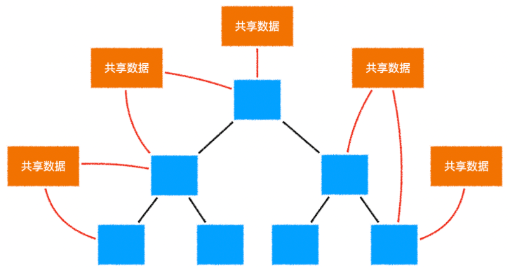
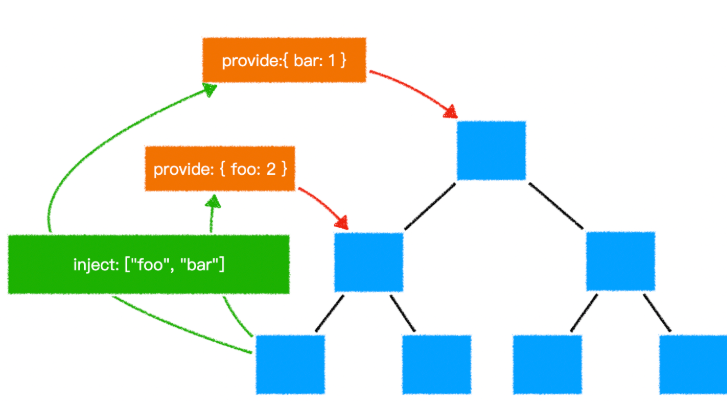
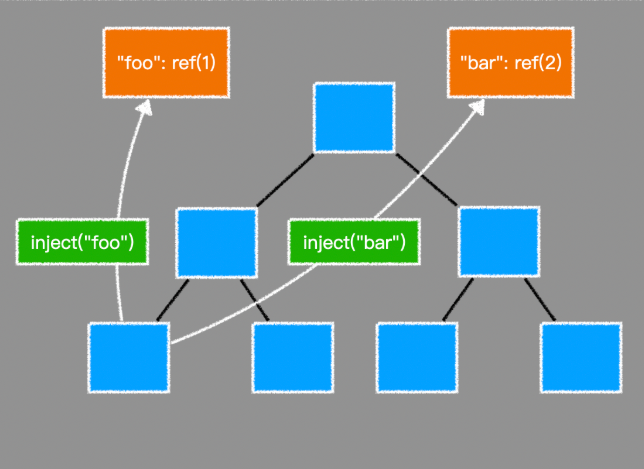

# Vue3 onePage

## createApp

```javascript
// vue2
const app = new Vue(options);
// 使用插件：Vue.use()
app.$mount("#app");
// vue3
// 不存在构造函数Vue
const app = createApp(App);
// 使用插件：app.use()
app.mount("#app");
// 简写：createApp(App).mount("#app");
// App是根组件，返回一个vue应用
```

## this 变化：vue3 的组件实例代理


## composition api 组合 api

vue2 配置式的，data,computed,props,methods,即 option api

vue3 对 ref 的特殊处理


## 去掉了 Vue 构造函数

可以更好的 tree shaking

在过去，如果遇到一个页面有多个`vue`应用时，往往会遇到一些问题

```html
<!-- vue2 -->
<div id="app1"></div>
<div id="app2"></div>
<script>
    Vue.use(...); // 此代码会影响所有的vue应用
    Vue.mixin(...); // 此代码会影响所有的vue应用
    Vue.component(...); // 此代码会影响所有的vue应用
  // 可能只是第一个需要用插件，第二个不用，之前毫无办法
  	new Vue({
      // 配置
    }).$mount("#app1")

    new Vue({
      // 配置
    }).$mount("#app2")
</script>
```

在`vue3`中，去掉了`Vue`构造函数，转而使用`createApp`创建`vue`应用

```html
<!-- vue3 -->
<div id="app1"></div>
<div id="app2"></div>
<script>
  去了vue实例里面      链式编程，因为每次都返回还是实例
  createApp(根组件).use(...).mixin(...).component(...).mount("#app1")
   createApp(根组件).mount("#app2")
</script>
```

> 更多 vue 应用的 api：[https://v3.vu ejs.org/api/application-api.html](https://v3.vuejs.org/api/application-api.html)

## 组件实例中的 API

在`vue3`中，组件实例是一个`Proxy`，它仅提供了下列成员，功能和`vue2`一样

属性：[https://v3.vuejs.org/api/instance-properties.html](https://v3.vuejs.org/api/instance-properties.html)

方法：[https://v3.vuejs.org/api/instance-methods.html](https://v3.vuejs.org/api/instance-methods.html)

只能调用列表里面的属性和方法，私有的和其他的不可以调用

## 对比数据响应式

vue2 和 vue3 均在相同的生命周期（beforeCreate 后，created 之前）完成数据响应式，但做法不一样


:::tip
为什么 vue3 中去掉了 vue 构造函数？
:::

vue2 的全局构造函数带来了诸多问题：

1. 调用构造函数的静态方法会对所有 vue 应用生效，不利于隔离不同应用
2. vue2 的构造函数集成了太多功能，不利于 tree shaking，vue3 把这些功能使用普通函数导出，能够充分利用 tree shaking 优化打包体积
3. vue2 没有把组件实例和 vue 应用两个概念区分开，在 vue2 中，通过 new Vue 创建的对象，既是一个 vue 应用，同时又是一个特殊的 vue 组件。vue3 中，把两个概念区别开来，通过 createApp 创建的对象，是一个 vue 应用，它内部提供的方法是针对整个应用的，而不再是一个特殊的组件。

:::tip
谈谈你对 vue3 数据响应式的理解
:::

vue3 不再使用 Object.defineProperty 的方式定义完成数据响应式，而是使用 Proxy。除了 Proxy 本身效率比 Object.defineProperty 更高之外，由于不必递归遍历所有属性，而是直接得到一个 Proxy。所以在 vue3 中，对数据的访问是动态的，当访问某个属性的时候，再动态的获取和设置，这就极大的提升了在组件初始阶段的效率。（想用那个再读那个），如果访问一个对象，则再返回一个 proxy。同时，由于 Proxy 可以监控到成员的新增和删除，因此，在 vue3 中新增成员、删除成员、索引访问等均可以触发重新渲染，而这些在 vue2 中是难以做到的。

vue2 的响应式是使用 Object.defineProperty 完成的，它会对原始对象有侵入。
在创建响应式阶段，会递归遍历原始对象的所有属性，当对象属性较多、较深时，对效率的影响颇为严重。不仅如此，由于遍历属性仅在最开始完成，因此在这儿之后无法响应属性的新增和删除。
在收集依赖时，vue2 采取的是构造函数的办法，构造函数是一个整体，不利于 tree shaking。

vue3 的响应式是使用 Proxy 完成的，它不会侵入原始对象，而是返回一个代理对象，通过操作代理对象完成响应式。
由于使用了代理对象，因此并不需要遍历原始对象的属性，只需在读取属性时动态的决定要不要继续返回一个代理，这种按需加载的模式可以完全无视对象属性的数量和深度，达到更高的执行效率。
由于 ES6 的 Proxy 可以代理更加底层的操作，因此对属性的新增、删除都可以完美响应。
在收集依赖时，vue3 采取的是普通函数的做法，利用高效率的 WeakMap 实现依赖记录，这利于 tree shaking，从而降低打包体积。

## v-model

`vue2`比较让人诟病的一点就是提供了两种双向绑定：`v-model`和`.sync`，在`vue3`中，去掉了`.sync`修饰符，只需要使用`v-model`进行双向绑定即可。

为了让`v-model`更好的针对**多个属性**进行双向绑定，`vue3`作出了以下修改

- 当对自定义组件使用`v-model`指令时，绑定的属性名由原来的`value`变为`modelValue`，事件名由原来的`input`变为`update:modelValue`

```html
<!-- vue2 -->
<ChildComponent :value="pageTitle" @input="pageTitle = $event" />
value绑定一个数据，input的时候给这个数据重新赋值
<!-- 简写为 -->
<ChildComponent v-model="pageTitle" />

<!-- vue3 -->
<ChildComponent
  :modelValue="pageTitle"
  @update:modelValue="pageTitle = $event"
/>
<!-- 简写为 -->
<ChildComponent v-model="pageTitle" />
```

- 去掉了`.sync`修饰符，它原本的功能由`v-model`的参数替代

```html
<!-- vue2 -->
<ChildComponent :title="pageTitle" @update:title="pageTitle = $event" />
<!-- 简写为 -->
<ChildComponent :title.sync="pageTitle" />

<!-- vue3 -->
<ChildComponent :title="pageTitle" @update:title="pageTitle = $event" />
<!-- 简写为 -->
<ChildComponent v-model:title="pageTitle" />
```

- `model`配置被移除
- 允许自定义`v-model`修饰符
  vue2 无此功能

举例：trim


## v-if v-for

`v-if` 的优先级 现在高于 `v-for`

## key

- 当使用`<template>`进行`v-for`循环时，需要把`key`值放到`<template>`中，而不是它的子元素中
- 当使用`v-if v-else-if v-else`分支的时候，不再需要指定`key`值，因为`vue3`会自动给予每个分支一个唯一的`key`
  即便要手工给予`key`值，也必须给予每个分支唯一的`key`，**不能因为要重用分支而给予相同的 key**

## Fragment

`vue3`现在允许组件出现多个根节点

## 组件的变化

Teleport

asyncComponent 异步组件

## ReactivityApi

> reactivity api: [https://v3.vuejs.org/api/reactivity-api](https://v3.vuejs.org/api/reactivity-api)

### 获取响应式数据

| API        | 传入                      | 返回             | 备注                                                                                                                                 |
| :--------- | ------------------------- | ---------------- | ------------------------------------------------------------------------------------------------------------------------------------ |
| `reactive` | `plain-object`            | `对象代理`       | 深度代理对象中的所有成员                                                                                                             |
| `readonly` | `plain-object` or `proxy` | `对象代理`       | 只能读取代理对象中的成员，不可修改                                                                                                   |
| `ref`      | `any`                     | `{ value: ... }` | 对 value 的访问是响应式的<br />如果给 value 的值是一个对象，<br />则会通过`reactive`函数进行代理<br />如果已经是代理，则直接使用代理 |
| `computed` | `function`                | `{ value: ... }` | 当读取 value 值时，<br />会**根据情况**决定是否要运行函数                                                                            |

```javascript
// 想把{ a: 1, b: 2 }变成响应式
import { reactive, readonly, ref, computed } from "vue";
// 1. reactive
const state = reactive({ a: 1, b: 2 });
// window.state = state;
// 2. readonly
// 只读，不能set
/*
const imState = readonly({ a: 1, b: 2 });
window.imState = imState;
*/
/*
const imState = readonly(state);//代理套代理
window.imState = imState;
// imState -> state -> {a:3,b:2}

// 3. ref
const count = ref(0);//如果里面是对象，就会调用reactive；普通值就ref
console.log(count);
const count = ref(state);//已经是代理，就返回这个代理
console.log(count.value===state)
// 4. computed
*/
/* const sum = computed(() => {
    console.log("computed");
    return state.a + state.b;
})
console.log(sum.value);//当这句话运行的时候就会输出computed，但是只允许一次(有缓存)
当依赖数据a,b变了，就重新运行
 */
```

应用：

- 如果想要让一个对象变为响应式数据，可以使用`reactive`或`ref`
- 如果想要让一个对象的所有属性只读，使用`readonly`
- 如果想要让一个非对象数据变为响应式数据，使用`ref`
- 如果想要根据已知的响应式数据得到一个新的响应式数据，使用`computed`
- 总结：在 vue3 中，两种数据响应式格式：ref object 和 proxy

笔试题 1：下面的代码输出结果是什么？

```javascript
import { reactive, readonly, ref, computed } from "vue";

const state = reactive({
  firstName: "Xu Ming",
  lastName: "Deng",
});
const fullName = computed(() => {
  console.log("changed");
  return `${state.lastName}, ${state.firstName}`;
});
console.log("state ready");
console.log("fullname is", fullName.value);
console.log("fullname is", fullName.value); //计算属性有缓存
const imState = readonly(state);
console.log(imState === state); //false

const stateRef = ref(state);
console.log(stateRef.value === state); //如果已经是代理，则直接使用代理

state.firstName = "Cheng";
state.lastName = "Ji"; //改了数据，计算属性还是不允许，得等到用到.value的时候才运行

console.log(imState.firstName, imState.lastName);
console.log("fullname is", fullName.value);
console.log("fullname is", fullName.value);

const imState2 = readonly(stateRef);
console.log(imState2.value === stateRef.value); //代理有区别，一个可改一个不可改
```

笔试题 2：按照下面的要求完成函数

```javascript
function useUser() {
  // 在这里补全函数
  return {
    user, // 这是一个只读的用户对象，响应式数据，默认为一个空对象
    setUserName, // 这是一个函数，传入用户姓名，用于修改用户的名称
    setUserAge, // 这是一个函数，传入用户年龄，用户修改用户的年龄
  };
}
```

答案

```javascript
import { readonly, reactive } from "vue";

function useUser() {
  // 在这里补全函数
  const userOrigin = reactive({}); //原始的可以改
  const user = readonly(userOrigin); //只读了
  const setUserName = (name) => {
    //运用reactive巧妙的避开了只读不能改
    userOrigin.name = name; //通过原始来改
  };
  const setUserAge = (age) => {
    userOrigin.age = age;
  };
  return {
    user, // 这是一个只读的用户对象，响应式数据，默认为一个空对象
    setUserName, // 这是一个函数，传入用户姓名，用于修改用户的名称
    // 难点：只读了，咋改
    setUserAge, // 这是一个函数，传入用户年龄，用户修改用户的年龄
  };
}

const { user, setUserName, setUserAge } = useUser();

console.log(user);
setUserName("monica");
setUserAge(18);
console.log(user);
```

笔试题 3：响应式防抖

```javascript
function useDebounce(obj, duration) {
  // 在这里补全函数
  return {
    value, // 这里是一个只读对象，响应式数据，默认值为参数值
    setValue, // 这里是一个函数，传入一个新的对象，需要把新对象中的属性混合到原始对象中，混合操作需要在duration的时间中防抖
  };
}
```

答案

```javascript
import { reactive, readonly } from "vue";

function useDebounce(obj, duration) {
  // 在这里补全函数
  const valueOrigin = reactive(obj);
  const value = readonly(valueOrigin);
  let timer = null;
  const setValue = (newValue) => {
    clearTimeout(timer);
    timer = setTimeout(() => {
      console.log("值改变了");
      Object.entries(newValue).forEach(([k, v]) => {
        valueOrigin[k] = v;
      });
    }, duration);
  };
  return {
    value, // 这里是一个只读对象，响应式数据，默认值为参数值
    setValue, // 这里是一个函数，传入一个新的对象，需要把新对象中的属性混合到原始对象中，混合操作需要在duration的时间中防抖
  };
}

const { value, setValue } = useDebounce({ a: 1, b: 2 }, 5000);

window.value = value;
window.setValue = setValue;
```

### 监听数据变化

**watchEffect**

> **自动收集依赖，依赖改变时候自动收集**

```javascript
const stop = watchEffect(() => {
  // 该函数会立即执行，然后追中函数中用到的响应式数据，响应式数据变化后会再次执行
});

// 通过调用stop函数，会停止监听
stop(); // 停止监听
```

```javascript
import { reactive, ref, watchEffect } from "vue";

const state = reactive({ a: 1, b: 2 });
const count = ref(0);

watchEffect(() => {
  console.log(state.a, count.value); //都是响应式的
}); //watchEffect马上执行一次
// state.b++;//不变，因为不依赖b，不运行get
state.a++;
state.a++;
state.a++;
state.a++;
state.a++;
count.value++;
count.value++;
count.value++;
count.value++;
// 异步的，会进入微队列，数据改变完成后才运行，所以只会运行一次 6 4
```

**watch**

```javascript
import { reactive, ref, watch } from "vue";

const state = reactive({ a: 1, b: 2 });
const count = ref(0);

// eg1
// watch(state.a, (newValue, oldValue) => {//不会依赖，直接就把state.a读出来了
//   console.log('new', newValue, 'old', oldValue)
// })
// eg2
// watch(() => state.a, (newValue, oldValue) => {//函数是在watch里面调用，收集依赖
//   console.log('new', newValue, 'old', oldValue)
// })
// eg3
// watch([() => count.value], (newValue, oldValue) => {
//   console.log('new', newValue, 'old', oldValue)
// })
// eg4
// watch(count, (newValue, oldValue) => {//count可以直接这样写，因为count是对象。不能.value,如果.value就相当于给了0
//   console.log('new', newValue, 'old', oldValue)
// })
watch([() => state.a, count], () => {
  console.log("变化了");
});

count.value++;
state.a++;
```

```javascript
// 等效于vue2的$watch
// 不同于watchEffect  不会立即执行
// 监听单个数据的变化
const state = reactive({ count: 0 });
watch(
  () => state.count,
  (newValue, oldValue) => {
    // ...
  },
  options
);

const countRef = ref(0);
watch(
  countRef,
  (newValue, oldValue) => {
    // ...
  },
  options
);

// 监听多个数据的变化
watch([() => state.count, countRef], ([new1, new2], [old1, old2]) => {
  // ...
});
```

**注意：无论是**`watchEffect`**还是**`watch`**，当依赖项变化时，回调函数的运行都是异步的（微队列）**

应用：除非遇到下面的场景，否则均建议选择`watchEffect`

- 不希望回调函数一开始就执行
- 数据改变时，需要参考旧值
- 需要监控一些回调函数中不会用到的数据

```javascript
import { reactive, ref, watch } from "vue";

const state = reactive({ a: 1, b: 2 });
const count = ref(0);

watch([() => state.a, count], () => {
  //第二个参数：数据变化的时候运行回调函数
  console.log("变化了");
}); //不同于watchEffect,一开始不允许，要加上一个配置：{immediate:true}才会直接运行
count.value++;
state.a++;
```

笔试题: 下面的代码输出结果是什么？

```javascript
import { reactive, watchEffect, watch } from "vue";
const state = reactive({
  count: 0,
});
watchEffect(() => {
  //立即执行
  console.log("watchEffect", state.count); //自动收集依赖
});
watch(
  //不会立即执行
  () => state.count, //手动告诉他收集的依赖是state.count
  (count, oldCount) => {
    console.log("watch", count, oldCount);
  }
);
console.log("start");
setTimeout(() => {
  //宏队列
  console.log("time out");
  state.count++;
  state.count++; //这次为准
});
state.count++;
state.count++; //这两个++导致了watchEffect，watch检测到了变化，进入了微队列

console.log("end");
```


### 判断

| API          | 含义                                                                                                                                                               |
| ------------ | ------------------------------------------------------------------------------------------------------------------------------------------------------------------ |
| `isProxy`    | 判断某个数据是否是由`reactive`或`readonly`                                                                                                                         |
| `isReactive` | 判断某个数据是否是通过`reactive`创建的.详细:[https://v3.vuejs.org/api/basic-reactivity.html#isreactive](https://v3.vuejs.org/api/basic-reactivity.html#isreactive) |
| `isReadonly` | 判断某个数据是否是通过`readonly`创建的                                                                                                                             |
| `isRef`      | 判断某个数据是否是一个`ref`对象                                                                                                                                    |

### 转换

**unref**
等同于：`isRef(val) ? val.value : val`
应用：

```javascript
function useNewTodo(todos) {
  todos = unref(todos);
  // ...
}
```

**toRef**
得到一个响应式对象某个属性的 ref 格式

```javascript
const state = reactive({
  foo: 1,
  bar: 2,
});

const fooRef = toRef(state, "foo"); // fooRef: {value: ...}

fooRef.value++;
console.log(state.foo); // 2

state.foo++;
console.log(fooRef.value); // 3
```

**toRefs**
把一个响应式对象的所有属性转换为 ref 格式，然后包装到一个`plain-object`中返回

```javascript
const state = reactive({
  foo: 1,
  bar: 2,
});

const stateAsRefs = toRefs(state);
/*
stateAsRefs: not a proxy
{
  foo: { value: ... },
  bar: { value: ... }
}
*/
```

应用：

```javascript
setup(){
  const state1 = reactive({a:1, b:2});
  const state2 = reactive({c:3, d:4});
  return {
    ...state1, // lost reactivity 展开剂运算符让他失去了响应式
    ...state2 // lost reactivity
  }
}

setup(){
  const state1 = reactive({a:1, b:2});
  const state2 = reactive({c:3, d:4});
  return {
    ...toRefs(state1), // reactivity
    ...toRefs(state2) // reactivity
  }
}
// composition function
function usePos(){
  const pos = reactive({x:0, y:0});
  return pos;
}

setup(){
  const {x, y} = usePos(); // lost reactivity
  const {x, y} = toRefs(usePos()); // reactivity
}
```

### 降低心智负担

所有的`composition function`均以`ref`的结果返回，以保证`setup`函数的返回结果中不包含`reactive`或`readonly`直接产生的数据

```javascript
function usePos(){
  const pos = reactive({ x:0, y:0 });
  return toRefs(pos); //  {x: refObj, y: refObj}
}
function useBooks(){
  const books = ref([]);
  return {
    books // books is refObj
  }
}
function useLoginUser(){
  const user = readonly({
    isLogin: false,
    loginId: null
  });
  return toRefs(user); // { isLogin: refObj, loginId: refObj }  all ref is readonly
}

setup(){
  // 在setup函数中，尽量保证解构、展开出来的所有响应式数据均是ref
  return {
    ...usePos(),
    ...useBooks(),
    ...useLoginUser()
  }
}
```

## CompositionApi

composition api 相比于 option api 有哪些优势？

不同于 reactivity api，composition api 提供的函数很多是与组件深度绑定的，不能脱离组件而存在。

## setup

```javascript
// component
export default {
  setup(props, context) {
    // 该函数在组件属性被赋值后立即执行，早于所有生命周期钩子函数，只运行一次
    // props 是一个对象，包含了所有的组件属性值
    // context 是一个对象，提供了组件所需的上下文信息
  },
};
```

context 对象的成员

| 成员  | 类型 | 说明                    |
| ----- | ---- | ----------------------- |
| attrs | 对象 | 同`vue2`的`this.$attrs` |
| slots | 对象 | 同`vue2`的`this.$slots` |
| emit  | 方法 | 同`vue2`的`this.$emit`  |

# 生命周期函数

| vue2 option api | vue3 option api    | vue 3 composition api             |
| --------------- | ------------------ | --------------------------------- |
| beforeCreate    | beforeCreate       | 不再需要，代码可直接置于 setup 中 |
| created         | created            | 不再需要，代码可直接置于 setup 中 |
| beforeMount     | beforeMount        | onBeforeMount                     |
| mounted         | mounted            | onMounted                         |
| beforeUpdate    | beforeUpdate       | onBeforeUpdate                    |
| updated         | updated            | onUpdated                         |
| beforeDestroy   | 改 beforeUnmount   | onBeforeUnmount                   |
| destroyed       | 改 unmounted       | onUnmounted                       |
| errorCaptured   | errorCaptured      | onErrorCaptured                   |
| -               | 新 renderTracked   | onRenderTracked                   |
| -               | 新 renderTriggered | onRenderTriggered                 |

beforeCreate 和 created 去除？在这两个后，已经有了数据响应式，而在 composition api 中，响应式已经被抽离出去（见上节）
新增钩子函数说明：

| 钩子函数        | 参数          | 执行时机                       |
| --------------- | ------------- | ------------------------------ |
| renderTracked   | DebuggerEvent | 渲染 vdom 收集到的每一次依赖时 |
| renderTriggered | DebuggerEvent | 某个依赖变化导致组件重新渲染时 |

DebuggerEvent:

- target: 跟踪或触发渲染的对象
- key: 跟踪或触发渲染的属性
- type: 跟踪或触发渲染的方式

:::tip
composition api 相比于 option api 有哪些优势？

> 1. 为了更好的逻辑复用（粒度更细了，组件间相同的功能逻辑复用）和代码组织
> 2. 更好的类型推导（利于 TypeScript 类型推导）

有了 composition api，配合 reactivity api，可以在组件内部进行更加细粒度的控制，使得组件中不同的功能高度聚合，提升了代码的可维护性。对于不同组件的相同功能，也能够更好的复用。
相比于 option api，composition api 中没有了指向奇怪的 this，所有的 api 变得更加函数式，这有利于和类型推断系统比如 TS 深度配合。
:::

[https://vuejs.org/guide/built-ins/suspense.html](https://vuejs.org/guide/built-ins/suspense.html)

## 共享数据

### vuex 方案

安装`vuex@4.x`

两个重要变动：

- 去掉了构造函数`Vuex`，而使用`createStore`创建仓库
- 为了配合`composition api`，新增`useStore`函数获得仓库对象

### global state

由于`vue3`的响应式系统本身可以脱离组件而存在，因此可以充分利用这一点，轻松制造多个全局响应式数据



```javascript
// store/useLoginUser 提供当前登录用户的共享数据
// 以下代码仅供参考
import { reactive, readonly } from "vue";
import * as userServ from "../api/user"; // 导入api模块
// 创建默认的全局单例响应式数据，仅供该模块内部使用
const state = reactive({ user: null, loading: false });
// 对外暴露的数据是只读的，不能直接修改
// 也可以进一步使用toRefs进行封装，从而避免解构或展开后响应式丢失
export const loginUserStore = readonly(state);

// 登录
export async function login(loginId, loginPwd) {
  state.loading = true;
  const user = await userServ.login(loginId, loginPwd);
  state.loginUser = user;
  state.loading = false;
}
// 退出
export async function loginOut() {
  state.loading = true;
  await userServ.loginOut();
  state.loading = false;
  state.loginUser = null;
}
// 恢复登录状态
export async function whoAmI() {
  state.loading = true;
  const user = await userServ.whoAmI();
  state.loading = false;
  state.loginUser = user;
}
```

### Provide&Inject

在`vue2`中，提供了`provide`和`inject`配置，可以让开发者在高层组件中注入数据，然后在后代组件中使用



除了兼容`vue2`的配置式注入，`vue3`在`composition api`中添加了`provide`和`inject`方法，可以在`setup`函数中注入和使用数据


考虑到有些数据需要在整个 vue 应用中使用，`vue3`还在应用实例中加入了`provide`方法，用于提供整个应用的共享数据

```javascript
creaetApp(App).provide("foo", ref(1)).provide("bar", ref(2)).mount("#app");
```



因此，我们可以利用这一点，在整个 vue 应用中提供共享数据

```javascript
// store/useLoginUser 提供当前登录用户的共享数据
// 以下代码仅供参考
import { readonly, reactive, inject } from "vue";
const key = Symbol(); // Provide的key

// 在传入的vue应用实例中提供数据
export function provideStore(app) {
  // 创建默认的响应式数据
  const state = reactive({ user: null, loading: false });
  // 登录
  async function login(loginId, loginPwd) {
    state.loading = true;
    const user = await userServ.login(loginId, loginPwd);
    state.loginUser = user;
    state.loading = false;
  }
  // 退出
  async function loginOut() {
    state.loading = true;
    await userServ.loginOut();
    state.loading = false;
    state.loginUser = null;
  }
  // 恢复登录状态
  async function whoAmI() {
    state.loading = true;
    const user = await userServ.whoAmI();
    state.loading = false;
    state.loginUser = user;
  }
  // 提供全局数据
  app.provide(key, {
    state: readonly(state), // 对外只读
    login,
    loginOut,
    whoAmI,
  });
}

export function useStore(defaultValue = null) {
  return inject(key, defaultValue);
}

// store/index
// 应用所有store
import { provideStore as provideLoginUserStore } from "./useLoginUser";
// 继续导入其他共享数据模块...
// import { provideStore as provideNewsStore } from "./useNews"

// 提供统一的数据注入接口
export default function provideStore(app) {
  provideLoginUserStore(app);
  // 继续注入其他共享数据
  // provideNewsStore(app);
}

// main.js
import { createApp } from "vue";
import provideStore from "./store";
const app = createApp(App);
provideStore(app);
app.mount("#app");
```

### 对比

|              | vuex | global state | Provide&Inject              |
| ------------ | ---- | ------------ | --------------------------- |
| 组件数据共享 | ✅   | ✅           | ✅                          |
| 可否脱离组件 | ✅   | ✅           | ❌ 和 vue 应用/组件深入绑定 |
| 调试工具     | ✅   | ❌           | ✅                          |
| 状态树       | ✅   | 自行决定     | 自行决定                    |
| 量级         | 重   | 轻           | 轻                          |

## script setup

> `script setup`的提案文档：[https://github.com/vuejs/rfcs/blob/script-setup-2/active-rfcs/0000-script-setup.md](https://github.com/vuejs/rfcs/blob/script-setup-2/active-rfcs/0000-script-setup.md)

```vue
<template>
  <hello-world></hello-world>
  <p>the number is {{ count }}</p>
  <button @click="increase">click to increase</button>
</template>

<script>
import HelloWorld from "./HelloWorld.vue";
import { ref } from "vue";
export default {
  setup() {
    const count = ref(0);
    const increase = () => {
      count.value++;
    };
    return {
      HelloWorld,
      count,
      increase,
    };
  },
};
</script>
```

当我们使用`composition api`时，往往整个组件对象的配置中只有一个`setup`

因此，`vue3`在`SFC`中使用`script setup`来简化代码书写

```vue
<template>
  <hello-world></hello-world>
  <p>the number is {{ count }}</p>
  <button @click="increase">click to increase</button>
</template>

<script setup>
import HelloWorld from "./HelloWorld.vue";
import { ref } from "vue";
const count = ref(0);
const increase = () => {
  count.value++;
};
</script>
```

在`script setup`中，所有的顶级绑定都会被使用`setup`的返回值，顶级绑定包括：

- `import`导入
- 顶级变量

### 如何使用组件属性

```vue
<template>
  <h1>Hello {{ props.title }}</h1>
</template>

<script setup>
import { defineProps } from "vue";
const props = defineProps(["title"]);
</script>
```

编译结果

```vue
<template>
  <h1>Hello {{ props.title }}</h1>
</template>

<script>
export default {
  props: ["title"],
  setup() {},
};
</script>
```

### 如何使用组件事件

```vue
<template>
  <button @click="handleClick">Click Me</button>
</template>

<script setup>
import { defineEmit } from "vue";
const emit = defineEmit(["click"]);
const handleClick = () => {
  emit("click");
};
</script>
```

编译结果：

```vue
<template>
  <button @click="handleClick">Click Me</button>
</template>

<script>
export default {
  emits: ["click"],
  setup(props, { emit }) {
    const handleClick = () => {
      emit("click");
    };
    return {
      handleClick,
    };
  },
};
</script>
```

## ref sugar

> `ref`语法糖目前仍在提案阶段，具有一定的争议
>
> `ref sugar`提案地址：[https://github.com/vuejs/rfcs/blob/ref-sugar/active-rfcs/0000-ref-sugar.md](https://github.com/vuejs/rfcs/blob/ref-sugar/active-rfcs/0000-ref-sugar.md)

```vue
<template>
  <!-- 受模板上下文代理的影响，在模板中直接当做原始值使用 -->
  <h1>Hello, {{ fullName }}</h1>
  <p>设置姓名</p>
  <p>
    姓：
    <input type="text" v-model="firstName" />
  </p>
  <p>
    名：
    <input type="text" v-model="lastName" />
  </p>
</template>

<script>
import { ref, computed } from "vue";
export default {
  setup() {
    const firstName = ref("邓"); // firstName 是一个对象
    const lastName = ref("旭明"); // lastName 是一个对象
    // 在 setup 函数中，则必须把 ref 当做对象使用
    const fullName = computed(() => firstName.value + lastName.value);
    return {
      firstName,
      lastName,
      fullName,
    };
  },
};
</script>
```

使用`ref`时，主要有以下心智负担：

- 模板和`setup`中对待`ref`不一致
- `ref`、`computed`同`reactive`带来的响应数据结构不一致

为解决以上问题，`vue3`在`SFC`中提出`ref sugar`方案，它是在`script setup`方案上进一步的演化

上述代码可以用`ref sugar`简化为

```vue
<template>
  <!-- 使用ref标记的数据直接使用即可 -->
  <h1>Hello, {{ fullName }}</h1>
  <p>设置姓名</p>
  <p>
    姓：
    <input type="text" v-model="firstName" />
  </p>
  <p>
    名：
    <input type="text" v-model="lastName" />
  </p>
</template>

<script setup>
import { computed } from "vue";
ref: firstName = "邓"; // 这是一个ref
ref: lastName = "旭明"; // 这是一个ref
// 使用ref标记的数据直接使用即可
const fullName = computed(() => firstName + lastName);
</script>
```

上述`js`部分代码会被编译为

```vue
<script setup>
import { computed, ref } from "vue";
const firstName = "邓";
const lastName = "旭明";
const fullName = computed(() => firstName.value + lastName.value);
</script>
```

### 争议

- `ref sugar`带来了新的`js`语义，并且同`TypeScript`语义冲突
- `ref sugar`仅在`script setup`中有效，出了`SFC`环境就会失效，心智负担不减反增
- `ref sugar`虽然降低了初学者的*使用成本*，但却增加了*理解成本*
- 当使用`TypeScript`的时候，可以从编辑器中获得智能提示，可以很轻松的辨别一个数据是否是`ref`，根本没必要解决这个问题，否则会让事情变得越来越复杂。

## Suspence

`UserName`组件的`setup`函数是异步的，只有等到它的`setup`函数加载完成后才能够显示模板

```vue
<template>
  <h1>Hello {{ name }}</h1>
</template>

<script>
function delay(duration = 1000) {
  return new Promise((resolve) => {
    setTimeout(() => {
      resolve();
    }, duration);
  });
}
export default {
  async setup() {
    await delay();
    return {
      name: "邓哥",
    };
  },
};
</script>
```

`App`组件使用了`UserName`组件，并使用了`Suspense`组件等待`UserName`组件渲染完成。

```vue
<template>
  <Suspense>
    <template #default>
      <UserName />
    </template>
    <template #fallback>
      <h1>Loading...</h1>
    </template>
  </Suspense>
</template>

<script>
import UserName from "./UserName.vue";
export default {
  components: {
    UserName,
  },
};
</script>
```

## TypeScript

`vue3`对`TypeScript`支持良好，无论使用`vue-cli`还是`vite`，都可以达到开箱即用的效果。

> 使用`vite`的时候，由于没有针对`.vue`文件的类型定义，需要手动定义，以避免编辑器报错

## 自定义渲染器


`vue3`有着清晰的模块结构，特别是它将`dom`操作进行了分离，使得`vue3`的核心模块与`dom`操作脱钩，这样一来，就非常便于我们替换成其他的渲染模式。

## hook 范式

```vue
<template>
  <h1>count:{{ countRef }}</h1>
  <p>
    <button @click="decrease">decrease</button>
    <button @click="increase">increase</button>
  </p>
</template>

<script>
import { ref } from "vue";

function useCount() {
  let countRef = ref(0); //具有响应式了
  // console.log(countRef);
  const increase = () => {
    countRef.value++;
  };
  const decrease = () => {
    countRef.value--;
  };
  return {
    countRef,
    increase,
    decrease,
  };
}

export default {
  setup() {
    // console.log("所有生命周期钩子函数之前自动调用");
    // console.log(this); // this -> undefined

    // setup中，count是一个对象
    // 实例代理中，count是一个count.value

    //1. 新增

    //2. 修改

    //3. 删除
    return {
      ...useCount(),
    };
  },
};
</script>
```

## **说一下 _vue3.0_ 是如何变得更快的？**

> **优化 _Diff_ 算法**
>
> 相比 _Vue 2_，_Vue 3_ 采用了更加优化的渲染策略。去掉不必要的虚拟 _DOM_ 树遍历和属性比较，因为这在更新期间往往会产生最大的性能开销。
>
> 这里有三个主要的优化：
>
> - 首先，在 _DOM_ 树级别。

> 在没有动态改变节点结构的模板指令（例如 _v-if_ 和 _v-for_）的情况下，节点结构保持完全静态。
>
> 当更新节点时，不再需要递归遍历 _DOM_ 树。所有的动态绑定部分将在一个平面数组中跟踪。这种优化通过将需要执行的树遍历量减少一个数量级来规避虚拟 _DOM_ 的大部分开销。
>
> - 其次，编译器积极地检测模板中的静态节点、子树甚至数据对象，并在生成的代码中将它们提升到渲染函数之外。这样可以避免在每次渲染时重新创建这些对象，从而大大提高内存使用率并减少垃圾回收的频率。
> - 第三，在元素级别。

> 编译器还根据需要执行的更新类型，为每个具有动态绑定的元素生成一个优化标志。
>
> 例如，具有动态类绑定和许多静态属性的元素将收到一个标志，提示只需要进行类检查。运行时将获取这些提示并采用专用的快速路径。
>
> 综合起来，这些技术大大改进了渲染更新基准，_Vue 3.0_ 有时占用的 _CPU_ 时间不到 _Vue 2_ 的十分之一。
>
> **体积变小**
>
> 重写后的 _Vue_ 支持了 _tree-shaking_，像修剪树叶一样把不需要的东西给修剪掉，使 _Vue 3.0_ 的体积更小。
>
> 需要的模块才会打入到包里，优化后的 _Vue 3.0_ 的打包体积只有原来的一半（_13kb_）。哪怕把所有的功能都引入进来也只有 _23kb_，依然比 _Vue 2.x_ 更小。像 _keep-alive、transition_ 甚至 _v-for_ 等功能都可以按需引入。
>
> 并且 _Vue 3.0_ 优化了打包方法，使得打包后的 _bundle_ 的体积也更小。
>
> 官方所给出的一份惊艳的数据：打包大小减少 _41%_，初次渲染快 _55%_，更新快 _133%_，内存使用减少 _54%_。

## 说一说相比 _vue3.x_ 对比 _vue2.x_ 变化

> 1. 源码组织方式变化：使用 TS 重写
> 2. 支持 Composition API：基于函数的 API，更加灵活组织组件逻辑（vue2 用的是 options api）
> 3. 响应式系统提升：Vue3 中响应式数据原理改成 proxy，可监听动态新增删除属性，以及数组变化
> 4. 编译优化：vue2 通过标记静态根节点优化 diff，Vue3 标记和提升所有静态根节点，diff 的时候只需要对比动态节点内容
> 5. 打包体积优化：移除了一些不常用的 api（inline-template、filter）
> 6. 生命周期的变化：使用 setup 代替了之前的 beforeCreate 和 created
> 7. Vue3 的 template 模板支持多个根标签
> 8. Vuex 状态管理：创建实例的方式改变,Vue2 为 new Store , Vue3 为 createStore
> 9. Route 获取页面实例与路由信息：vue2 通过 this 获取 router 实例，vue3 通过使用 getCurrentInstance/ userRoute 和 userRouter 方法获取当前组件实例
> 10. Props 的使用变化：vue2 通过 this 获取 props 里面的内容，vue3 直接通过 props
> 11. 父子组件传值：vue3 在向父组件传回数据时，如使用的自定义名称，如 backData，则需要在 emits 中定义一下
